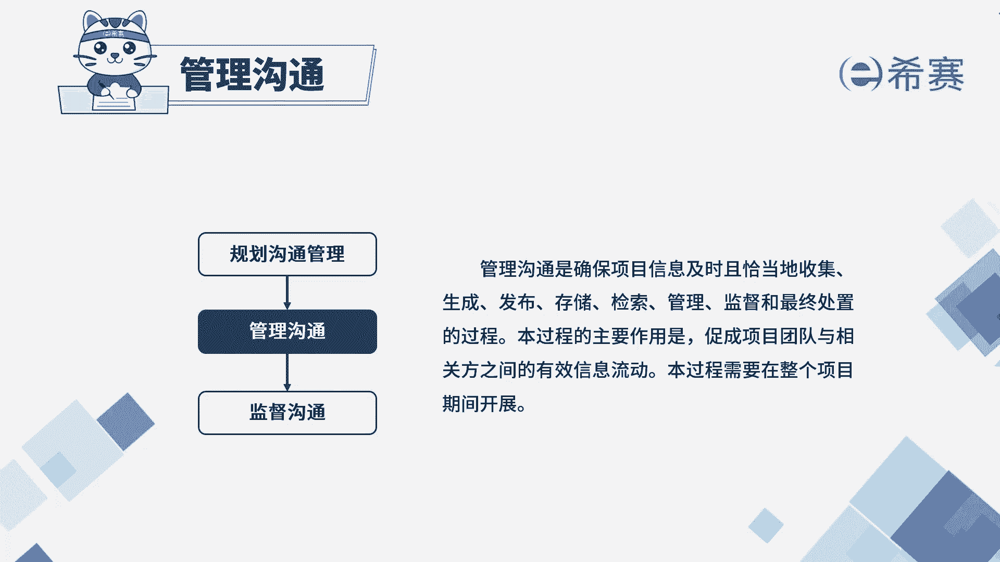
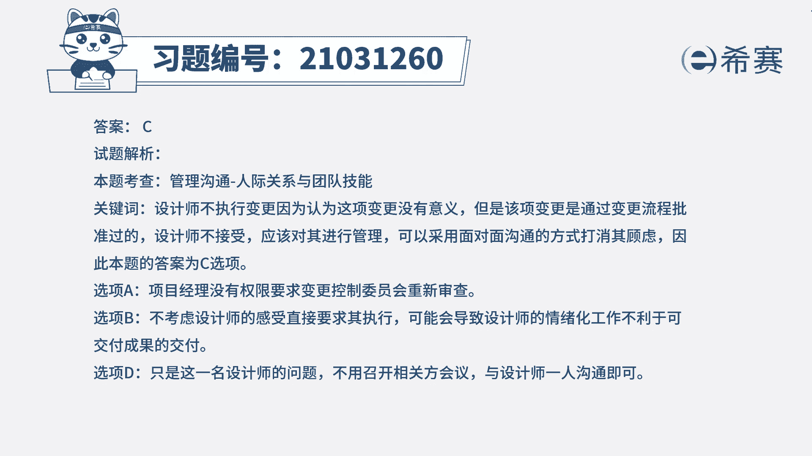

# 24年PMP模拟题-PMP付费模拟题100道免费视频新手教程-从零开始刷题 - P48：48 - 冬x溪 - BV1Fs4y137Ya

项目经理正在管理一项室内软装项目，在项目进行过程中，一相关方认为将餐桌设计成可伸缩的形式，能够提升客户的满意度，该相关方随后提交了变更请求，并获得了批准，虽然当前项目进度超前，项目预算也很充足。

但餐桌设计师却迟迟不开始进行变更后的设计，因为设计师认为此项变更没有意义，项目经理应该怎么解决，a要求变更控制委员会重新审查批准的变更，b要求设计师立即执行这项变更，c与该设计师开会，以打消其顾虑。

d召开相关方会议讨论解决方案，读完题目，我们可以找到题干中的关键句，设计师认为此项变更没有意义，但是题干中说了，该项变更是已经获得了批准，那就要去执行相应的变更，现在问项目经理应该怎么解决。

那就应该与设计师进行沟通，了解他不执行的根本原因，并帮助其解决问题，所以c选项是符合的，我们再看其他选项，先看a选项，项目经理并没有权限要求变更控制委员会，去重新审查批准的变更，所以a不选，再看b选项。

强制性的要求设计师去执行，可能会导致设计师之后带着消极的情绪去工作，这将不利于可交付成果的交付，所以没有从根本上去解决问题，所以b也不选，最后我们看d选项，这里只是这位设计师的问题。

没有涉及到其他的相关方，所以不需要去召开相关方会议去讨论，所以d也不合适。

因此我们本题最佳的答案就是c选项，本题考察内容是项目沟通管理中。

