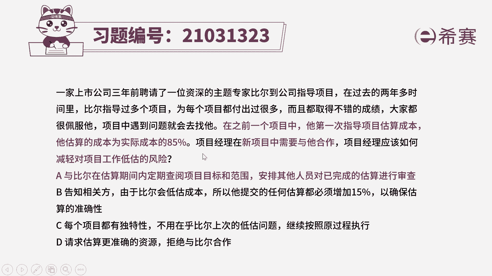
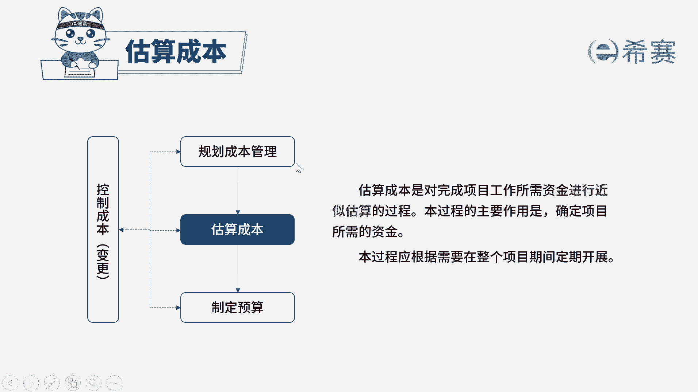

# 24年PMP模拟题-PMP付费模拟题100道免费视频新手教程-从零开始刷题 - P50：50 - 冬x溪 - BV1Fs4y137Ya

一家上市公司3年前，聘请了一位资深的主题专家，比尔到公司指导项目，在过去的2年多时间，比尔指导过多个项目，为每个项目都付出过很多，而且都取得不错的成绩，大家都很佩服他，项目中遇到问题就会去找他。

在之前的一个项目中，他第一次指导项目估算成本，他估算的成本为实际成本的85%，项目经理在新项目中需要与他合作，项目经理应该如何减轻对项目工作低估的风险，选项a与比尔在估算期间，定期查阅项目的目标和范围。

安排其他人员对已完成的估算进行审查，选项b告知相关方，由于比尔会低估成本，所以他提交的任何估算都必须增加15%，以确保估算的准确性，选项c每个项目都有独特性，不用在乎比尔上次的低估问题。

继续按照原过程执行，选项d请求估算更准确的资源，拒绝与比尔合作，题干比较长，我们直接来看一下关键点，是不是某一个资源，它在之前项目中估算成本是他估算的成本，只有实际成本的85%，就是估低了。

而现在新项目中，我们需要与他进行合作，问的是如何减轻对工作低估的一个风险，我们首先可以排除bd选项，b选项是直接把提交的任何估算都增加，15%，这个做法是过于绝对的，他在之前项目中。

估算成本为实际成本的85%，不代表他在以后任何项目中，刚好都是85%，而d选项是直接拒绝与比尔合作和题干中，新项目中需要与他合作是冲突的，再来看一下ac选项，a选项是在比尔估算期间。

定期审查项目的目标和范围，安排其他人员对已完成的估算进行审查，相当于是一个实时监控的工作，那么这样的话，我们就可以降低他低估项目成本的风险，因为我们是定期持续的去查阅了项目的范围。

并且还安排了其他人进行一个二字的审查，所以a选项是可以达到体干，降低工作低估风险的目的的，最后c选项，每个项目都有独特性，不用在乎他上次的低估问题，继续按照原过程执行，那么这个选项他就是比较消极的。

因为毕竟他有过这样低估成本的风险，我们不能够忽略这个风险，因此综合分析下来，只有a选项是可以达到题干目的的，我们选择a选项。

大家可以看一下文字解析部分，本题考察的是项目成本管理。

