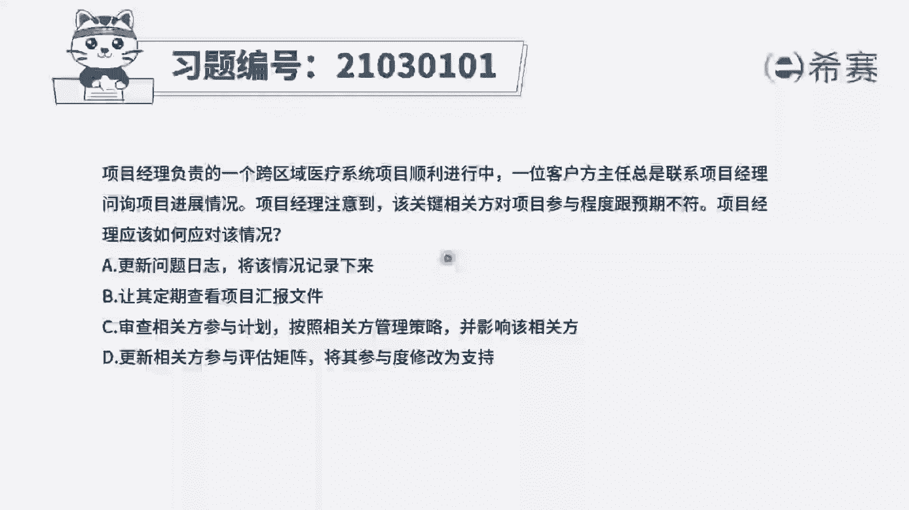
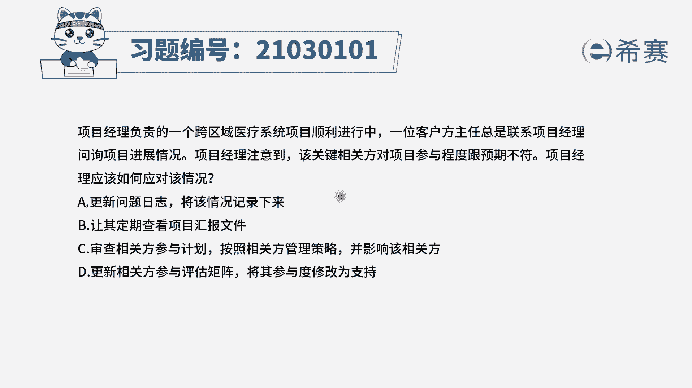
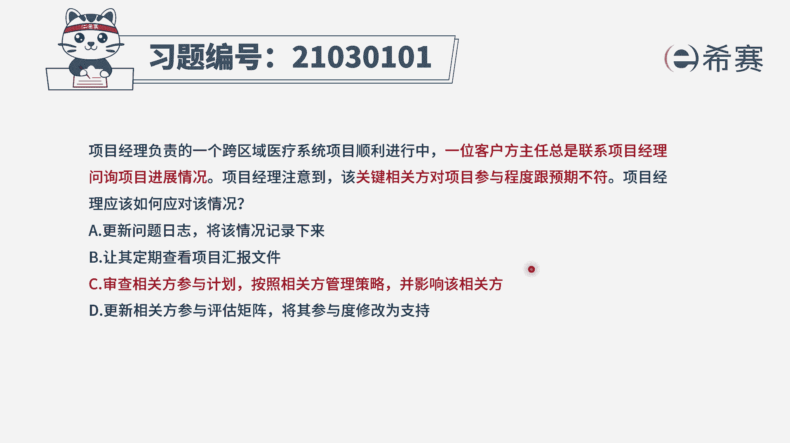
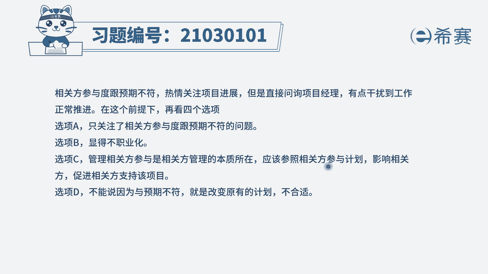
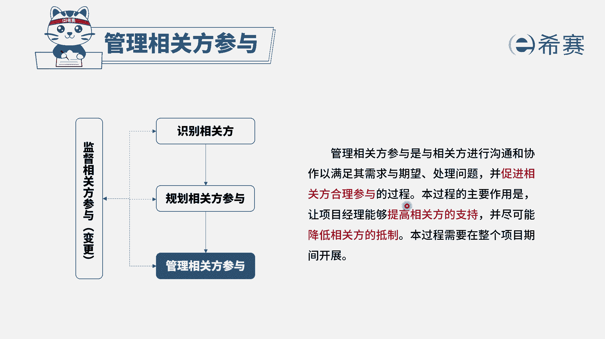

# 24年PMP模拟题-PMP付费模拟题100道免费视频新手教程-从零开始刷题 - P54：54 - 冬x溪 - BV1Fs4y137Ya

项目经理负责一个跨区域医疗系统项目。

项目经理负责的一个跨区域医疗系统，项目顺利进行中，一位客户方主任总是联系项目经理，询问项目进展情况，项目经理注意到，该关键相关方对项目的参与程度与预期的不符，项目经理应该如何应对该情况。

选项a更新问题日志，将该情况记录下来，选项b让其定期查看项目汇报文件，选项c审查相关方参与计划，按照相关方管理策略，并影响该相关方，选项d更新相关方参与度评估举证，将其参与度修改为支持，我们先来看题干。

题干的问题是不是客户方的主任，他总是联系项目经理，询问项目的进展情况，说明他参与程度是非常高的，但是它的参与程度跟我们预期的并不符合，比如说他过于热情了，这也是属于参与程度不符合的情况。

那么如何把相关方的参与程度，变成跟我们预期一致呢，这个本质就是在做相关方的管理工作，因此我们应该选择，跟相关方参与计划有关系的选项，看似四个选项，a选项更新问题日志，将该情况记录下来。

首先这并不是我们马上就需要做的，我们重点是要去解决现在的这个情况，不仅仅只是记录，并且问题它定性为已经发生，且对项目产生负面影响的才叫做问题，那么现在仅仅是相关方参与程度不符合，举个例子。

比如说我们希望这个相关方它是保持中立的，但是他对项目非常的支持，他过于热情，这种情况是不是真的产生了负面影响呢，也不一定，所以题干没有过多的信息依据支持，我们把它定义成问题，a选项它本身是不太合适的。

再来看b选项，让其定期的查看项目的汇报文件，我们现在要解决的是，相关方参与程度不符合的问题，而并不是去迎合这个相关方，b选项相当于他总是询问项目的进展情况，那么你就总是让他去看，这刚好是合了他的意。

而这是跟我们预期不符的，再来看c选项，审查相关方参与计划，按照相关方管理策略，并影响该相关方，这是不是就是我们说到的，进行相关方面的管理呀，n s c选项是nt的正确答案，最后看一下d选项。

更新相关方参与度评估举证，将其参与度修改为支持，这个选项的前半句其实没有什么问题，但是我们并不能把这个总是询问项目进展，就定义成支持，并且他现在是预期不符，我们应该选择去解决问题的一个选项。

因此四个选项中c选项是最正确的。

大家可以看一下文字解析。

本题考察的是管理相关方过程。

