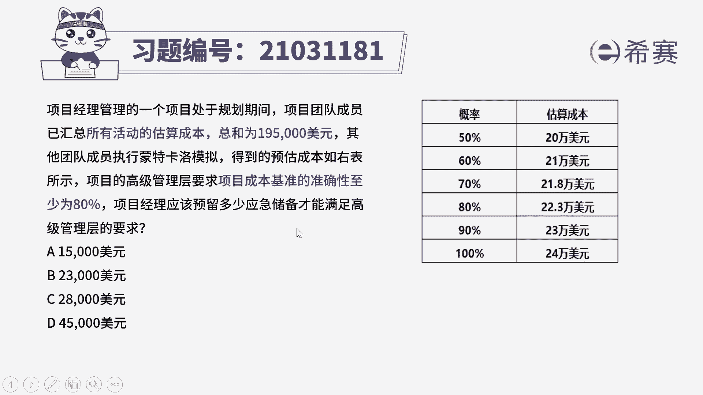
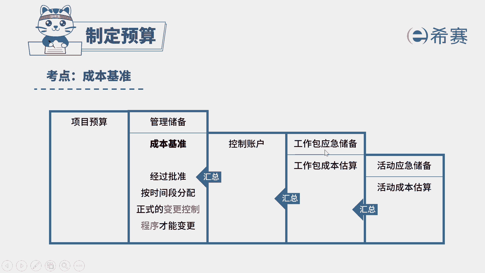
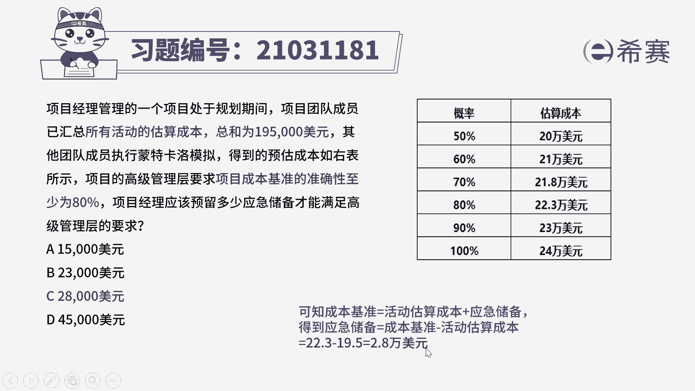
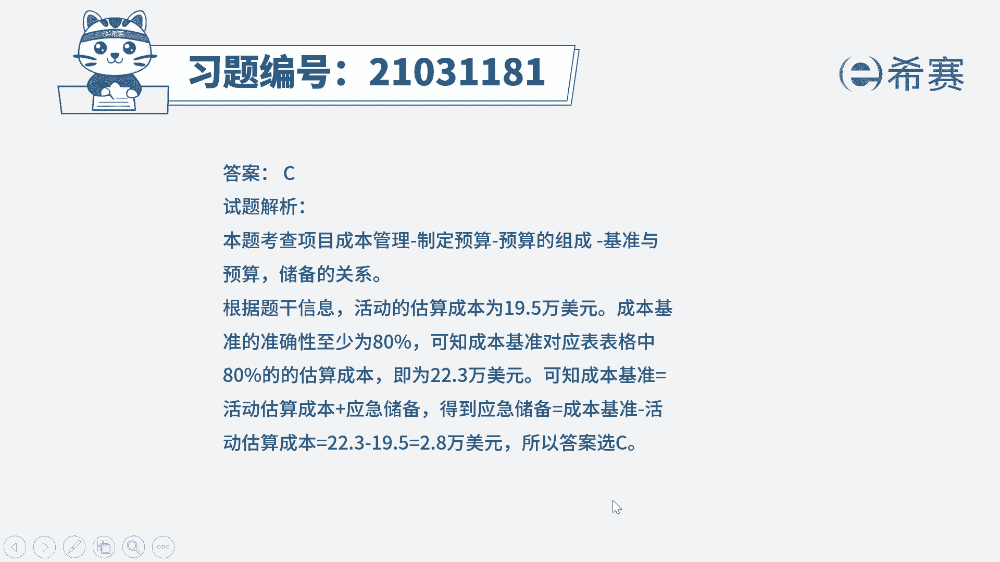

# 24年PMP模拟题-PMP付费模拟题100道免费视频新手教程-从零开始刷题 - P55：55 - 冬x溪 - BV1Fs4y137Ya

项目经理管理的一个项目处于规划期间，项目团队成员已汇总所有活动的估算，成本总和为195000美元，其他团队成员执行蒙特卡洛模拟，得到的预估成本如右表所示，项目的高级管理层要求。

项目成本基准的准确性至少是80%，项目经理应该预留多少应急储备，才能满足高级管理层的要求，那么选项是给出四个不同的数值，这种情况我们怎么计算呢，我们先来找到关键词。

是不是估算成本已经给出了是195000，那么现在高级管理层，它要求你成本基准的准确性在80%，我们对应看一下这个表，80%，说明你估算成本要达到一个22。3万元，这个中间差是什么。

中间差其实就是指的应急储备。

我们简单来回顾一下成本基准的组成，成本基准它是由应急储备和成本估算组成，因此在我们刚刚这个题目中，我们如果要达到80%的一个，成本基准的准确性，是不是需要22。3万，而工作包的成本估算已经给出了是19。

5万，因此这个差值部分其实指的就是，我们需要应对不确定性。

准备多少的应急储备，所以这一题是由22。3-19。5，得到2。8万美元，这个2。8万美元就是指的应急储备，因此选择c选项。

