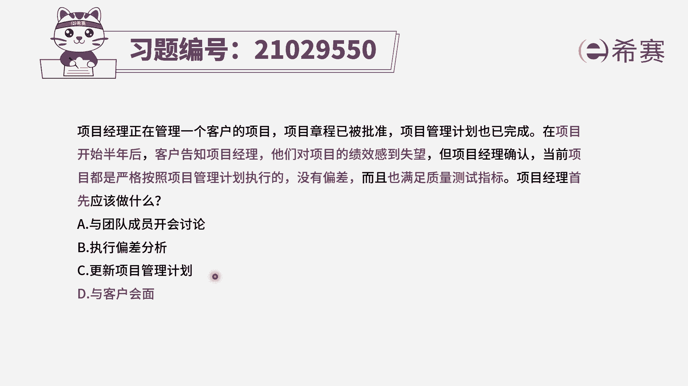

# 24年PMP模拟题-PMP付费模拟题100道免费视频新手教程-从零开始刷题 - P6：6 - 冬x溪 - BV1Fs4y137Ya

项目经理正在管理一个客户的项目，项目章程已被批准，项目管理计划也已完成，在项目开始半年后，客户告知项目经理，他们对项目的绩效感到失望，在项目经理确认，当前项目都是严格按照项目管理计划执行的，没有偏差。

而且也满足质量测试指标，项目经理首先应该做什么，选项a与团队成员开会讨论，选项b执行偏差分析选项c，更新项目管理计划选项d与客户会面好，我们先来看题干的关键词，是不是客户对项目技巧非常失望。

但是项目经理他已经确认过，我是按照计划严格执行的，没有偏差，也满足质量标准，那么为什么会出现这种情况呢，我们要解决客户他的一个问题，是不是，首先最好能够跟客户去进行一个沟通交流。

了解他们失望的一个点到底在哪里，然后才能采取措施去消除客户的不满，所以四个选项中d选项是正确的，看一下其他选项，a选项与团队成员开会讨论，题干已经明确的告诉我们，计划是满足的，没有偏差，满足质量标准。

所以说我们和团队成员讨论，相当于是在猜测客户不满意的原因，不如直接跟客户去沟通，我们就可以了解到客户为什么不买，可以了解他的真实原因，所以a选项本身没错，但是d选项更加合适，再来看b c选项。

b选项是执行偏差分析，偏差分析是分析我们的项目技巧和计划，有没有偏差，但是题干已经告诉你没有偏差了，所以b选项和题干是冲突的，所以b选项和题干是冲突的，最后看一下c选项，更新项目管理计划。

我们按照计划执行，客户还不满意，有可能确实是我们的计划出了问题，但是我们不能直接去更新项目管理计划，是要走变更流程的，所以c选项也是错误的，不是我们首先要做的，那么四个选项中。

我们最应该先做的就是直接跟客户去沟通，去了解他们对项目技巧感到失望的原因在哪里，然后再去针对性的进行解决，因此我们选择d选项。

大家可以看一下文字解析。

本题考察的是管理相关方参与时，我们需要用到的一些沟通技能。

