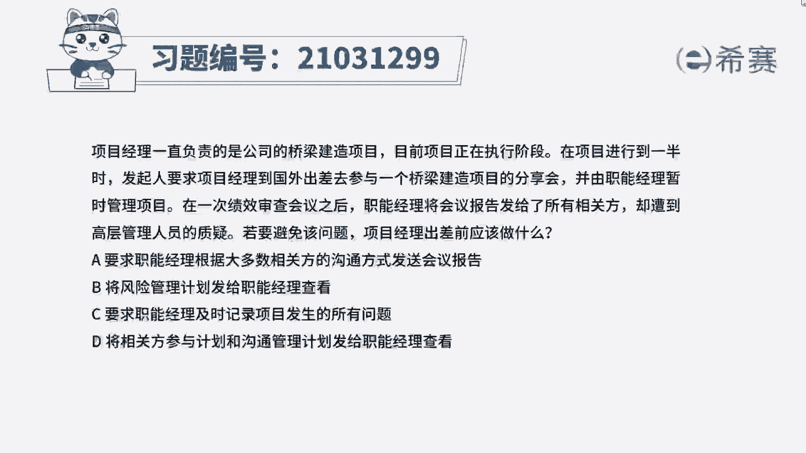
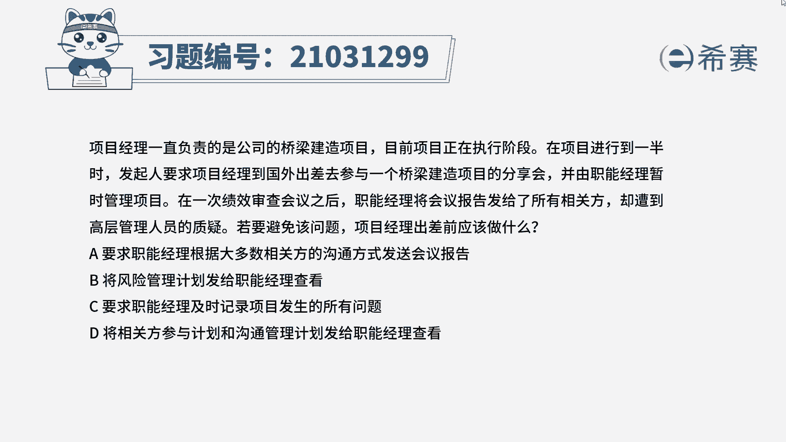
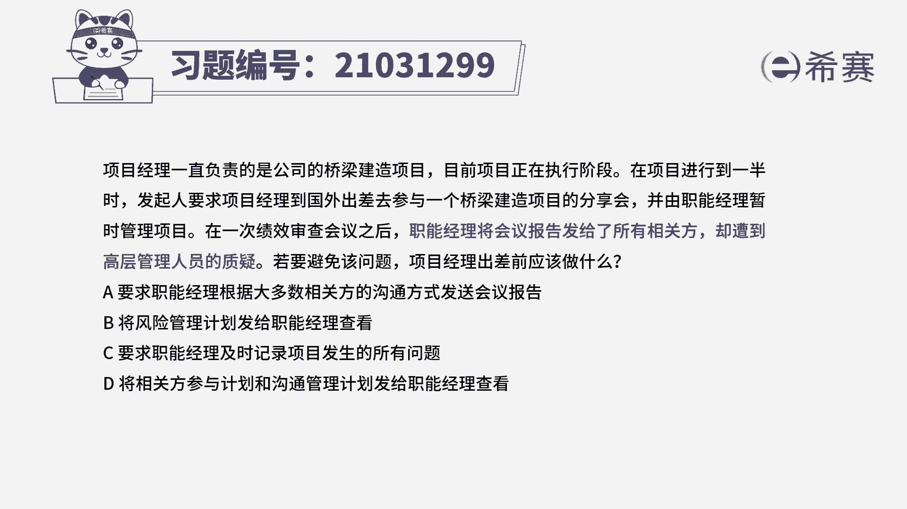
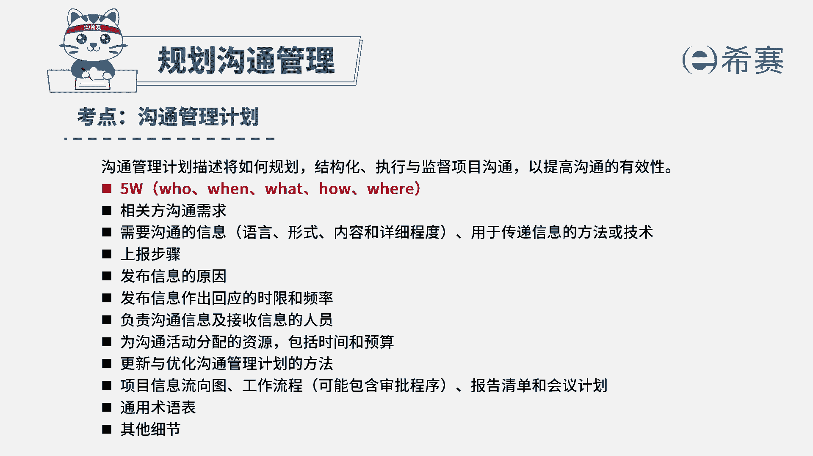

# 24年PMP模拟题-PMP付费模拟题100道免费视频新手教程-从零开始刷题 - P62：62 - 冬x溪 - BV1Fs4y137Ya

项目经理一直负责的是公司的桥梁建造项目，目前项目正在执行阶段。

在项目进行到一半时，发起人要求项目经理到国外出差，去参与一个桥梁建造项目的分享会，并由职能经理暂时管理项目，在一次绩效审查会议之后，职能经理将会议报告发给了所有相关方，却遭到高层管理人员的质疑。

若要避免该问题，项目经理出差前应该做什么，a要求职能经理根据大多数相关方的沟通方式，发送会议报告，b将风险管理计划发给职能经理查看，c要求职能经理及时记录项目发生的所有问题，d将相关方参与计划和沟通。

管理计划发给职能经理查看，读完题目，我们可以找到题干中的关键句，职能经理暂时管理项目，职能经理将会议报告发送给了所有相关方，却遭到了高层管理人员的质疑，现在问若要避免该情况，项目经理出差前应该做什么。

也就是说事先该怎么做，这里高层管理人员质疑，职能经理将会议报告发送给所有相关方，这种情况说明要么是用的沟通方式不对，要么就是不应该将报告发送给所有的相关方，只是发送给部分相关方。

而沟通方式对应的就是沟通管理计划，是否要把报告发送给所有相关方，就涉及到相关方的信息，对应的是相关方登记册或者是相关方参与计划，但是选项中包含这两者的只有d选项，所以d是符合的，我们再看一下其他选项。

我们先看a选项，a选项说的是按照大多数相关方的沟通方式，发送报告，但是每位相关方的沟通需求可能都不一样，所以不能直接只用一种沟通方式，与所有的相关方去进行沟通，所以a不选，再看b选项。

我们知道风险管理计划，是指导如何进行风险管理的指南性文件，所以不会记录该怎么去发送会议报告，或者是发给谁的这个问题，而且这里跟风险没有任何关系，这里是沟通管理和相关方管理的问题，所以b也不选。

最后我们看c选项，题目问的是事先应该采取什么措施，来避免这种情况的发生，c选项只记录问题，不能避免问题会发生，所以c也不选，因此我们本题最佳的答案就是d选项。

本题考察的知识点是项目沟通管理中规划。

