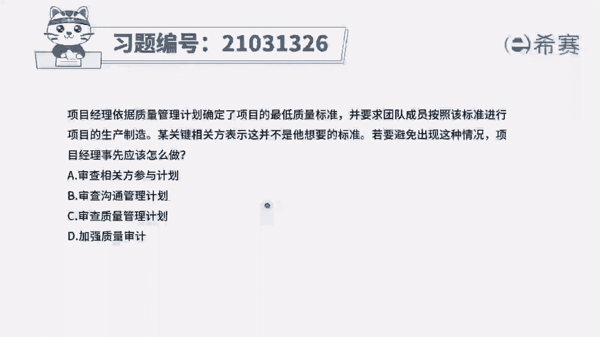
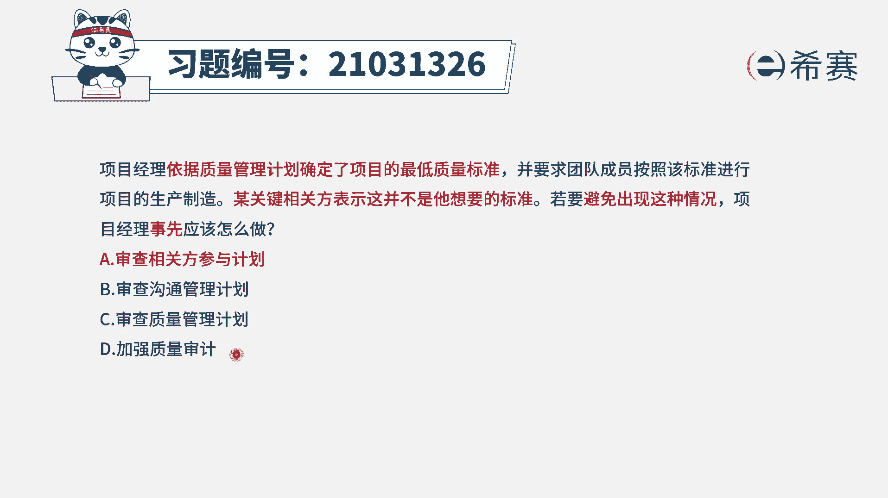
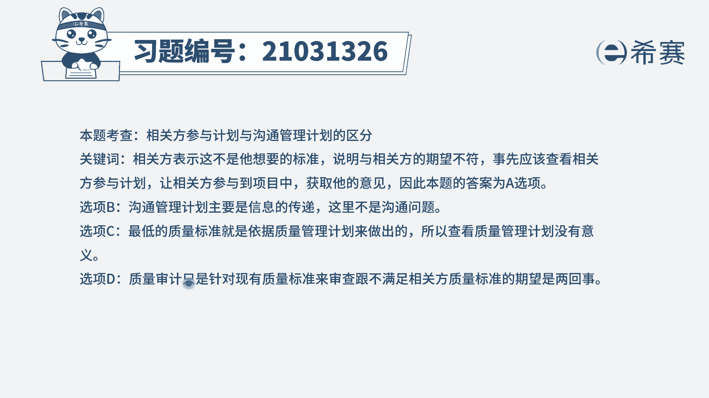
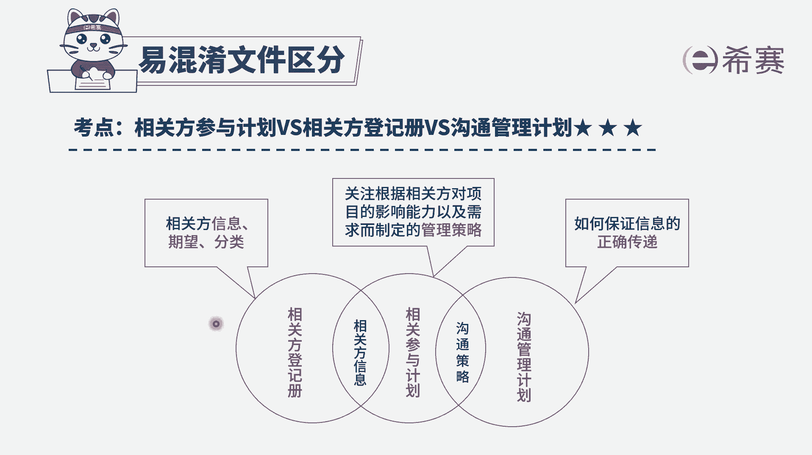

# 24年PMP模拟题-PMP付费模拟题100道免费视频新手教程-从零开始刷题 - P64：64 - 冬x溪 - BV1Fs4y137Ya

项目经理依据质量管理计划，确定了项目的最低质量标准，并要求团队成员按照该标准，进行项目的生产制造，某关键相关方表示，这并不是他想要的标准，若要避免出现这种情况，项目经理事先应该怎么做。

选项a审查相关方参与计划选项，b审查沟通管理计划选项，c审查质量管理计划选项d加强质量审计，读完题，我们先找题干的关键词，我们是依据现有的一个质量管理计划，确定了项目的最低质量标准，但是有一个相关方说。

这个标准并不是他想要的，题干问的是，如果你要避免出现这种情况，事先怎么做，既然相关方说这个标准并不是他想要的，说明我们事先没有识别到这个相关方，他想要什么，他的期望需求是什么。

所以事先我们可以去参照相关方参与计划，相关方参与计划，它是确定了我们如何去促进相关方有效的参与，比如说管理相关方的期望，要求相关方提供一些信息，因此a选项是可选项，再来看一下其他选项。

b选项是审查沟通管理计划，沟通管理计划强调的是信息的传递，但是在这个题干中，我们不能明确的得出，是因为沟通出了问题才导致这样的情况，是没有信息依据的，c选项，审查质量管理计划。

因为我们事先就是按照质量管理计划，去确定的最低标准，所以说你再去审查的话，本身是没有太大意义的，并不能解决像官方他要的标准，你想要知道他想要什么标准，你应该去跟相关方进行沟通。

去进行相关方的管理才是d选项，也是同理，质量审计，它是我们去确定项目的活动，是不是符合项目的政策过程，程序的一种结构化的过程，他审查的是质量管理过程，甚至于说跟最低质量标准本身的关联都没有，c选项大。

因此它与质量标准不满足相关方的期望，没有一个直接的关系，d选项也是错误的，那么四个选项中最合适的选项只有a选项。

大家可以看一下解析。

本题考察的是几个易混淆文件的区分，包括相关方参与计划。

