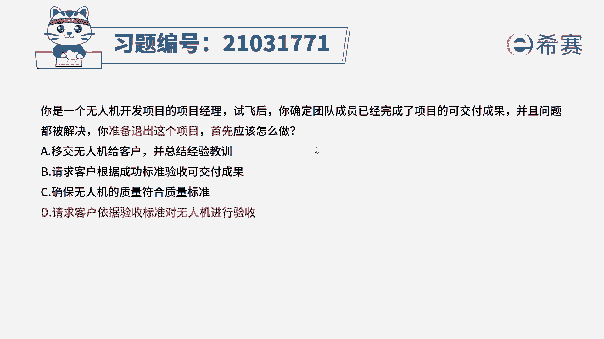
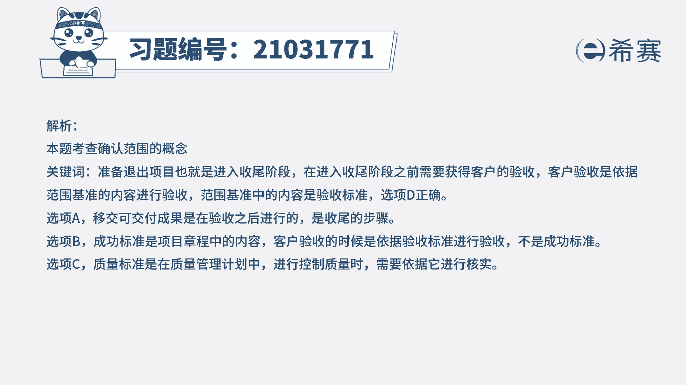
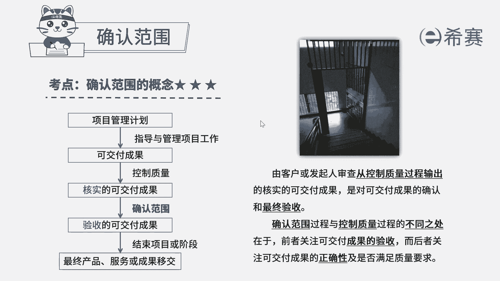

# 24年PMP模拟题-PMP付费模拟题100道免费视频新手教程-从零开始刷题 - P65：65 - 冬x溪 - BV1Fs4y137Ya

你是一个无人机开发项目的项目经理，试飞后，你确定团队成员已经完成了项目的可交付成果，并且问题都被解决，你准备退出这个项目，首先应该怎么做，a移交无人机给客户，并总结经验教训。

b请求客户根据成功标准验收可交付成果，确保无人机的质量符合质量标准，d请求客户依据验收标准对无人机进行验收，读完题目，回答题干，我们来看一下这道题的关键词，现在这个项目它已经完成了，项目经理。

他准备退出这个项目，首先应该怎么做，准备退出项目，它也就是说进入了收尾阶段，在收尾阶段之前要做的就是获得客户的验收，客户验收它是依据范围基准的内容进行验收，也就是根据范围基准当中的验收标准，来进行验收。

所以这道题正确选项是第一选项，请求客户依据验收标准对无人机进行验收，我们再来看一下其他三个选项，移交无人机给客户，并总结经验教训，这个a选项移交无人机给客户，他是在d选项进行验收之后进行的工作。

所以这里有一个先后顺序，因为题目问的是首先应该怎么做，所以应该是先进行验收，再进行移交，所以a选项排除，再来看一下b选项，请求客户根据成功标准验收可交付成果，成功标准它是项目章程当中的内容。

客户验收的时候，它是根据验收标准进行验收的，而不是成功标准，所以b选项排除，最后看一下c选项，确保无人机的质量符合质量标准，那质量标准它是在质量管理计划当中，如果我们要是在控制质量的时候呢。

我们就是需要依据质量管理计划来进行核实，但是我们现在这个阶段，他正在是收尾这个阶段，所以首先应该是进行验收，所以c选项排除，所以这道题最佳选项是d选项。

这是我们这道题的文字解析。

有需要的同学可以看一下，这道题考察的知识点是第五章。

