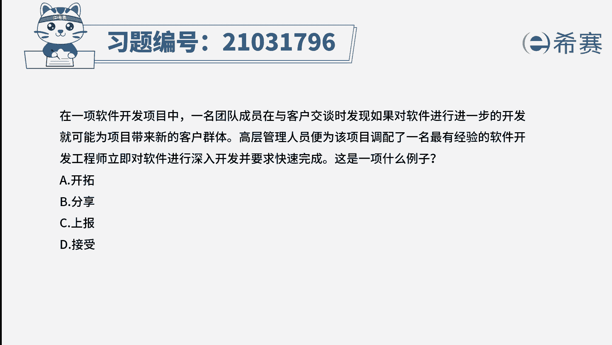
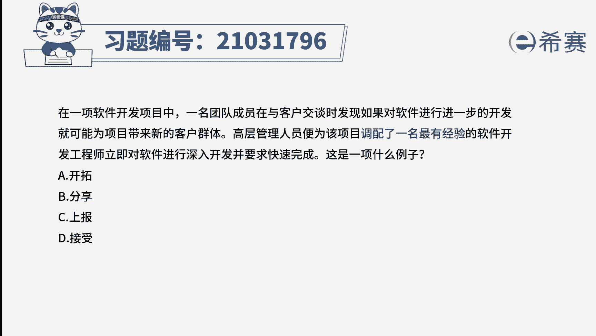
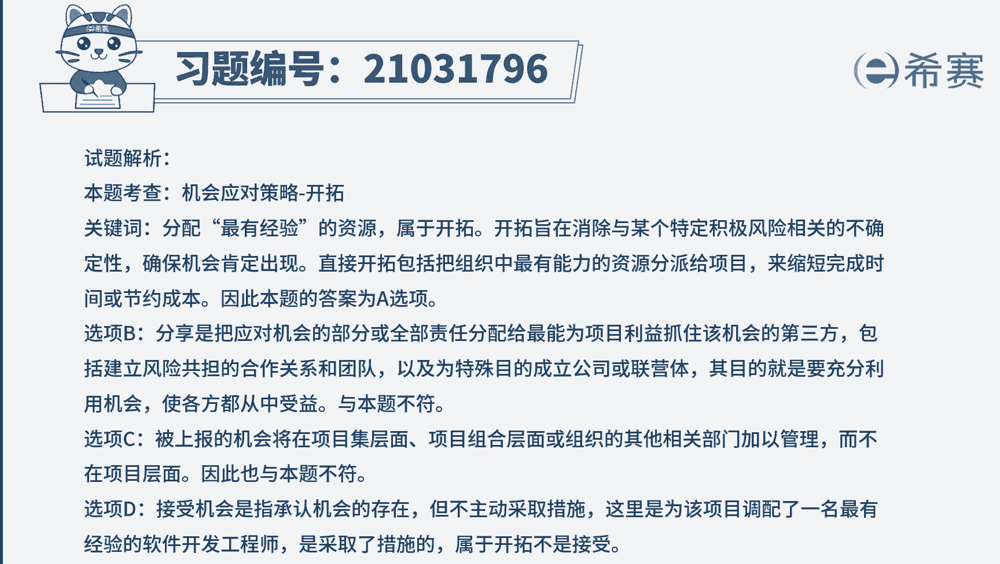

# 24年PMP模拟题-PMP付费模拟题100道免费视频新手教程-从零开始刷题 - P66：67 - 冬x溪 - BV1Fs4y137Ya

在以下软件开发项目中，一名团队成员在与客户交谈时发现，如果对软件进行进一步的开发，就可能为项目带来新的客户群体，高层管理人员，并为该项目配备了一名，最有经验的软件开发工程师，立即对软件进行深入开发。

并要求快速完成，这是一项什么例子，a开拓b分享，c上报d接受好，读完题目，我们先来看一下问题，这是一项什么例子，唉，可以定位到考察的是规划风险，应对机会，应对策略的选择。

我们再回顾一下机会应对策略有五种，上报的话，一般是不在项目范围之内的，或者超出项目经理权限的应对策略，会选择上报，分享的话是把机会与第三方来分享，所谓的合作共赢，接受的话是机会来了就来了。

没有来的话也不主动去追求好，剩下两个是我们很多同学难以区分的，开拓和提高，开拓的话就是确保百分之百的让机会发生，提高的话是提高机会发生的概率或积极影响，在做题的时候，我们可以根据关键词来区分。

开拓的关键词是增加最高级的资源，有z字的，那就是开拓，提高的关键词是增加资源，就是普普通通的或者更高级的这种表达，会比这次的强调程度更低一点，好我们再回到题干中。

看到一些关键词，配了一名最有经验的开发工程师，从这个最字我们就可以快速定位的是，刚刚所讲到的开拓策略选项a为最佳选项。

好了我们此道题就先讲解到这里。

