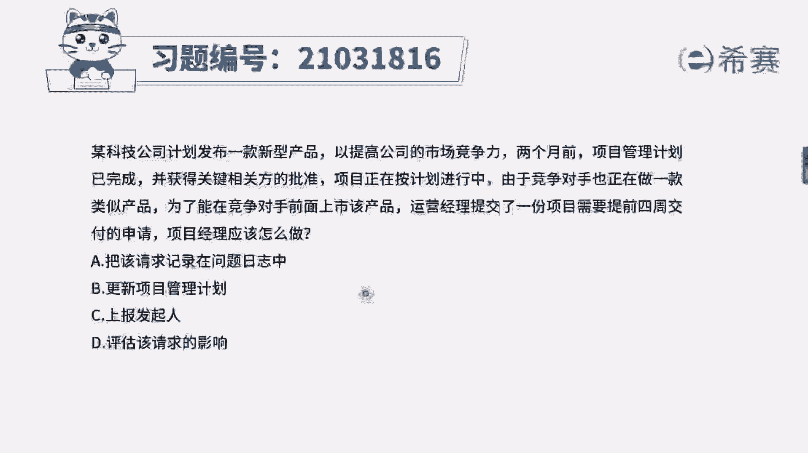
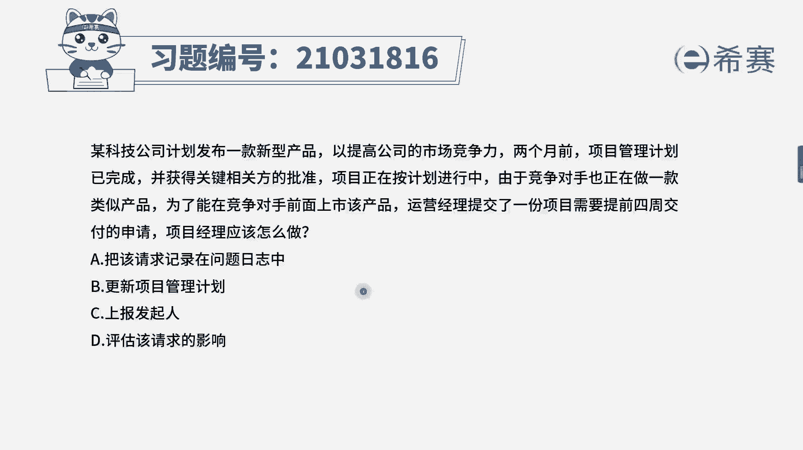
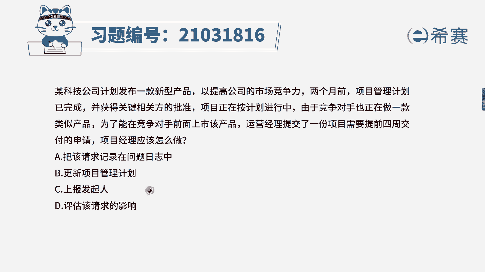
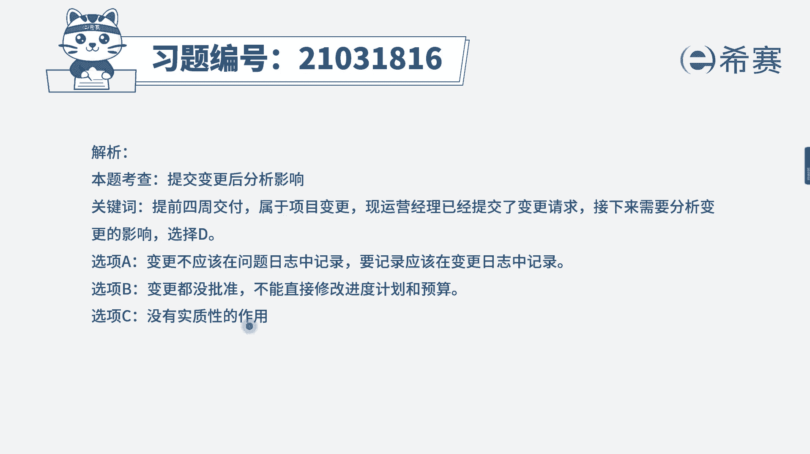
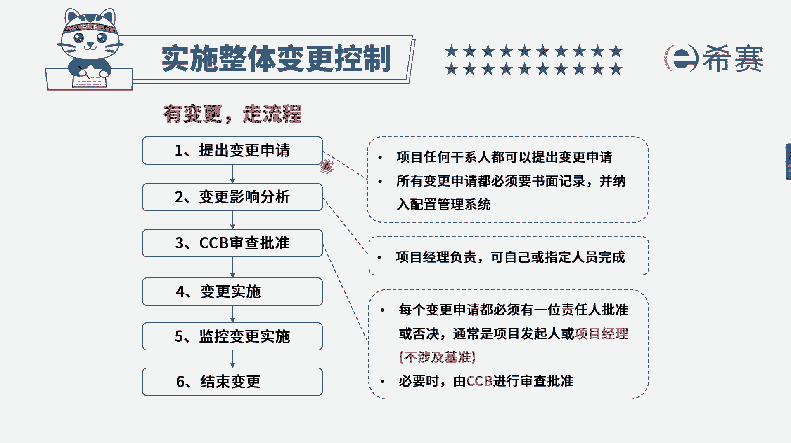

# 24年PMP模拟题-PMP付费模拟题100道免费视频新手教程-从零开始刷题 - P67：67 - 冬x溪 - BV1Fs4y137Ya

某科技公司计划发布一款新型产品，以提高公司的市场竞争力。

两个月前，项目管理计划已完成，并获得关键相关方的批准，项目正在按计划进行中，由于竞争对手也正在做一款类似产品，为了能在竞争对手前面上市，该产品运营经理提交了一份项目，需要提前四周交付的申请。

项目经理应该做什么，选项a把该请求记录在问题日志中，选项b更新项目管理计划，选项c上报发起人选项d，评估该请求的影响，现在是不是运营经理，也就是外部的相关方，他已经提交了一份变更请求。

我们说外部相关方先提交变更，再分析影响，所以下一步我们应该评估这个变更请求，它会带来什么样的影响，因此选择d选项，再来分析一下其他几个选项，a选项将该请求记录在问题日志中，注意这里并不是问题。

问题是指已经发生了的，对项目有负面影响的事件，这里并不是已经延期了或者如何，而是我们需要提前去交付产品，如果这个选项改成将变更记录在变更日志中，那么也是一个可选的选项，再来看b选项，更新项目管理计划。

现在才刚刚提交，变更，是不是涉及到了进度的基准，这个时候我们应该分析影响，提交给c c b批准后才能更新项目管理计划，所以说这个选项它不是项目经理可以直接做的，而是d选项后，如果批准了再做b选项。

最后c选项上报发起人，这是很多题目都会设置的一个干扰选项，只有当超出项目经理权限时，我们才选择上报，所以综合分析下来，现在是已经提交了变更请求，下一步应该分析影响选择d选项。

大家可以看一下文字解析。

本题考察的是实施整体变更控制流程，我们可以简单看一下，是先提交变更。

