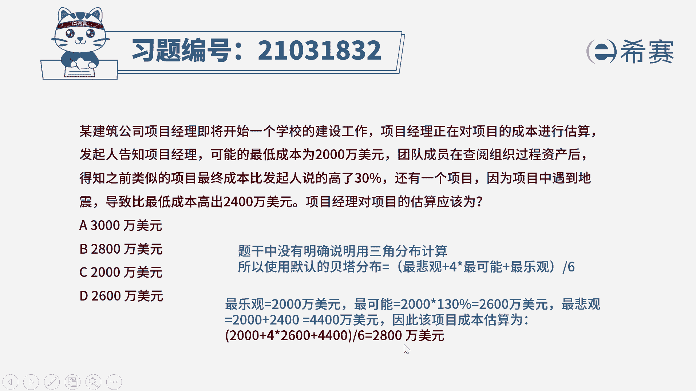
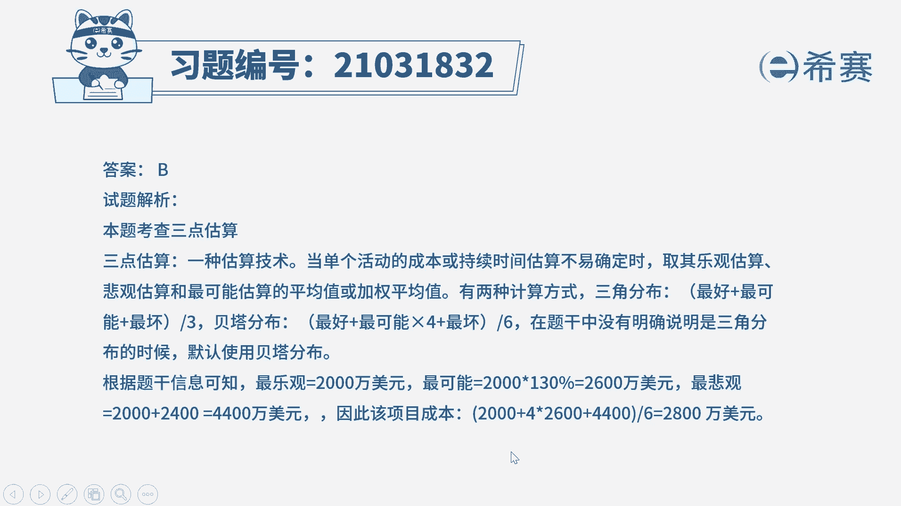
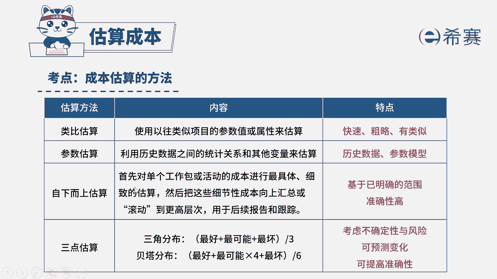

# 24年PMP模拟题-PMP付费模拟题100道免费视频新手教程-从零开始刷题 - P68：68 - 冬x溪 - BV1Fs4y137Ya

某建筑公司项目经理，即将开始一个学校的建设工作，项目经理正在对项目的成本进行估算，发起人告知，项目经理可能的最低成本为2000万美元，团队成员在查阅组织过程资产后，得知，之前类似的项目。

最终成本比发起人说的高了30%，还有一个项目因为在项目中遇到地震，导致比最低成本高出2400万美元，项目经理对项目的估算应该为，a选项3000万美元，b选项2800万美元，c选项2000万美元。

d选项2600万美元，读完题，我们先找到题干的关键词，题干是给了三个不同的数据，可能的最低成本为2000万美元，那么最低成本说明，我们可能用最少的钱完成项目，这是不是最乐观的情况，而团队成员说。

类似的项目，最终成本比发起人说的这个2000万美元，是不是高了30%，而高了30%，是不是就是2000x1+30%，是等于2600万美元的，最后一个数据是因为项目过程中遇到了困难，所以导致比最低成本。

也就是比2000万美元高出2400万美元，因此最悲观的情况也就是花最多钱的情况，一共是4400万美元，那么知道三个数据之后，我们应该使用哪种计算方法呢，三个数据我们会使用三点估算。

那么三点估算有两种方法，一个是三角分布，一个是贝塔分布，如果题干中没有明确说要用到三角分布，我们就默认使用贝塔分布，它的计算公式是最悲观加上四倍的，最可能加上最乐观除以六。

因此我们把数据代入可以得出项目，如果按照三点估算中贝塔分布来进行计算的话，它的成本估算为2000+4倍的2600，加上4400÷6，最后算出来是2800万美元，因此这一题选择b选项。

大家可以看一下文字解析。

本题考察的知识点是项目成本管理。

