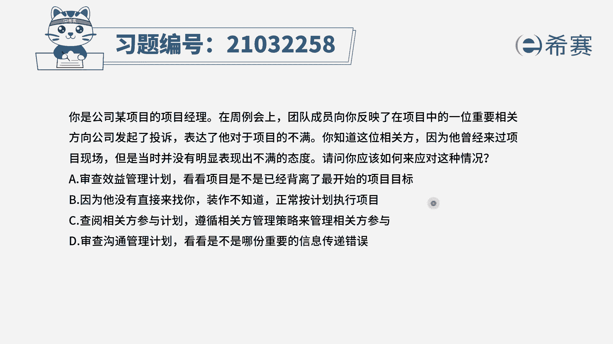

# 24年PMP模拟题-PMP付费模拟题100道免费视频新手教程-从零开始刷题 - P70：70 - 冬x溪 - BV1Fs4y137Ya

你是公司某项目的项目经理，在周例会上，团队成员向你反映了在项目中。

一位重要相关方向公司发起了投诉。

表达了他对于项目的不满，你知道这位相关方，因为他曾经来过项目现场。

但是当时并没有明显表现出不满的态度，请问您应该如何来应对这种情况，选项a审查效益管理计划，看看项目是不是已经背离了最开始的项目目标，选项b因为他没有直接来找你，装作不知道。

正常按计划执行选项c查阅相关方参与计划，遵循相关方管理策略来管理相关方参与选项d，审查沟通管理计划，看看是不是哪份重要信息传递错误好，我们先来看一下题干的关键词，现在是不是一位重要的相关方。

他对公司投诉表达他对项目的不满，这是典型的一个相关方参与程度不符合的，比如说我们希望他保持中立，希望他支持项目，但是他是对项目的态度是反对的，不支持的，这种情况下，我们应该如何去解决呢。

相关方参与程度不符合，我们肯定是要参照相关方参与计划，去进行相关方的管理，比如说找他开个会，或者使用不同的沟通策略或者其他方式，具体是什么方式，我们应该在相关方参与计划中是写明确了的。

所以看一下四个选项，首先我们可以排除b选项，因为他没有来直接找你，装作不知道，这种不作为的选项肯定不是考试中的优先选，再来看一下其他几个选项，其实d选项是有一点类似的，一个是查看效益管理计划。

看看项目是不是已经背离了目标，另外一个是审查沟通管理计划，看看是不是哪份信息传递错误，这两种情况都是我们自顾自的在猜测原因，对不对，相关方他不满意，可能的情况有非常多，有可能是目标的偏移。

有可能是成本出问题了，有可能是进度出问题了，有可能是沟通问题，那么这是因为我们不知道具体是哪种情况，所以要去管理相关方，我们可以遵循相关方参与计划中的管理策略，去促进相关方它有效的执行以及参与决策。

我们通过沟通跟他去开会，比如说跟他去私下的聊一聊，可以了解他的需求期望，从而处理问题，降低相关方对项目的抵制，因此c选项查阅相关方参与计划，遵循相关方的管理策略来管理相关方参与。

是四个选项中比较合适的选项，刚好题目问的也是你如何来应对这种情况，所以问的也是一个解决方案，因此c选项是正确的。

大家可以看一下文字解析。

