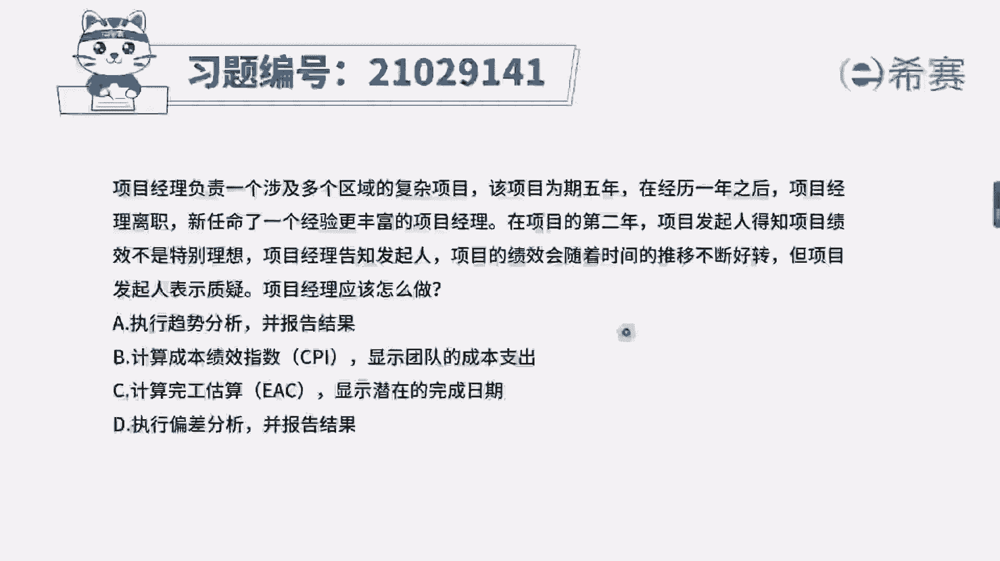
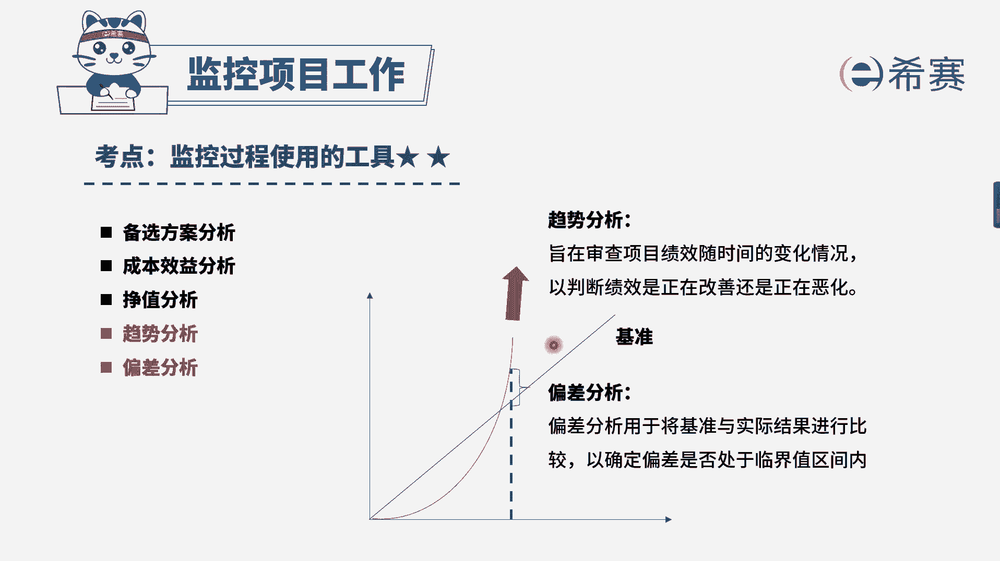

# 24年PMP模拟题-PMP付费模拟题100道免费视频新手教程-从零开始刷题 - P72：72 - 冬x溪 - BV1Fs4y137Ya

项目经理负责一个涉及多个区域的复杂项目，该项目为期5年。

在经历1年之后，项目经理离职，新任命了一个经验更丰富的项目经理，在项目的第2年，项目发起人得知项目技巧不是特别理想，项目经理告知发起人，项目的绩效会随着时间的推移不断好转，但项目发起人表示质疑。

项目经理应该怎么做，选项a执行趋势分析并报告结果，选项b计算成本绩效指数，cpi显示团队的成本支出，选项c计算完工估算ea c显示潜在的完成日期，选项d执行偏差分析并报告结果。

我们来看一下题干是说项目经理告诉发起人，项目的绩效会随着时间的推移不断好转，但是项目发起人表示质疑，我们应该怎么来证实这一点，可以使用什么工具呢，看一下选项是不是首先应该排除bd选项。

b选项是计算成本的绩效指数，他是把实际的情况和目标去进行比较，得出来的是实际成果，而并不是未来的一个情况，d选项，同样的偏差分析也是分析的实际情况，不是未来情况，这两个都是一样的，类似的。

最后剩下ac选项a选项，趋势分析，趋势分析本来的定义，就是针对未来情况去进行一个分析，因此a选项是可选的，c选项计算完工估算，大家可能觉得这个选项很对，因为完工估算它也是指完工的一个情况，是未来的情况。

但是c选项为什么错误，因为它前后逻辑是不对的，完工估算ec它是等于实际的成本花多少钱，再加上剩下我们需要的一个估算，它表示的是成本，并不是c选项，后半句说的可以显示潜在的完成日期。

所以c选项这句话是错误的，综合分析下来，我们应该选择a选项。

大家可以看一下文字解析部分。

本题考察的是趋势分析工具技术。

