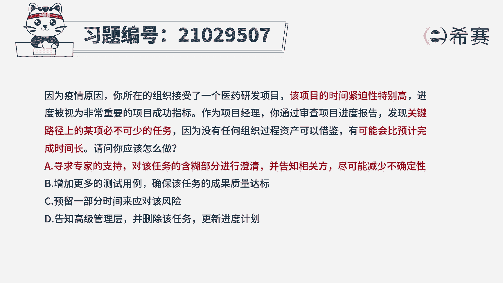

# 24年PMP模拟题-PMP付费模拟题100道免费视频新手教程-从零开始刷题 - P73：73 - 冬x溪 - BV1Fs4y137Ya

因为疫情原因。

你所在的组织接受了一个医药研发项目，该项目的时间紧迫性特别高。

进度被视为非常重要的项目成功指标。

作为项目经理，已通过审查项目进度报告，发现关键路径上的某项必不可少的任务，因为没有任何组织过程资产可以借鉴，有可能会比预计完成时间长，请问你应该怎么做，a寻求专家的支持，对该任务的含糊部分进行澄清。

并告知相关发尽可能减少不确定性，b增加更多的测试用例，确保该任务的成果质量指标，c预留一部分时间来应对该风险，d告知高级管理层，并删除该任务，更新进度计划好，读完题目，先来看一下问题。

项目经理应该怎么做，我们再回到题干，可以看到项目的时间紧迫性特别高，说明项目对进度要求很高，而项目经理在审查的时候发现，关键路径上的任务可能会比预计完成时间长，这个可能非常抢眼。

说明识别到了项目延期的危险，对于精度要求高的项目应该如何做呢，我们来看一下四个选项，选项a通过澄清信息，减少危险的可能性是可行的做法，针对以识别的风险进行处理，施加影响，尽量防止该风险发生。

作为被选项选项b增加更多的测试用例，可以确保质量，但是题干说的是进度属于无关项，选项c预留时间说明是接受了延期的风险，不能满足题干要求，选项d我们做题的时候需要把握一点。

一般上报高层的做法都不是最优的选项，秉持一个原则，项目经理要积极处理项目中遇到的问题，所以相比来说还是选项a最合适，我们在做题的时候，不需要去死记硬背，这种情况下我该怎么做。

而是要通过四个选项对比来选择，所以说pmp选的是最佳实践，常常有同学会问我，那个题为什么选这个选项，这个题又不选呢，其实是在当前情境下有更好的选项好了。

我们此题就先讲解到这里，大家可以自行参考一下相关的文字解析。

好通过此道题的讲解。

我们知道本题考察的知识点。