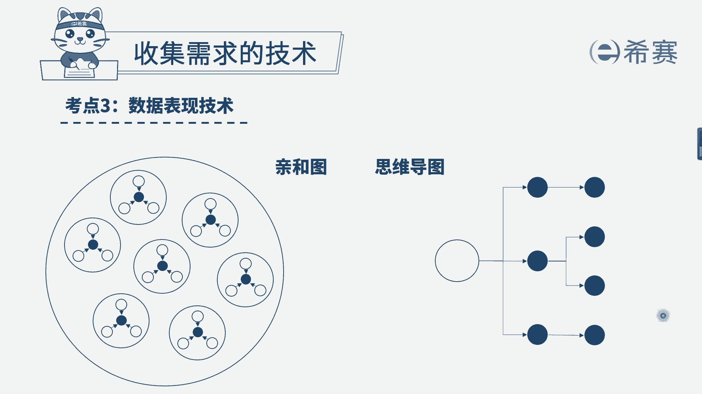

# 24年PMP模拟题-PMP付费模拟题100道免费视频新手教程-从零开始刷题 - P74：74 - 冬x溪 - BV1Fs4y137Ya

项目经理正在负责一个公司内部项目，项目涉及到的部门，很多项目经理得知，在项目启动前，公司内部组织结构刚刚重组完成，项目经理对这些涉及到的部门之间的关系，还不了解，项目经理应该做什么来确定他们之间的关系。

选项a完成相关方思维导图选项b，审查资源分解结构选项c，审查相关方参与度，评估举证选项d咨询高级管理层，我们先来看一下题干的关键词，现在是一个内部项目，而公司内部组织结构刚刚重组。

项目经理对项目涉及到的部门之间的关系，不了解，提纲问的是应该做什么来确认他们之间的关系，我们来看一下几个选项，a选项完成相关方思维导图，大家可能奇怪诶，什么是相关方思维导图啊，其实就是咱们说的思维导图。

只是说它的对象是相关方，根据咱们书上的定义，相关方思维导图，它适用于对相关方信息相互关系，以及他们的组织关系进行一个可视化的整理，是不是刚好是完全符合我们的提议的，再来看b选项，审查资源分解结构。

首先这个对象就是错的，资源资源是指的项目内的资源，不管是人力资源还是物力资源，都是指的项目内，它是对于项目内资源的一个分类，现在咱们是对项目外的部门之间的关系不了解，所以b选项他对象就错了。

c选项审查相关方参与度，评估举证，这个举证他是评估相关方的参与程度，比如说某个相关方它是不支持项目的，它是中立的，它是支持型的，它是领导型的等等，这个也是不符合题干的，最后d选项咨询高级管理层。

其实这个选项本身不能说它是错误的，只是说它不太合适，一般来说我们在做题的时候，一定要体现项目经理的一个积极主动性，因此相对来说我们会选择更合适的a选项，完成相关方思维导图。

大家可以简单看一下思维导图的一个表现形式。

