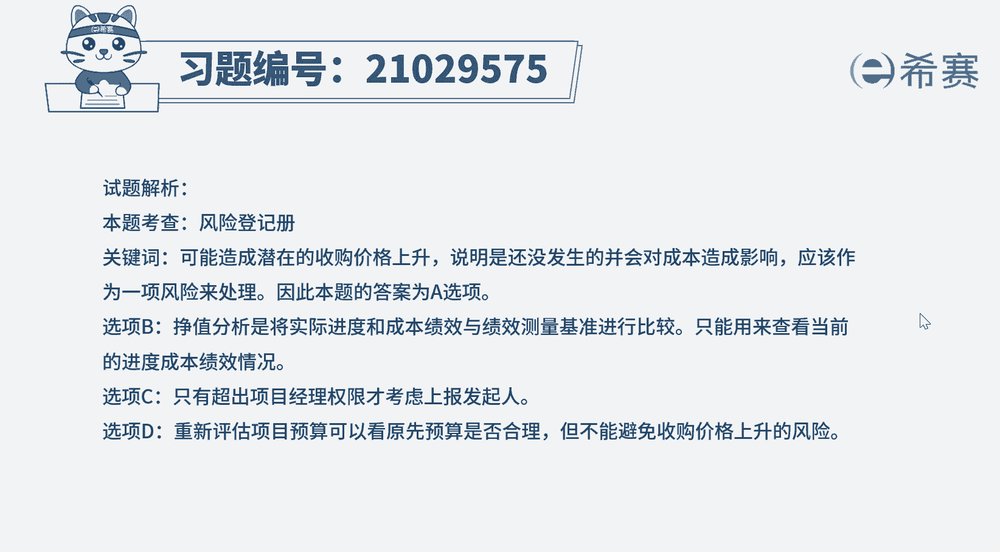

# 24年PMP模拟题-PMP付费模拟题100道免费视频新手教程-从零开始刷题 - P77：77 - 冬x溪 - BV1Fs4y137Ya

在一项农副产品收购的项目中。

该项目根据农副产品的生长周期，被分成三个阶段开展，在前面两个阶段的收购过程中，一直遵循统一的收购价格，由于受竞争对手的影响，预计在第三个阶段，收购的农副产品的产量大幅减少。

而这可能会造成潜在的收购价格上升，项目经理应该如何避免这种情况，将潜在的收购价格上升添加为一项新的风险，执行增值分析c上报发起人，d重新评估项目预算好，读完题目先来看一下问题，应该如何避免这种情况。

再回到题干，可以看到，因为农副产品的产量大幅减少，可能会造成潜在的收购价格上升，我们可以看到这个可能非常抢眼，根据这个可能我们就可以快速判断，这是识别到了风险，那么对于新识别到的风险。

首先应该更新风险登记册，然后再进行分析规划风险应对，所以选项a为最佳选项，对于风险管理，我们一定要熟练知道风险管理的顺序是，第一步识别风险，第二步风险定性分析，第三步风险定量分析。

但是不一定所有风险都有定量分析哦，然后第四步规划飞行应对，最后是风险发生了，就实时分析应对，而识别风险，分析风险规划，风险应对发生风险等，都是需要更新风险登记册的，所以下一步都是要查看或更新风险登记册。

再来看一下选项b，增值分析是将实际与基准进行比较，只能查看当前进度和成本的绩效情况，不能避免收购价格上升的风险，选项c正常情况下，项目经理都需要积极解决问题，不用上报发起人，除非超出自己权限了。

才会上报选项d重新估算，只可以看到原先预算是否合理，但不能避免收购价格上升的风险。

好了我们此道题就先讲解到这里，大家可以自行参考一下相关的文字解析。

整个题目讲解下来，我们可以知道，本题考察的知识点就是项目风险管理，识别风险和规划。

