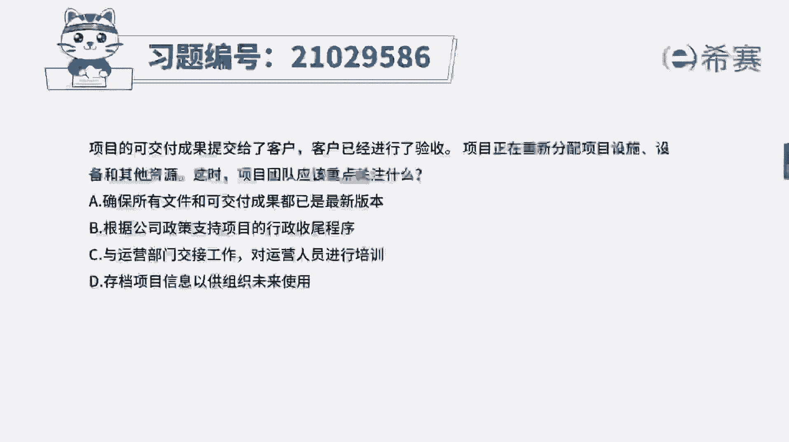
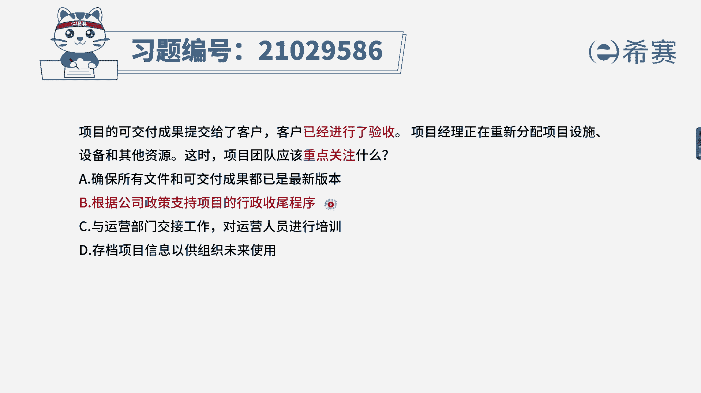
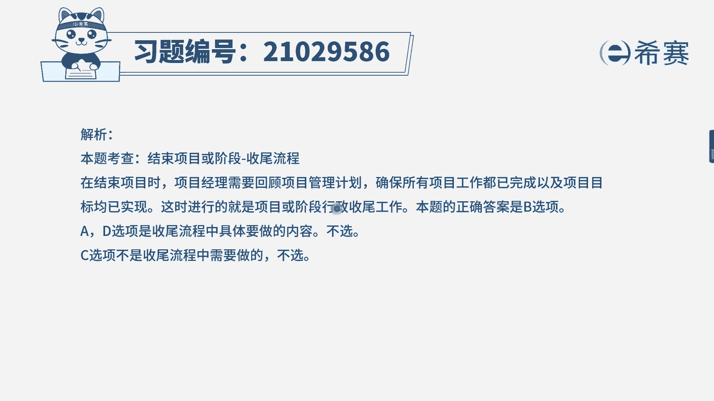
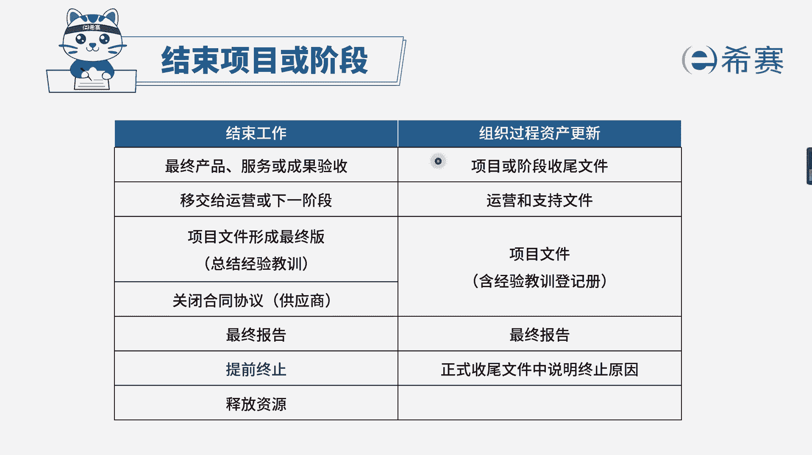

# 24年PMP模拟题-PMP付费模拟题100道免费视频新手教程-从零开始刷题 - P78：78 - 冬x溪 - BV1Fs4y137Ya

项目的可交付成果提交给了客户，客户已经进行了验收，项目经理正在重新分配项目设施，设备和其他资源，这时项目团队应该重点关注什么，选项a，确保所有文件和可交付成果都已经是最新版本。

选项b根据公司政策支持项目的行政收尾程序，选项c与运营部门交接工作，对运营人员进行培训，选项d存档项目信息一共组织未来使用，我们先来看一下时间节点，是已经进行了验收，而项目经理正在重新分配项目设施。

设备和其他资源，大家可能不太理解这句话，他的意思就是说哎，比如说我们把一些设备材料把它分配出去，释放出去，甚至说部分的资源把它释放出去，是这个意思，这句话是咱们官方教材的一个原话，大家要有一定的印象。

相当于就说项目经理现在正在是在收尾，收尾的时候，我们要重点关注什么呢，看一下几个选项，a选项确定文件可交付成果是最新版本，以及d选项存档项目信息以供未来使用，这些都是收尾流程中某一个具体的步骤。

而b选项是直接根据公司的政策，支持项目的行政收尾程序，行政收尾就是指的收尾，它是包含d选项的，因此b选项是最全面的，是本题的正确答案，c选项错在哪里呢，前半句是没有问题的。

我们是要与运营部门进行一个交接，但是后半句对运营人员进行一个培训，它不是咱们项目的一个内容。

因此c选项是错误的，大家可以看一下文字解析。

