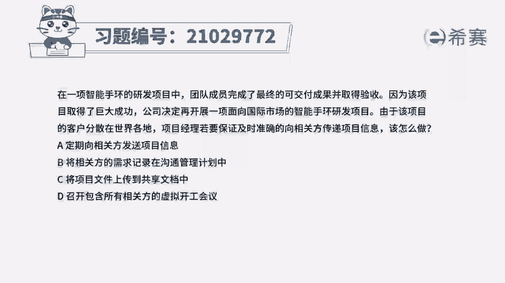
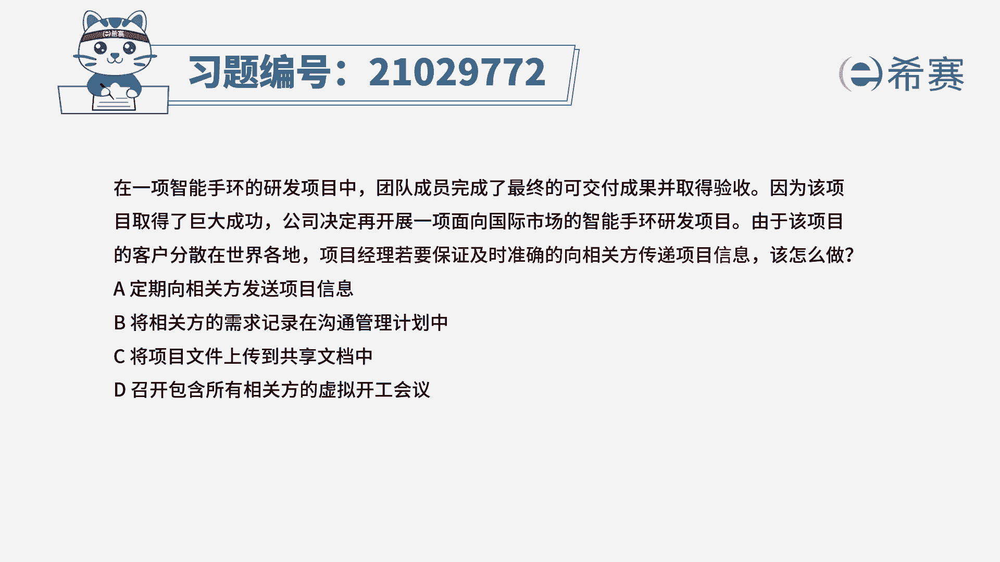
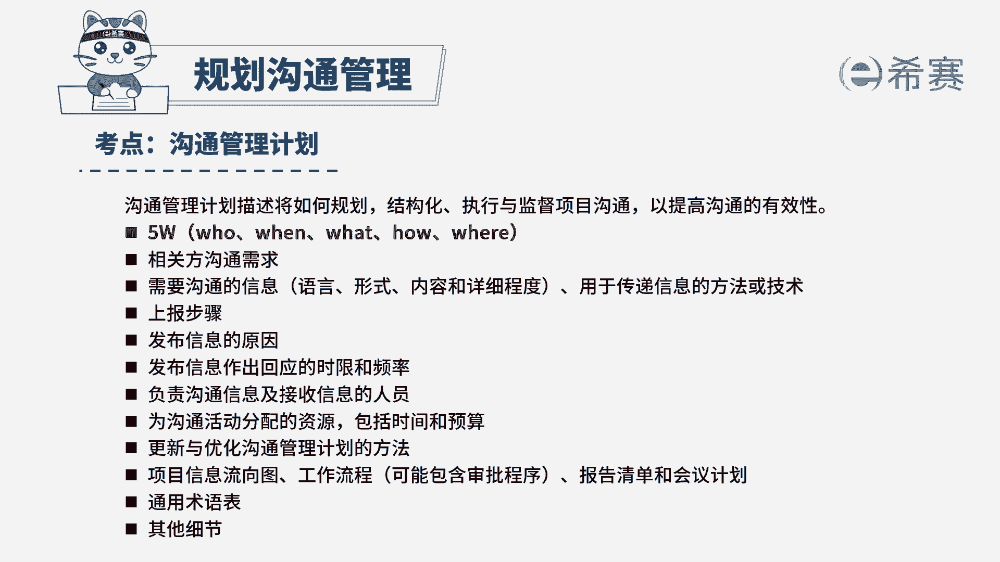

# 24年PMP模拟题-PMP付费模拟题100道免费视频新手教程-从零开始刷题 - P84：84 - 冬x溪 - BV1Fs4y137Ya

在一项智能手环的研发项目中，团队成员完成了最终的可交付成果并取得验收，因为该项目取得了巨大成功，公司决定再开展一项，面向国际市场的智能手环研发项目，由于该项目的客户分散在世界各地，项目经理。

若要保证及时准确地向相关方传递项目信息，该怎么做，定期向相关方发送项目信息，b将相关方的需求记录在沟通管理计划中，c将项目文件上传到共享文档中，d召开包含所有相关方的虚拟开工会议，读完题目。

我们可以找到题干中的关键句，项目经理，若要保证及时准确地向相关方传递项目信息，应该怎么做，也就是说要确保信息正确的传递，那就要遵循沟通管理计划，按照沟通管理计划中记录的。

各个相关方的沟通需求进行及时准确的沟通，所以要先将相关方的沟通需求，记录到沟通管理计划中，所以选项中b选项是可选的，我们再看其他选项，首先看a选项，定期发送项目信息，并不能确保信息传递的及时性。

再看c选项，虽然上传到共享文档，但是需要相关方主动去获取信息，所以不能确保所有相关方都会及时查看到，我们最后看d选项，d选项说的是召开虚拟开个会议，开工会议的目的是传达项目目标。

阐明每个相关方的角色和职责，获取团队对项目的承诺，但是这里是确保信息正确传递，及时传递的问题，所以d选项开工会议只能达到开工会议的目的，不能确保信息正确传递，所以d也不选，因此本题最佳的答案就是b选项。

本题考察的内容是项目沟通管理中规划。

