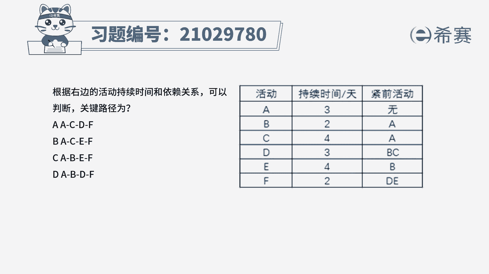
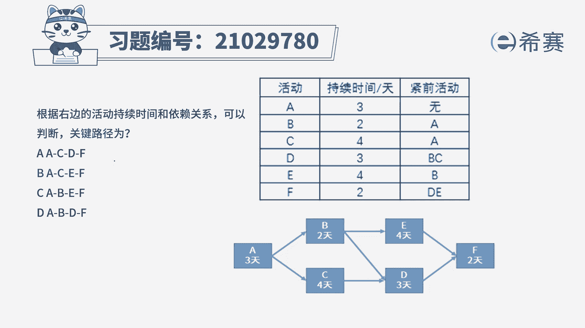
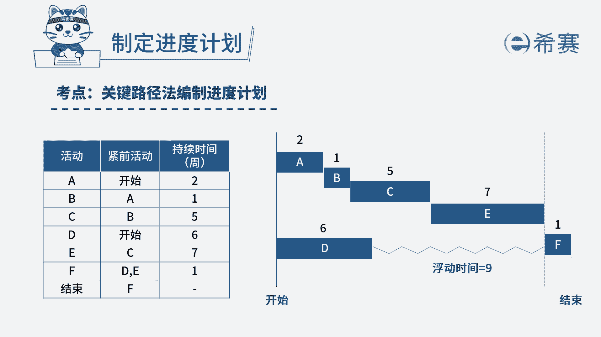
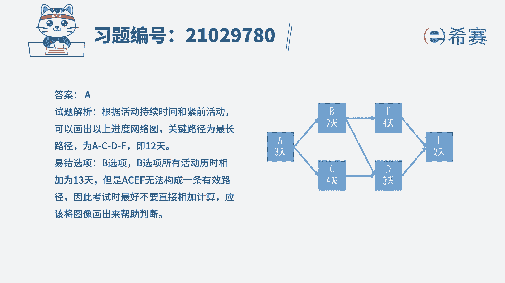

# 24年PMP模拟题-PMP付费模拟题100道免费视频新手教程-从零开始刷题 - P85：85 - 冬x溪 - BV1Fs4y137Ya

根据右边的活动持续时间和依赖关系，可以判断关键路径为a a c d f b a c e f，c a b e f a b d f，读完题目，我们可以知道这道题是在考察关键路径。

所以我们先根据图表信息来画出进度，网络图，我们可以看到下面的网络图总共是有三条路径，分别是a b e f a b d f，还有a c d f，所以我们分别算出三条路径的总耗时。

首先第一条路径a b e f的总耗时，可以算出来是11天，第二条路径a b d f的总耗时，可以算出来是十天，最后一条ac df总耗时是12天，所以这里问关键路径是什么。

关键路径就是总耗时最长的那条路径，就是12天，那对应的就是a c d f这条，所以a选项正确，所以本题的答案就是a选项。

本题考察的知识点是项目进度管理中。

