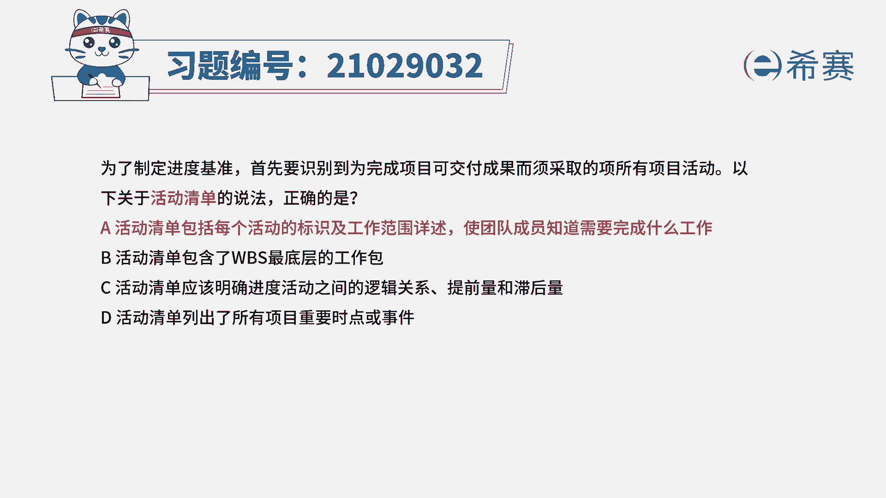

# 24年PMP模拟题-PMP付费模拟题100道免费视频新手教程-从零开始刷题 - P86：86 - 冬x溪 - BV1Fs4y137Ya

为了制定进度基准，首先要识别到未完成项目可交付成果，而需采取的所有项目活动，以下关于活动清单的说法正确的是，a活动清单包括每个活动的标识及工作范围，详述，使团队成员知道需要完成什么工作。

b活动清单包含了w bs最底层的工作包，c活动清单应该明确进度活动之间的逻辑关系，提前量和滞后量，d活动清单列出了所有项目重要时点或视线，d活动清单列出了所有项目重要时点或事件，读完题目。

我们可以找到题干中的关键句，题干说的是关于活动清单的说法，正确的是什么，所以这道题考察的就是活动清单的概念，活动清单包含项目所需的进度，活动以及每个活动工作范围的详细描述，使团队成员能够知道。

需要完成什么工作，所以a选项就是活动清单的定义，所以a选项正确，我们再看其他选项，先看b选项，定义活动，可以将w bs最底层的工作包继续分解，而在定义活动之后才能去得到活动清单，所以这里说活动清单包含。

所以这里活动清单包含了工作包的，这个说法是错误的，我们再看c选项，c选项属于活动属性的内容，不是活动清单的内容，c不选，最后看d选项，d选项是属于里程碑清单的内容，也不选，因此本题最佳的答案就是a选项。

本题考察的知识点是项目进度管理中。

