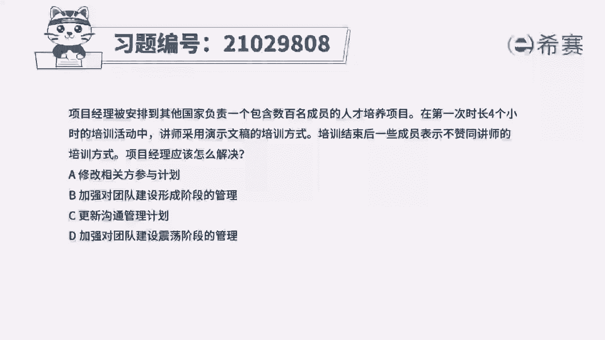
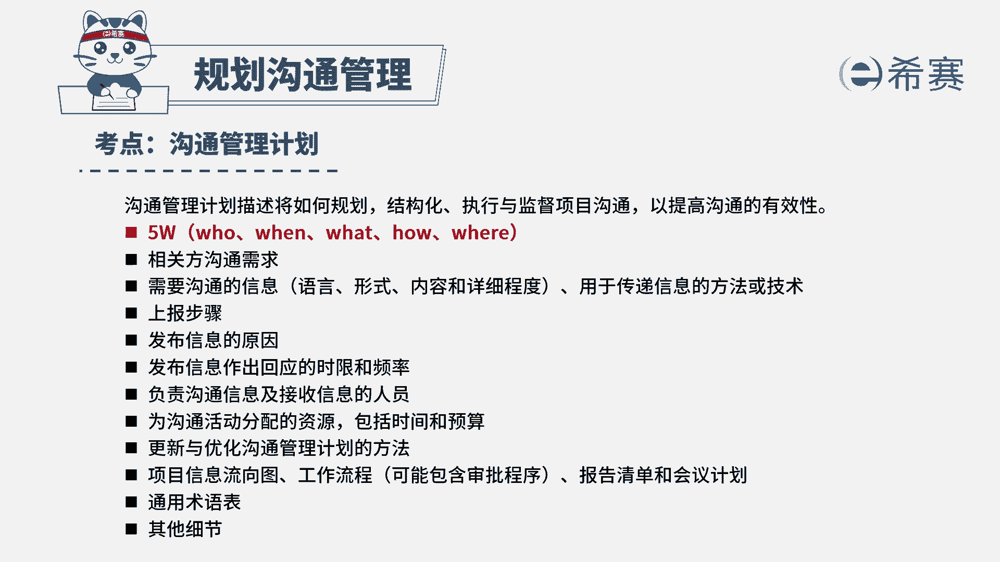
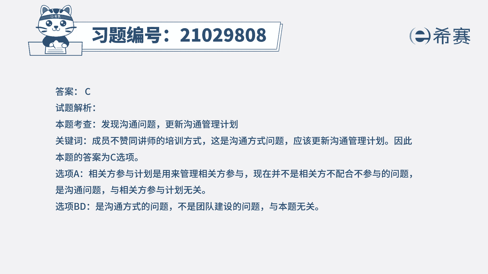

# 24年PMP模拟题-PMP付费模拟题100道免费视频新手教程-从零开始刷题 - P87：87 - 冬x溪 - BV1Fs4y137Ya

项目经理被安排到其他国家，负责一个包含数百名成员的人才培养项目，在第一次时长四个小时的培训活动中，讲师采用演示文稿的培训方式，培训结束后，一些成员表示不赞同讲师的培训方式，项目经理应该怎么解决。

a修改相关方参与计划，b加强对团队建设形成阶段的管理，c更新沟通管理计划，d加强对团队建设震荡阶段的管理，读完题目，我们可以找到题干中的关键句，在培训结束后，一些成员表示不赞同讲师的培训方式，也就是说。

讲师采用的演示文稿的培训方式，并不是某些相关方想要的这种沟通方式，现在问项目经理应该怎么解决，那就应该将相关方新的沟通需求，更新到沟通管理计划中，然后再按照正确的沟通方式进行培训，所以c选项是符合的。

我们再看其他选项，首先看a选项，相关方参与计划是用来管理相关方参与的，题干并没有指出相关方参与度有问题，这里只是沟通的问题，所以应该更新沟通管理计划，a不选，再看bd选项。

b选项说的是加强对形成阶段的管理，d选项说的是震荡阶段，形成阶段是指团队成员刚开始相互认识，团队成员倾向于相互独立，不一定开诚布公，而震荡阶段则是指，团队间经常出现不同意反对的意见，发生冲突等等。

但是这里涉及的只是团队成员与讲师之间的，就培训方式的问题发生了沟通问题，不是团队成员与团队成员之间的问题，所以与团队建设是没有关系的，这里是需要从根源解决沟通层面的问题，所以bd都不选。

因此本题的正确答案就是c选项。

本题考察的内容是项目沟通管理中规划。

