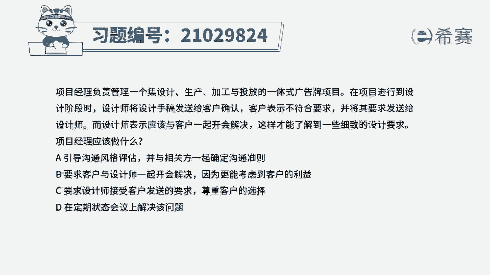
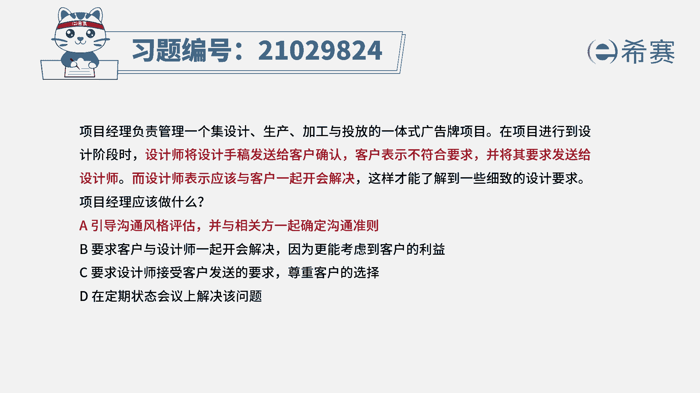
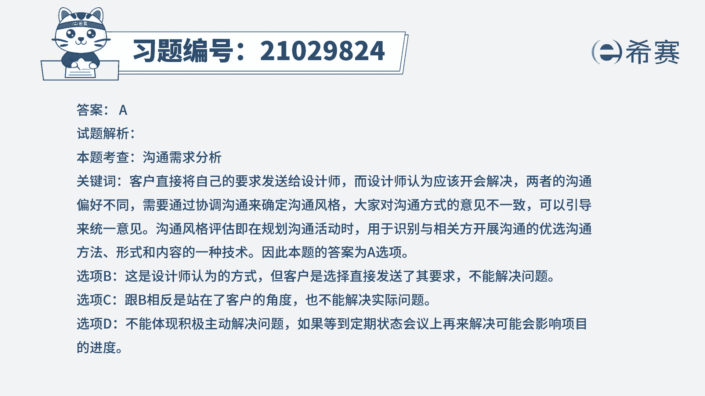

# 24年PMP模拟题-PMP付费模拟题100道免费视频新手教程-从零开始刷题 - P88：88 - 冬x溪 - BV1Fs4y137Ya

项目经理负责管理一个及设计，生产加工与投放的一体式广告牌项目，在项目进行到设计阶段时，设计师将设计手稿发送给客户，确认客户表示不符合要求，并将其要求发送给设计师，而设计师表示应该与客户一起开会解决。

这样才能了解到一些细致的设计要求，项目经理应该做什么，a引导沟通风格评估，并与相关方一起确定沟通准则，b要求客户与设计师一起开会解决，因为更能考虑到客户的利益，c要求设计师接受客户发送的要求。

尊重客户的选择，d在定期状态会议上解决该问题，读完题目，我们可以找到题干中的关键句，题干说设计师将设计手稿发送给客户，确认客户表示不符合要求，并将其发送给设计师，而设计师表示应该与客户开会解决。

也就是说，客户是要采取发送信息的方式与设计师沟通，但设计师认为应该开会沟通，说明两者的沟通偏好并不相同，题干问，项目经理应该做什么，那就应该确定好一种沟通方式，达成一致的意见。

再解决设计手稿不符合要求的问题，所以可以借助沟通风格评估，沟通风格评估就是在规划沟通活动时，用于评估沟通风格并识别沟通偏好的沟通方法，形式和内容的一种技术，所以a选项是可选的，我们再来看其他选项。

先看b选项，开会仅仅是设计师自己想要的沟通方式，而不是客户想要的，所以并不能解决问题，再看c选项，c选项与b选项相反，直接发送要求是客户想要的沟通形式，但不是设计师想要的，所以c也不合适，最后看d选项。

在定期会议上才去解决这个问题，并不是一种积极的方式，而且很可能因为这个问题影响项目的进度，所以跌也不合适，因此我们本题最佳的答案就是a选项。

本题考察的知识点是项目沟通管理中规划。

