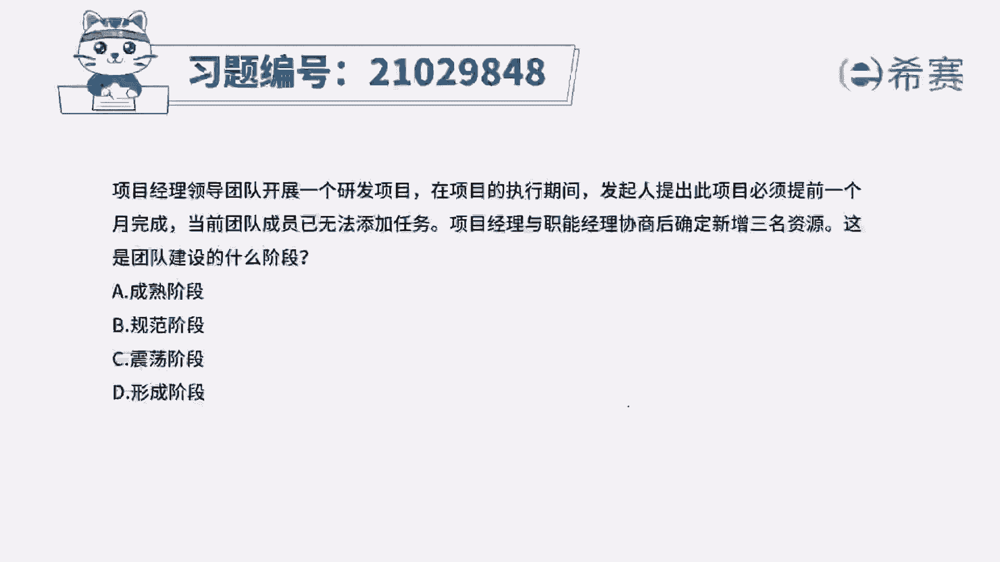
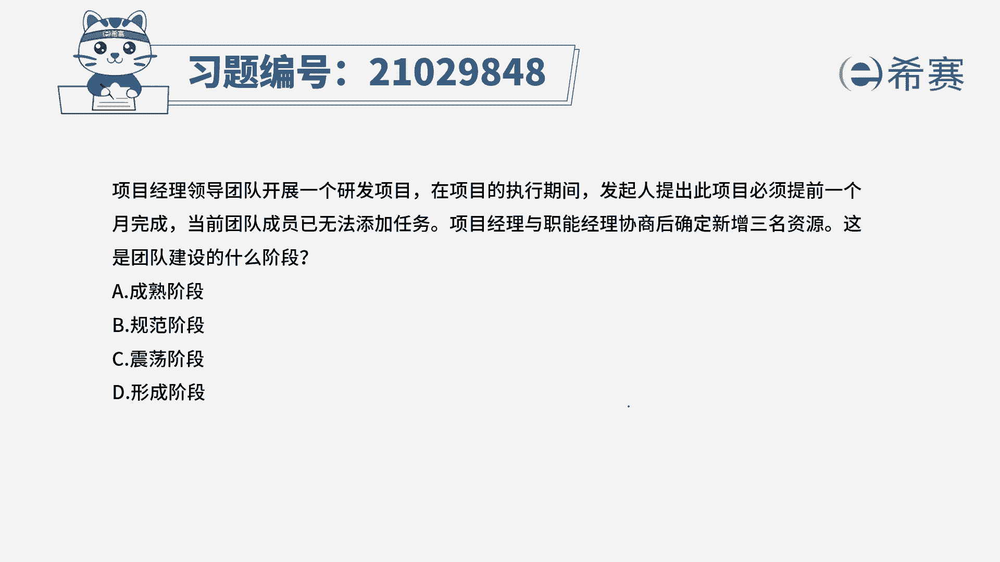
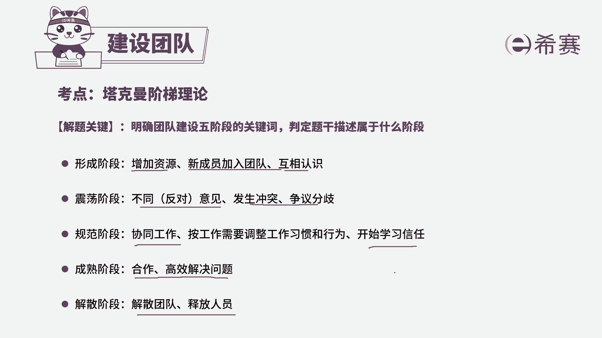
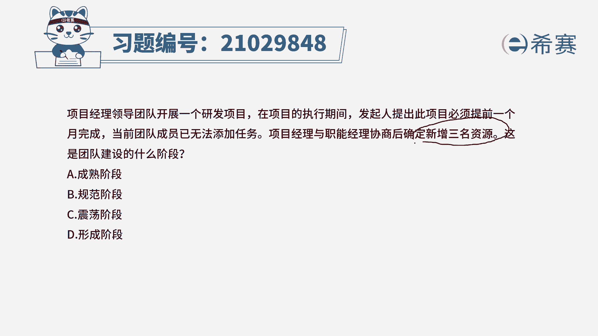
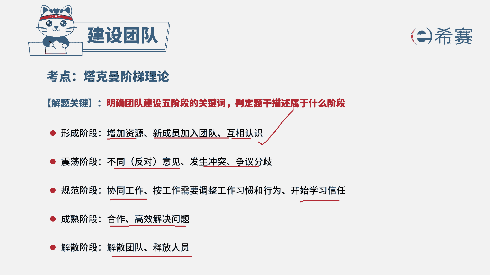
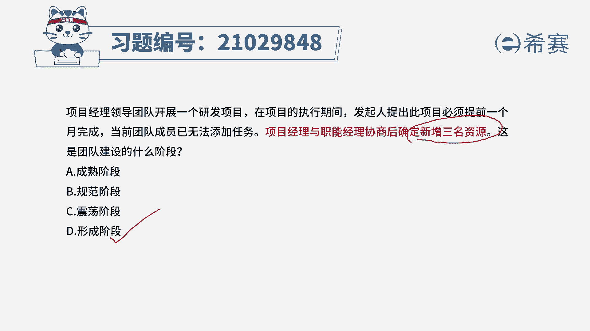
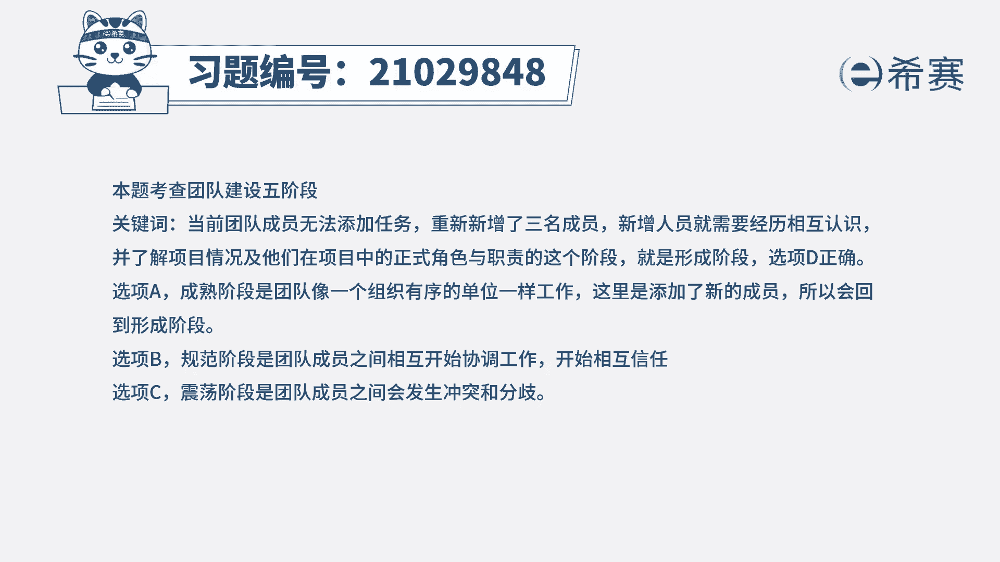

# 24年PMP模拟题-PMP付费模拟题100道免费视频新手教程-从零开始刷题 - P91：91 - 冬x溪 - BV1Fs4y137Ya

项目经理领导团队开展一个研发项目，在项目的执行期间发钱，提出此项目必须提前一个月完成，当前团队成员已无法添加任务，项目经理与职能经理协商后，确定新增三名资源，这是团队建设的什么阶段，a成熟阶段。

b规范阶段，c震荡阶段，d形成阶段，读完题目和选项，我们可以知道，这道题是在考察团队建设的五个阶段，所以我们做题之前，先回顾一下团队建设中的五个阶段。

先看一下行程阶段，形成阶段就是增加资源，有新成员加入团队，团队之间互相认识，政党阶段是团队间产生不同的意见，发生冲突，分歧，规范阶段则是团队间可以协同工作，开始学会相互信任。

而成熟阶段团队间是可以合作高效的解决问题，最后到解散阶段，解散阶段就是解散团队，释放团队人员，所以我们知道了这五个阶段的特点，我们再来看题目。

先看题目的关键句，题干说确定新增三名资源。

新增资源，根据我们刚刚讲过的知识点，就是第一个形成阶段有新成员加入团队。

所以应该选择形成阶段。

