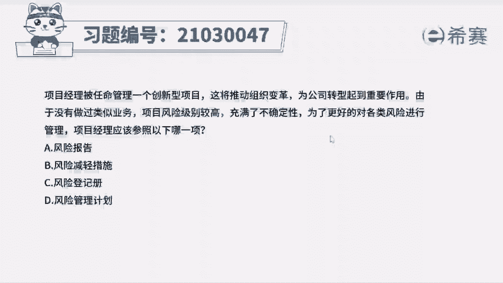
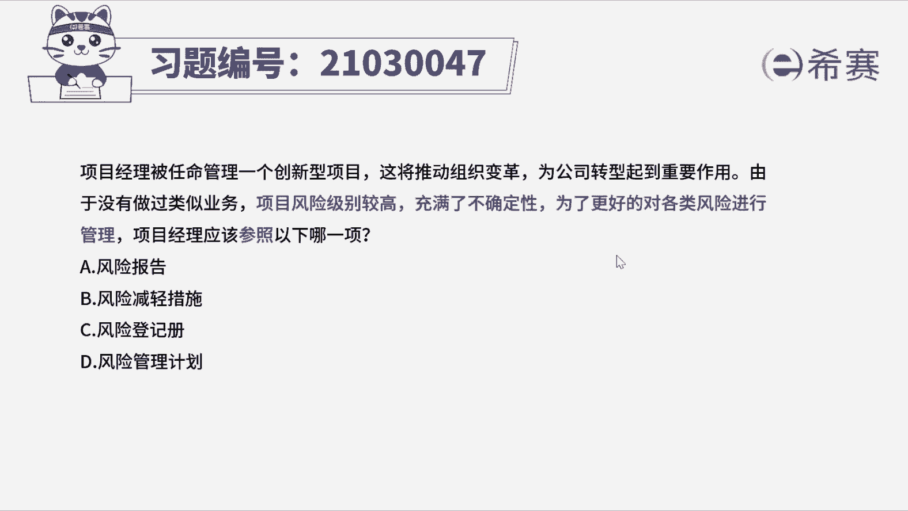
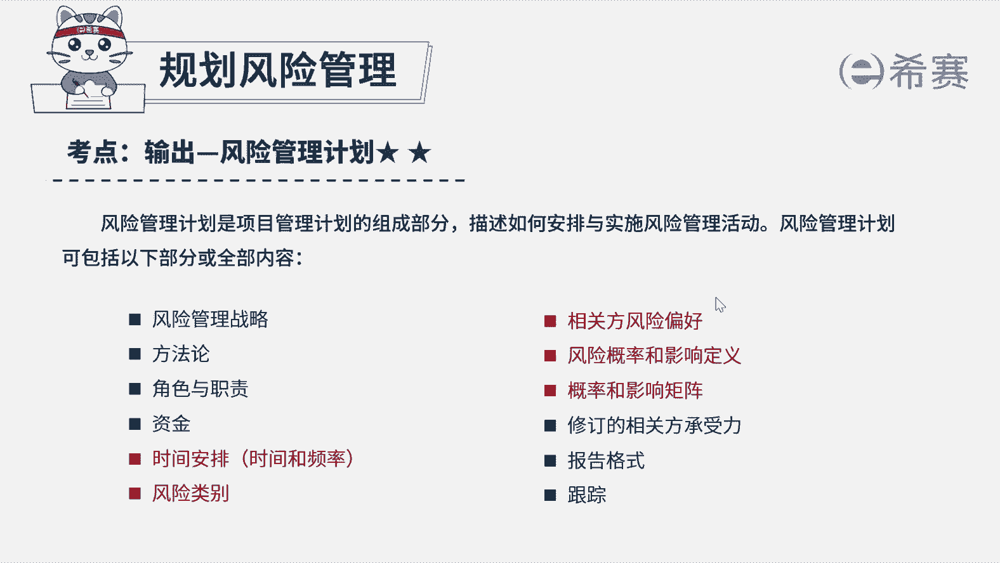
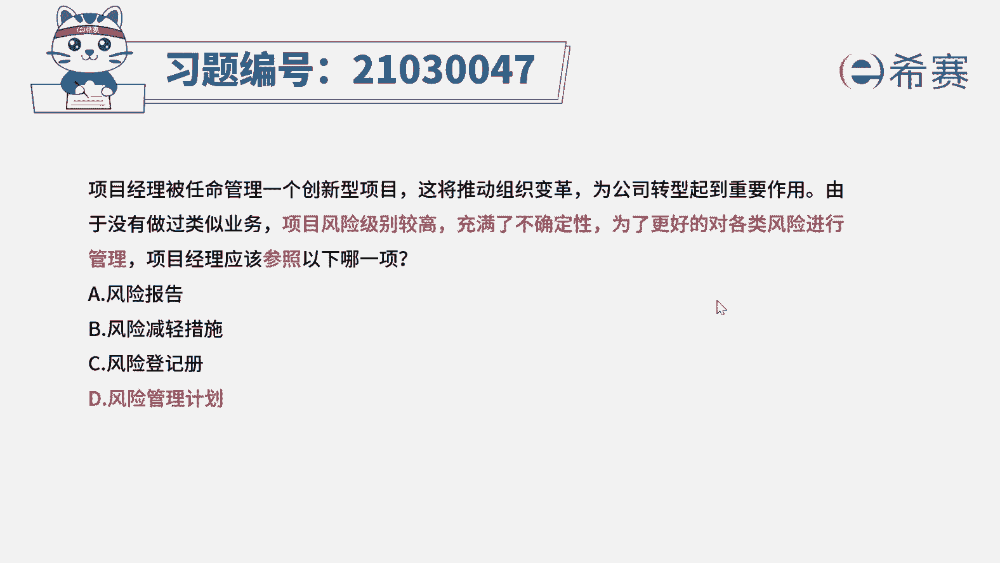

# 24年PMP模拟题-PMP付费模拟题100道免费视频新手教程-从零开始刷题 - P92：92 - 冬x溪 - BV1Fs4y137Ya

项目经理被任命管理一个创新型项目。

这将推动组织变革，为公司转型起到重要作用，由于没有做过类似项目，项目风险级别较高，充满了不确定性，为了更好地对各类风险进行管理，项目经理应该参照一下哪一项，a风险报告b风险减轻措施。

c风险登记册d飞行管理计划好，读完题目，我们先来看一下问题，项目经理应该参考什么，再回到题干，可以看到项目的风险级别高，要对各类风险进行管理啊，参考什么文件好，分析完题干中的关键词。

我们可以知道考察的就是风险管理计划的作用。

好风险管理计划在课上老师也有讲过，是风险管理的指南性文件，包含了一些风险管理的方法论，实时风险管理的频率。

报告格式，如何跟踪风险等等，好那这个题强调的是如何管理风险，要参考的文件，优先选择风险管理计划来进行指导，其他三个选项都是风险管理过程中产生的文件，比如风险报告是识别风险之后，汇总整体风险情况的。

风险减轻措施是规划风险应对的一种可能情况，风险登记册是识别风险之后，记录风险的具体信息的好，这个题还是不难的，主要是看清楚问题好啦。

我们这道题就先讲解到这里。