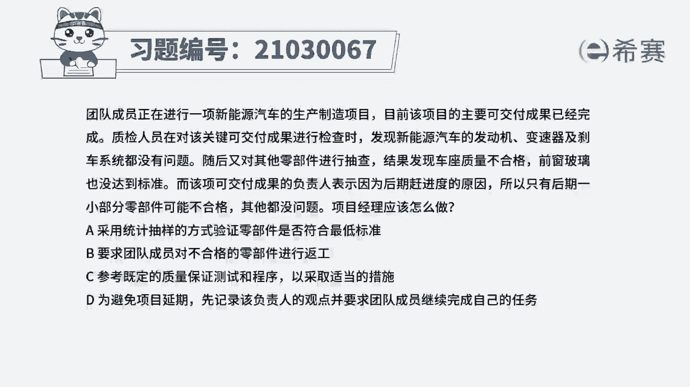
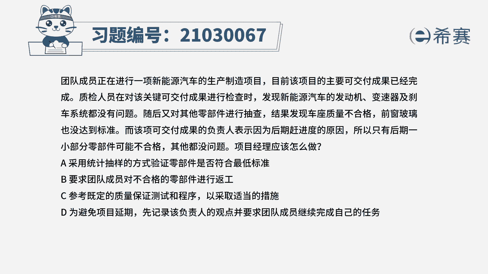
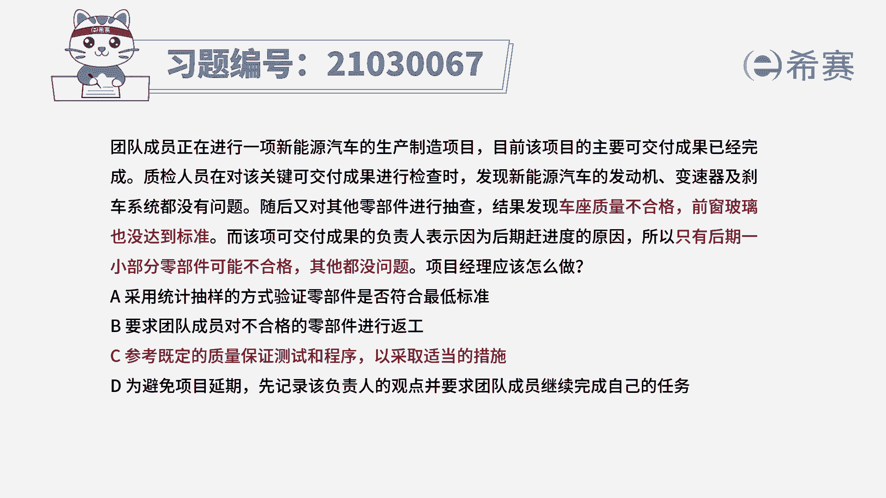
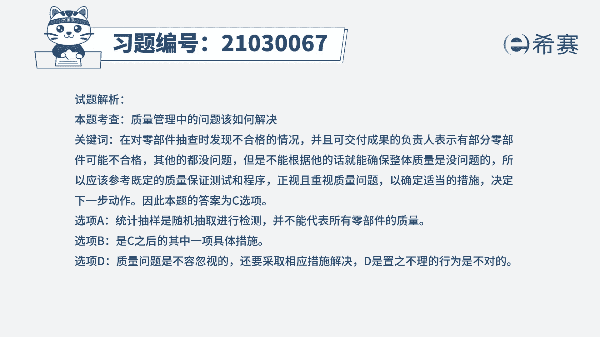
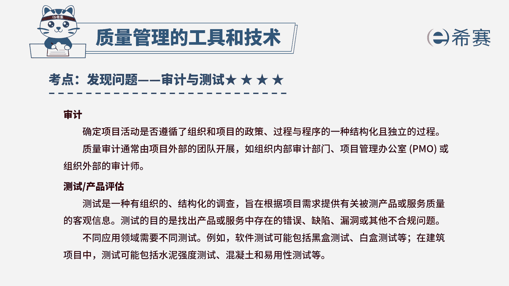

# 24年PMP模拟题-PMP付费模拟题100道免费视频新手教程-从零开始刷题 - P95：95 - 冬x溪 - BV1Fs4y137Ya

团队成员，正在进行一项新能源汽车的生产制造项目。

目前该项目的主要可交付成果已经完成，质检人员在对该关键可交付成果进行检查时。

发现新能源汽车的发动机。

变速器及刹车系统都没有问题，随后又对其他零部件进行检查，结果发现车座质量不合格，前窗玻璃也没达到标准，而该项可交付成果的负责人表示，因为后期改进度的原因，所以只有后期一小部分零件可能不合格。

其他都没问题，项目经理应该怎么做，a采用统计抽样的方式，验证零部件是否符合最低标准，b要求团队成员对不合格的零部件进行反攻，c参考既定的质量保证测试和程序，以采取适当的措施，d为避免项目延期。

先记录该负责人的观点，并要求团队成员继续完成自己的任务，这个题目它比较长，相当于做了一篇小的阅读理解，但是我们还是回头来找一下这道题目，它的关键词，质检人员，他抽查的时候。

发现汽车的他几个组件没有达到标准，但是负责人他是表示，只有后期的一小部分零件可能不合格，其他的都没有问题，问项目经理应该怎么做，现在我们是不是出现了质量问题，出现质量问题，我们就是要引起重视。

那负责人他是表示其他的地方都没有问题，我们不能够直接依据他的话，就确保整个产品它的质量是没有问题的，我们应该是要严格按照质量管理计划当中，相关的规定来决定，应该是采取什么样的措施，下一步又应该怎么去做。

所以这道题最佳选项是c选项，我们再来看一下其他三个选项，a选项采用统计抽样的方式，验证零部件是否符合最低标准，现在它采用的是统计抽样的方式，那如果我们要是抽样的全都是合格的。

而正好不合格的全部都没有抽到，所以这种情况它并不能够代表所有的零部件，它的一个质量情况，所以a选项排除，在看到b选项，要求团队成员对不合格的零部件进行反攻，b选项它现在是直接对于一些不合格的零部件。

就直接进行反攻了，我们应该是在参考的质量管理计划中，一些相关的规定之后，再来确定下一步实施的具体措施，所以首先应该是要先去审查一下相关的规定，才能够去确定下一步的行动是什么，所以b选项不能直接行动。

所以b排除，最后我们再来看一下d选项，为避免项目延期，先记录该负责人的观点，并要求团队成员继续完成自己的任务，现在我们这个题目它是出现了什么问题，质量问题，质量问题，这是一个非常严重的问题。

我们不能够忽视这种质量问题，d选项它其实采取了相当于是一种回避的态度，那出现了质量问题，我们就应该积极的去解决问题，所以d选项我们可以直接排除，所以这道题最佳选项就是c选项。

这是这道题的文字解析，有需要的同学可以暂停看一下。

