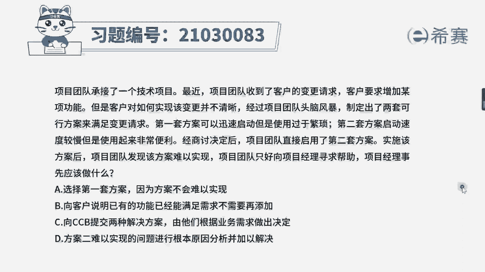
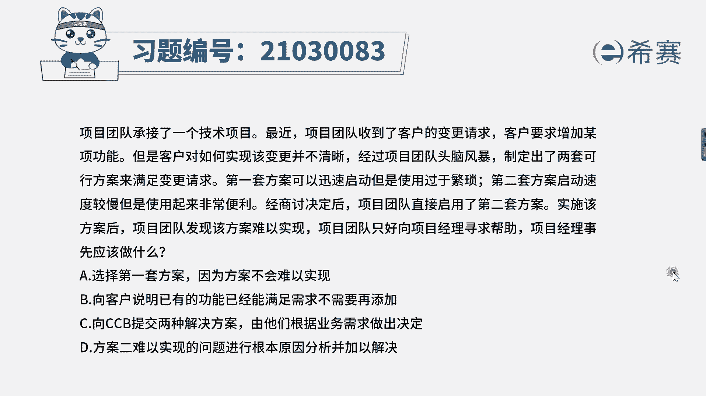
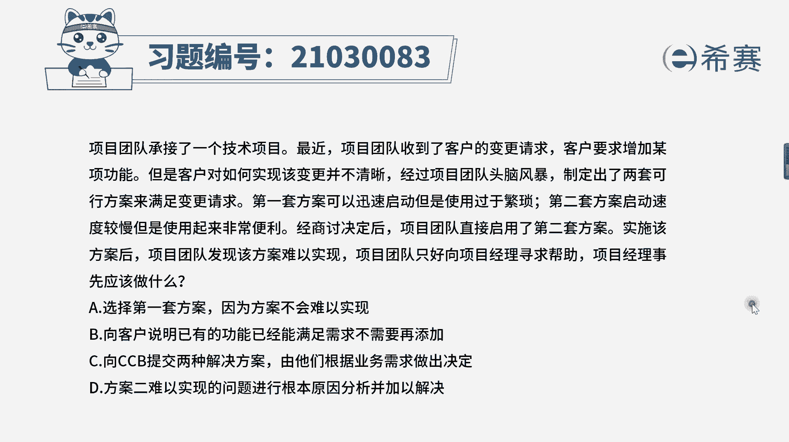
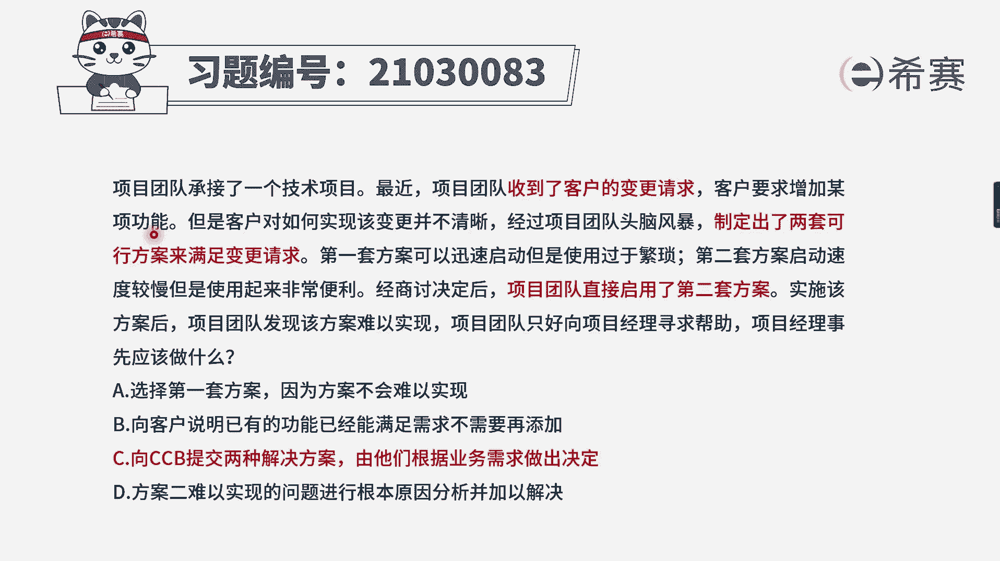
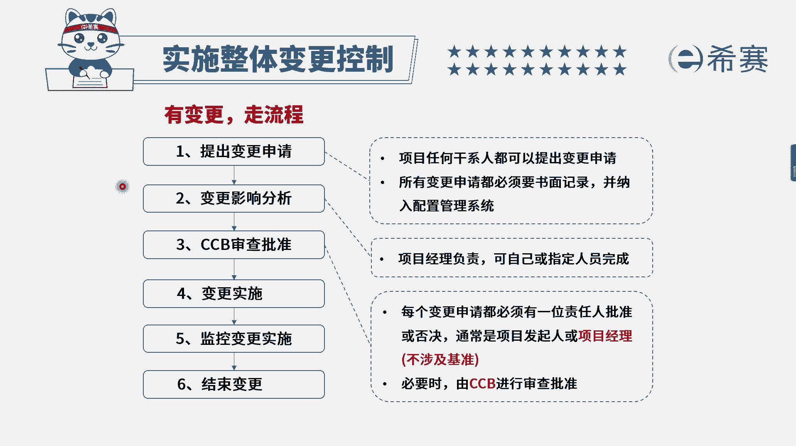

# 24年PMP模拟题-PMP付费模拟题100道免费视频新手教程-从零开始刷题 - P99：99 - 冬x溪 - BV1Fs4y137Ya

项目团队承接了一个技术项目，最近项目团队收到了客户的变更请求。

客户要求增加某项功能，但客户对如何实现该变更并不清晰。

经过项目团队头脑风暴，制定出了两套可行方案来满足变更请求，第一套方案可以迅速启动，但是使用过于繁琐，第二套方案启动速度较慢，但使用起来非常便利，经过商讨后，项目团队直接启用了第二套方案，实施该方案后。

项目团队发现该方案难以实现，只好向项目经理寻求帮助，项目经理事先应该做什么，选项a选择第一套方案，因为方案不会难以实现，选项b向客户说明已有功能已经满足需求，不需要再添加选项。

c向c c b提交两种解决方案，由他们根据业务需求作出决定，选项d方案二难以实现的问题，进行根本原因分析并加以解决，整个题干比较长，我们先来简化一下题目，这里相当于客户提出了一个增加功能的变更。

而团队制定了两套方案后，直接选择了其中一套实施，结果实现不了，这里有一个很大的问题，就是团队他直接启用了第二套方案，因为按照基本流程，新功能很有可能就会涉及到基准的一个变化。

咱们肯定是要通过变更流程进行综合分析，包括分析它的一个可行性，包括分析相关的一些影响，所以现在的问题就是没有走变更流程，题干问项目经理事先怎么做，肯定是要避免这种不符合变更流程的动作。

分析完后再来看一下几个选项，选项a它是直接选择第一套方案，这一样的也是没走变更流程，而选项b向客户说明，已有功能已经能够满足需求了，不要他再添加了，相当于是项目经理直接拒绝了客户的变更，这也是不可取的。

再来看一下cd两个选项，c选项是直接向cc b提交两种解决方案，由他们根据业务需求作出决定，这个是符合流程的，最后d选项是比较容易选错的，d选项的意思是，项目经理去找到这个方案难以实现的原因。

并加以解决，但是实际上如果咱们事先走流程，如果ccp他发现你这个方案不可行，他就会拒绝方案，所以就不会出现题干中这样的问题了，所以d选项它并不是解决根本的一个选项，仍然是违背了变更流程的，所以综上来看。

我们会选择c选项作为正确答案。

大家可以看一下文字解析，本题考察的知识点为项目整合管理。

