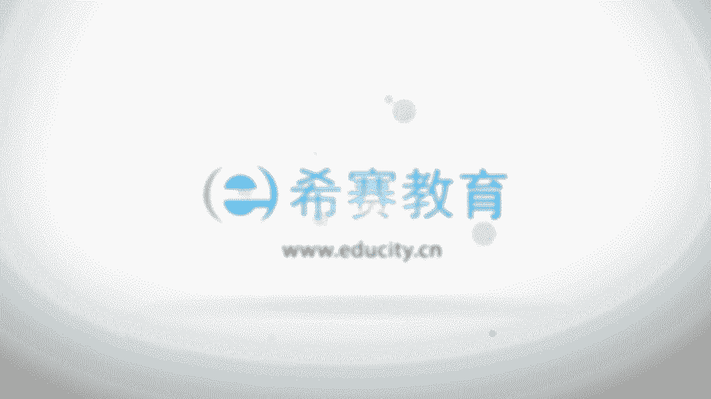

# 24年PMP网课全集免费看，114集pmp项目管理视频精讲视频-零基础 - P112：1006管理沟通 - 冬x溪 - BV1Zo4y1c7Yh

呃接下来我们一起看到的是第二个过程，叫管理沟通，那么管理沟通呢，它其实重点关注的是说，我们要去确保那些沟通管理计划这种东西，在真实的去执行的过程中，真正的都能够产生，能够达到他说确保项目信息及时且恰当。

来收集到生成发布以及存储检索，以及这样一些信息能够被管理监督，以及最终去处置，这是管理沟通，所以他是在执行的这样一个状态啊，它是具体去执行，我们看一下他那个输入，首先呢是项目管理计划中。

有一个资源管理计划是跟人相关的对吧，然后是相关方的管理计划，这也是跟人相关对吧，然后呢是沟通管理计划，沟通管计划就是我们规划沟通管理的输出，他告诉我们怎么样去做好这个管理，沟通的事项好。

然后项目文件中你看跟人相关的，有相关方，ok啊，然后呢，这里那个有问题日志和这样一个风险报告，因为我们不管是问题也好呀，风险也好，都会涉及到对应的责任人，都会有人去处理啊，还有呢是经验教学能力测。

告诉我们怎么做好这样一件事情对吧，然后沟通的过程中也会涉及到他，这里有个质量报告，就是做项目的那个质量，跟沟通的互动这一块也比较的重要，然后是输入中有一个工作绩效的报告，具体执行的这些报告。

然后是事业环境因素和组织过程资产，然后他的工具和技术我们看一下，是不是看了好多都看过啊，一个是沟通技术有看过对吧，然后是什么沟通方法也有看过，然后沟通技能呢这边没有去讲，然后一会我们会稍微小一点。

然后是项目管理信息系统，之前也有看过对吧，然后是项目的报告，这里没有讲，我们我们一起简单看一下，然后是人际关系与团队技能，这边有什么积极倾倾听冲突管理，积极倾听呃，文化意识，会议管理，然后人际交往。

政治意识啊，这些什么人际交往的话不好说，政治意识也不好说，然后这个文化意识也是都不好说的东西啊，这是妙不可言的东西，但书上也讲不清楚，书上其实也是简单讲一下，事实上就是说每一个人他在成长的过程中。

他对这些东西的认知，以及他对这样一个事情的处理，都会有它自己的一套，这一套就是他的这些意识啊，好然后还有会议我们也也看过了啊，那我们一会会把那几个没看过的简单看一下，会把这个嗯沟通技能看一下。

把那个项目报告看一下，他最后的输出呢就是项目的沟通记录，以及一些计划的更新，文件的更新，还有组织控资产的更新，主动控资产当然是告诉我们怎么样去做好沟通，对吧啊，计划的更新有沟通管理计划的更新。

以及相关方的这个管理计划的更新，然后文件有经验教训，登记册其实跟这个就有关系对吧，然后是问题日志和风险登记册，这个也有关系，然后跟人妖相关的这样一个相关方，登记册也有关系。

那这边还对于进度也做了一些调整，我们一起来看一下管理沟通这样一个知识领域，它的一个信息啊，首先先是有效的信息发布的技术，因为管理沟通，它是要去确保这样一些信息，能够及时且恰当地生成，发布。

存储检索等等对吧，它能够去促进团队成员和相关盘之间，有效的这样一个信息流动，也就是说具体去实施，他要去确保以适当的格式，正确的生成和发生到目标受众，那么有效的这样一个信息发布技术有哪些呢。

首先一个是信息的发发送接收模型，咱们是不是看过沟通模型对吧，要去考虑到关于反馈回路，还有考虑到关于沟通障碍这样一个东西啊，另外是每一届的选择，比如说我们到底是用书面还是用口头，什么时候用书面。

什么时候用口头，然后嗯以及用书面的话用一些非正式的，还是用一些什么正式的，然后然后是面对面的去互动，还是说通过电子邮件去互动，哎，这些媒介的选择也是你沟通的一些沟通，发布的一些需要关注的。

另外写作的风格主动被动的这样一些语态，句子结构用词，这个有的时候比如说我们可能会考虑到，有些东西写的比较俏皮，有东西写的非常的严肃对吧，然后会议管理技术，我们在开会的过程中，我们需要参考了一些东西。

准备一层，然后以及在会议过程中可能会有一些冲突的话，我如何去处理这样一个会议冲突，演示的技术，使用一些什么形体语言以及视觉辅助，比如现在就是一个视觉辅助的技术对吧，引导技术，引导技术好久没有见到他了啊。

啊事实上就是说我们之前说的是说啊，引导技术它会涉及到一个跨职能团队的成员，然后有一个人来去引导大家一起来开会讨论，对吧，呃这里说的是建立总共识，然后去克服一些相对应的障碍，还有一个呢是倾听技术。

主动去倾听，然后呢要去给对方一些响应呢，然后去以及澄清一些事情呢，要去确认一些理解，能去消除沟通障碍，呃这是关于一些有效的信息发布的技术，就是管理沟通中的一个基本的介绍信息啊，然后工具的集中呢。

我们的前面几个看过的，我们就不去重复讲了，然后这边看一个叫做沟通的技能，这个沟通技能呢，首先第一个他说的是叫沟通的胜任力，他说的是什么，他说呃其实就是你可能沟通技术有很多很多种，对不对。

那你可能需要去做一些裁剪，裁剪以后呢，把这样一些技能做一个组合，其实目的是什么，目的是能够去让这些相关的信息，能够按照他的需求能去达到对吧，信息的传递能够达到呀，能够让大家对信息有一个共享呢。

以及能够让人产生一些相对应的行为啊，是关于沟通胜任力，另外一个是反馈反馈，他说是关于这些沟通啊，可交付成果，一些情况都做一些相对应的反馈，我们其实在沟通模型中也说到，关于反馈的这个事情对吧。

还有是非口头技能，就是呃那个面对面的沟通互动的时候呢，除了语言这一部分以外，还有其他东西，他说通过示意语调，面部表情等适当的一些肢体语言，来去表达这样一些意识，包括说什么i touch好。

有一个有这样的说法，就是说如果你在那个台上面去演讲的时候呢，你一定要跟台下的观众有这样一些，那个i ti对吧，但是你又会很紧张，怎么办呢，你就是把目光望得稍微远一点点，挖到那个那个会会场的中后部的地方。

然后同时呢你把他们当成冬瓜，一大群冬瓜在这里看你演讲啊，这样可能没那么简单啊，没没那么紧张o呃，事实上就是说人就人和人之间互动的时候，就说前面一期是有讲过这种语言的部分，是只占到40%多。

然后非语言的部分占到一半以上，占了50%多以上啊，所以他也是很重要的一个，还有的是演示技术，演示呢，他说的是要去演示这样一些信息或文档的，正式交付，可能会包含这样一些部分部分的内容啊。

比如说是向相关方面去报告，项目的一些进度和信息的更新，然后提供一些背景信息呃，提供关于项目以及目标的这些通用的信息，来提升团队这样一个什么工作形象，以及提供一些具体的信息啊。

这些的话其实都是比较怎么说呢，这东西其实你没有办法说把一个东西，一个东西都分割开来，都是一个整体，就是整个关于沟通的话，你肯定是需要去练就这些表达和倾听，然后跟别人去互动，那这些东西都是混在一起的啊。

然后一个信息管理系统啊，那么信息管理系统呢也分了好几个，一个呢是什么电子项目管理工具，就是你可能会用到一些什么软件啊，会议啊，虚拟办公软件啊，一些网络啊之类的东西来去做互动对吧。

还有一个是什么电子沟通的工具，说邮件传真，语音音频视频网络会议，还可以是社交媒体啊，比如说比如说我们现在用的什么微信啊，qq啊这些东西啊，这是信息的管理系统，然后还有呢是项目报告的发布。

那么项目报告发布呢，他是说要去收集和发布项目信息呃，这样一个发布呢，其实可能会要发布给很多不同的人对吧，那么应该针对每一种不同的相关方，来去调整这样一些信息发布的湿度的层次，这个怎么说呢。

其实你回想一下我们在项目的进度管理中，会不会有一个嗯关于那些什么啊，下面的进度计划有一个里程碑计划，然后有一个进度计划，然后还有一个很详细的一个进度计划对吧，那么这种就是就是对于不同的那个相关方。

我们要去发布的时候，我们会调整它的一个详细的程度，ok给老板发的信息是越简单越好，越简单清晰明了越好，而给具体的这样一些比如说直接引导啊，或者是你的一些团队成员啊，你发布的信息就可能是一个。

非常详细的一些信息啊，呃除了注意它的一个什么层次形式细节啊，从简单的沟通到详尽的，先一个定制报告和演示，报告的形式是可能各不相同，同时呢我们说呃需要做出一些什么例外的情况，就是说特定的一些情形。

我们要如何去处理呃，工作绩效报告是监控项目工作过程的一个输出，但是这个过程他会编制临时的一些报告，演示博客以及一些各种文件啊，就是告诉你我们在项目的沟通过程中，可能会用到各种报告的形式。

那么报告的发布会根据需要来，事实上都是呃谁需要一些比较详细的信息，我们就给他详细的信息，需要简单的信息，就给他简单的信息啊，啊这里还有一个呢是人际关系和团队技能啊，这些首先应该是积极倾听。

包括说告知对方已经收到了，然后要去，如果说刚好有些东西跟你的是不一样的，你要去澄清他，然后呢要去跟他确认一些信息，然后理解，这样的话能够去防止呃消除这些障碍对吧，本身积极倾听。

其实我觉得是一个比较难做到的事情，尤其是对那种比较习惯表达的人来讲，他是需要刻意练习的，试着去练习啊，第二个是冲突管理，那么冲突管理呢我们前面专门有一个知识内容，就专门讲冲突管理，撤退也好呀。

求同存异也好呀，妥协也好呀，强迫也好呀，还是说是面对面解决问题，都是冲突处理的方式啊，根据你的当下的情形，来选择合适的方式来去处理，然后团队技能中什么文化意识，你要去意识到这样一个当前的情况。

以及什么政治意识，所以当他都是有助于项目经理来去呃，根据当下的一个情形，或者我们说识时务者为俊杰对吧，了解当下的这样一个情形，然后做出相对的一些处理方式，还有一个会议管理，我们寝室前面已经有讲过啊。

就是要他说要准备一程，然后要去确保按时开始，按时结束，然后呃大家都参与进来，要切题，不要跑题，然后在过程中表达一些呃，如果说中间会有一些什么问题和冲突的话呢，我们要去做一些处理，然后要记录下来。

然后要去做一个review，然后最后是要分发给所有人，要分配相对应的一个行动，责任人也说我们可能会练很多这种to do的东西，然后给到一些人对吧，练一些行动项啊，还有一些人际关系的一些技能。

就是跟人去互动来去呃。