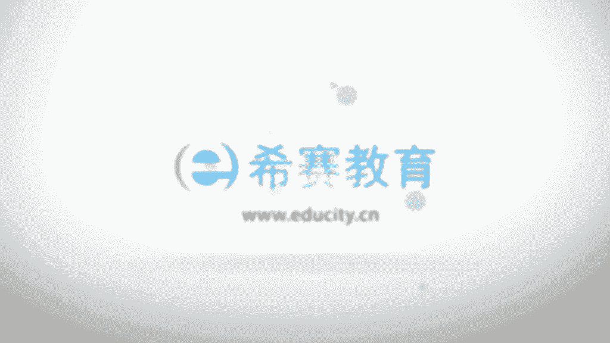

# 24年PMP网课全集免费看，114集pmp项目管理视频精讲视频-零基础 - P20：0301、项目经理及影响力 - 冬x溪 - BV1Zo4y1c7Yh

大家好，欢迎大家来到西夏教育啊，接下来我们一起看到的是拼搏指南，这本书第六版的第三章叫项目经理的角色，那这个版本的第三章呢，事实上是跟上一个版本，跟第五版中有非常大的这样一个改动。

在之前的版本中对项目经理是有一些的描述，但是比较少，而在这个版本中，他整个把项目经理放到了一个完整的章节，并且给到很多很多内容，他把项目经理所要去承担的这样一些角色啊，所要去负责的责任往前去延展。

然后往后去延伸，也就是说项目经理，他不只是关注项目的执行过程中啊，所要去关注这些管理的事项，同时对于前期的这样一些，比如说嗯商业论证，可行性分析啊，项目的选型啊，以及满足企业的战略目标啊。

都会有一些要求，以及在事后的话呢，对于项目做完以后的这样一个结果，他投入到运营，然后是否能够顺利的进行啊，有也是需要去关注的，所以他对我们项目经理要求是更加的高，同时它有个好处。

就是其实把我的位置拔高以后呢，你的权限也会变得更加大，我们一起来看一下啊，当然这个章节的很多内容看上去有点虚啊，先给大家说明一下，是有点虚的，所以我们只只能说是，可能会跟我们实际的做项目经理有一些出入。

这个也是属于正常现象，我相信任何一个东西，从开始的设想到最后的实施到落地，它是有一个时间段的，它是有有一个逐渐逐渐的这样一个过程，项目经理很多时候都是会从项目启动开始，就参与到项目，一直到项目的结束。

而在有些组织内部呢，它是会把他之前就要求去参与一些，评估和分析的活动，也就是说项目还没有开始之前，你就要去参与到这样一些活动中来啊，包括一些什么咨询，管理层和业务部门的领导的一些想法。

来去推进战略目标的实现，来提高整个组织的一个绩效，来满足客户的需求，然后有些组织还会要求项目经理来去管理，或是协助项目，商业分析，商业论证，什么商业分析，商业论证会关注什么。

他重点关注就是这样一个项目值不值得去做，对不对，值得去做或者不值得去做，它一定有它考量的维度，可能会是关注说这样一个项目能否挣钱，可能会是说这样一个项目，能否去让我们有更多的民生。

有更多的这样一个广告的效应，或者是能够在客户的这样一个视线里面，去晃动一下，去出现等等，一定是有他自己的这样一些目标呃，然后项目经理才有可能还会参与参与，后续的这样一些跟进的活动。

来实现它的这样一个商业效益，所以把项目经理的要求其实拉高了，前期也要参与更多，后期还要去关注，那么整个关于项目经理呢，在这一章节中，他有这样一个比方，就是把项目经理和大型乐团来做一个类比。

在大型乐团中可能会有很多不同的，比如说是大提琴啊，小提琴啊，管弦乐啊之类的啊，演奏钢琴啊之类的，各种不同类型的这样一些乐器的演奏者，而那个指挥家呢，他是去指挥整个这样一个乐团乐队，而项目经理呢。

他也是类类似于这样一个指挥家的这一个角色，就是项目团队中可能会有很多的不同的成员，他们有各自的这些角色，他们会分派不同的任务去做他具体的事项，而项目经理呢就像一个指挥家一样，去把整个团队成员都组合起来。

去整合起来去做这样一些事情，所以每一个成员，他可能会是有自己的这样一些具体的角色，比如说什么设计啊，制造啊，实施啊等等，而项目经理是要把大家给融到一起来，在团队中的责任。

他说要从整体上来去看待团队的产品，这样的话呢才好去做规划，协调和完成，其实就是项目经理要求会更高，你要达到一个更高的一个维度，来去看待整个这样的一件事情，以及知识和技能的话呢。

我们项目经理应该具备的知识，技能要求也更多了，我们可以看一下啊，一个是项目管理的知识啊，这个是我们通常在过往的过程中，我们一直都清楚的，就是说你作为一个项目经理的话，你肯定要具备一些管理的知识对吧。

还有一些技术的知识，这也是很重要的事上，比如说我之前在it这样一个行业里面嗯，去工作了一些时间，知道如果说你完全不懂技术的话，你其实做项目经理是很困难的，很多时候很多事情不好去推进。

以及团队成员他不一定会那么好的去配合，有的时候甚至可能会欺负这样一个项目经理，都有可能会发生对吧，所以你除了懂项目管理的知识以外，你还要懂一些技术的知识，要啊有一些什么理解和经验。

项目经理通过沟通来领导项目团队，进行规划和协调，事实上，项目经理花在沟通上的时间应该是非常多的，可能达到85%到90%，就大量的时间在用于跟团队成员的沟通，跟领导的沟通，跟客户的沟通对吧。

这是关于项目经理的这样一个简单的概述，那项目在这一块呢，我们给到了三个经理的角色，一个经理叫做运营的经理，那运营的经理他是负责具体的运营，也就是说，这样一个项目的成果可能已经展现出来以后呢。

要去把它运营持续的去运营下去啊，能够让他产生这些现金流啊，或者是能够持续的去产生这样一些新的结果呀，成果呀之类的对吧，这是关于运营，他要负责保证业务运营的这样一个高效性呃，说在核心业务的领域。

要承担管理角色的这样一些人，它跟职能经理不相同，运营是直接管理供销售的，也就是说它所运营生产出来的这样一些东西，是可以拿出去卖掉，可以赚钱的啊，而职能经理呢，我们在前面的那个呃组织结构的时候。

其实也有讲过，执政经理，他是专职在某一个知识领域，或者某一个业务部门的管理的这样一些人员，比如说是某一个人力资源部的老大呀，财务部的老大呀，采购部的这样一个boss呀，职能经理啊。

这也是一个职能团队的这样一个经理，他们会重点关注某一个领域的事情，他们通常会有一些固定的员工来去开展，这样一件事情，便是有一种连续性，有持续性，这是关于职能经理，那职能经理他是为项目经理来提供一些资源。

比如说提供一些资源啊，技术的服务啊等等，嗯包括说你项目项目团队需要做哪些事情，那职能经理可能就会安排某一些人员，来参与到你的项目中对吧，而项目经理呢他是由组织委派的这样一个人。

这个人呢是要去实现他团队的目标的，他的目标是什么，实现团队这样一个项目标，项目标就是啊创造一个独特的产品成果或服务，对不对，就是我们要去在一定的时间内，去创造这样一个产品，成果或者服务的这样一个人。

所以你是有责任要去做这样一个事情，通常呢在项目的过程中，一定要尽早的来确认，并且去任命项目经理，越长越好，很多时候其实是在项目还没开始的时候，就已经默认的是任命的一个项目经理。

然后呢他会参与到起草一些啊，制定项目章程的内容中，最后呢呃制定出项目章程以后呢，由领导来签发，由发起来签发这样一个项目章程，那签发的项目当中在任命他作为项目经理，好正式的去开始这样一个项目，呃。

最晚最晚也必须在规划之前来任命，这样一个项目，也是启动以后，然后开始规划了，去任命这样一个项目，而项目经理的影响力，我们会来看一下整个po指南第六版中，对于项目经理的影响力呢，是有一个很重点的阐述。

它会从五个层面来阐述他的影响力，首先第一个层面呢是关于项目层面，项目经理在项目层面，就说我们要去实现项目的这样一个目标，实现项目的目标以及相关般的期望，相关方是什么意思呢。

相关班它的英文叫stick holders，在以前的版本中翻译叫做干系人，在新的版本中翻译成相关方，他指的是跟政府这个项目相关的人员，包括说会影响这个项目的人员，以及会被这个项目所影响的人员。

当然还包括那些，自以为被这个项目所影响的人员啊，他都叫相关方，所以在项目层面的话，项目经理他是要去实现团队的这个项目目标，和相关方的这样一些期望，但这样一些相关方的期望他可能有冲突，对不对。

所以我们要从中去做一个平衡，他说一方面是要去利用资源来平衡，有相互竞争的制约因素，什么叫相互竞争的制约因素呢，比如说范围，时间成本质量，那一个项目你想做的东西更多一点，你范围要做多一点的话。

你可能耗的时间就可能会更长，你希望这个事情做的更快一点，时间好短一点，做得更快一点，那你可能就要花更多的钱，你希望做的又快，然后钱又花的不不要不要多花钱，甚至还少花钱，那么它的质量可能就会更差。

所以他们之间是有相互有竞争的，我们要从中去取一个平衡，因为每一个组织它的每一个项目，它都有它特一些特性，它有它的一些要求，所以我们会从啊范围啊，时间啊，成本啊，质量的等等这些维度去取一个平衡。

而项目经理你是要去充当这样一个角色，来做这样一个事情，然后以及因为相关方，他们之间可能会有一些利益的冲突，有一些那个期望的冲突，那么你还要去平衡相关方，他们之间的这样一个，相互的冲突和竞争性的目标。

也就是说因为相关方有可能是有客户，也可能会有自己内部的人员对吧，都算啊，那么这些人他的要求可能是不一样的，因为很多时候，我们的要求是跟我们的这样的位置有关系，你站在哪个位置，你对一个事情的要求。

就是有有什么样一个特定的要求对吧，而项目经理呢，你需要去平衡这样一个有相互冲突的，这样一个内容啊，这个具体内容呢我们会在项目的相关方管理，这个章节去完整，并且去重点的来讲解啊。

在这边还有一个很有意思的信息，叫做使用的软技能，什么叫软技能呢，他说是人际关系技能和人员管理的技能，也就是说在这个整个在第pm指南的第六版中，他对于项目经理要求非常的高，尤其是对于这样一个软技能的。

要求是会非常的高，也说我们要去使用这样一些人际关系技能，而具体人际关系技能是有哪些呢，后面有很多很多，这边啊大概要讲一下啊，通过多种方法来去完善这样一些技能，至于怎么样去完善多种方法，什么样的方法。

比如说我觉得最简单的一种方式就是培训，你通过培训快速的去学习，当然还包括说自学，包括说在项目的管理的过程中，自己去感悟，去悟，不断去实践，跟别人去交流，都上了，创造一些沟通计划和进度计划。

维护沟通计划和进度计划，还遵循一些沟通计划和进度计划，这也是在项目层面你需要去关注的，不断的以可预见的方式来进行沟通，什么叫可预见的方式呢，也就是说我通过这种方式来沟通以后。

我大概能够知道会产生什么样的一个结果，对未来可把控，寻求了解项目相关方的沟通需求，你只有了解他的沟通需求以后，你才能够去满足他的沟通需求，对不对，当然了，还有就是我们要去先了解他。

整个整个对这样一个项目的需求，我们才可以去满足项目的需求，以简练的清晰的，完整的，简单的，以及和经过裁剪的这样一些方式来进行沟通，因为沟通本身它有很多技能和技巧，这个的话其实还真的没有办法说。

一下子就学会啊，每个人都有自己那一套沟通的规则，或者说一些技巧对不对，那么有些东西的话，我们不是说每一种都要用得上，但是我们一定是要表达清晰，然后能够让对方愿意听，并且能够去听见我们的声音。

然后能够去认同我们所表达的信息对吧，包含重要的正面的和负面的信息，其实有的时候有些人他是只关注正面的信息，或者只去传达正面的信息，有些人是只关注负面信息和只传达负面信息，而你作为项目经理都要去关注。

并且要去做交流，然后并且说嗯合并反馈的渠道，人际关系技能，通过项目经理的影响力范围，来拓管广泛的这样一个人际网络啊，这是一个很玄妙的东西啊，这是项目经理影响力的第一个层面，叫项目的层面。

也就是说在项目的层面，要去满足项目的目标和相关判的这样一个期望，然后第二个层面呢是组织的层面，那么项目经理在组织层面的话，你需要去把你的目光从你的项目的上面，要移得更移开，然后放的更大一点，放到哪里呢。

放到要跟其他的项目经理来有互动，因为其他项目经理，他可能会对你的项目有一定的影响，你跟其他项目经理的互动的话，是有助于产生一些积极的影响，来满足你项目的一些需求，而这些需求有可能是包括说你需要一些人呐。

需要一些技能啊，技术啊，资源啊等等，这些东西，都有可能会是从其他的这样一些项目经理也好，呀，或者经理也好，这边来获取到项目经理需要寻找各种方法，来培养人际关系，从而帮助团队实现目标。

这个人际关系的培养呃，还真的不是三两句话能够简单说说完的，呃，也不是说谁就能够说得清楚，通常都会有一些专题的课程，并且专题课程也只是讲其中的小小的一块对吧，我记得以前还有一个电视剧叫什么中国式关系。

然后还有一个专家叫真是强老先生，然后他讲那什么呃呃呃中国式管理等等，这边会涉到很多这种关于人际关系的，这样一些内容对吧，什么酒桌文化呀，然后这种洗脚文化呀之类，那项目经理在组织内要办一个强有力的。

倡导者的角色，就是呃一堆项目经理，都要去管理很多不同的项目对吧，那么中间可能会有一些东西是你会发现，有些可以值得优化的地方，那么你是需要去把它提出来，并且能够让大家一起来共同使用这一种方式。

来做一些事情，项目今天应该与发起人合作，来处理一些内部的政治或是战略的问题哈，这个就是很很大方向了哈，呃事实上就是说没有哪个问题，跟这个东西扯不上关系，都会跟他多少有些关系在里面。

项目经理要去致力于提高自己，在组织内部的这样一些管理能力和技能，然后并且参与到隐性的知识和显性的知识，的转移和整合啊，隐性知识和显性知它是这样一个区分，就是显性的知识呢，是我们啊通常很容易保存下来。

很容易传播的这样一些信息，包括说咱们咱们在书本上看到的信息啊，我们听语音听到这样一些信息啊，哎这些都算是显性的知识，而隐性的呢是不是那么好去传播的，就有的时候比如说我们经常有一句话叫做呃。

可意会不可言传的这样一些东西诶，那它就是属于隐性的这种方式的话，你可能会跟某一个人呆在一起，呆久了以后，你会产生一些潜移默化的影响，哎这就是一种方式来去传承或或是传递对吧。

同时项目经理他说还要去展现项目管理的价值，能够很多时候有些项目经理会觉得自己很苦逼，就是呃这件事情也是谁做的，另外一件事情也是谁做的，然后所有的事情都是由项目团队的，其他成员做的。

没有哪一个具体的可交付成果是由你来做的，那你的价值所在是在哪里，你要知道你的价值所在，你是整个管理和协调这样一个项目，团队的这样一个人物，所以他们所做的这样一些事情，如果没有你的话，那都是一盘散沙。

只有因为有你这样一个项目经理，有这样一个项目管理，才会让这样一些事情变得井然有序对吧，比如说以前有听过一个案例，有个人在那个健身房里面去跑步的时候呢，他跑他发现那个那个健身房。

那个跑步机下面前面有一台电视机，那么他就自然而然就想要去看电视，结果呢发现了一个电视机啊，装的比较高，他就想要去看，能不能把那个电视有所调整，结果发现调不了，那么他就没法跑，没法去看电视。

因为他要看电视的话，要抬起头去，看见的话，跑步起来就很容易摔跤对吧，但是站在那个安装电视的，那个员工的角度来讲的话呢，那个装电视的工程师他什么也没做错，他把电视装好了，站在一个安装跑步机的这样一个。

那个工程师的角度来讲呢，他也没做错，他也把电视装好了，但是为什么大家体验不好呢，因为这里面缺乏一个项目经理，因为缺乏你建一个项目经理，没有去把这样一个事情做一个整合，对不对，所以你的价值ok嗯。

还有一个就是提高组织对于，项目管理的这样一个接受，事实上很多时候很多组织，他是因为有几个员工考了pp以后呢，大家会更多的去关注，才会更多的去关注这样一个项目管理的事情，提高组织类的这样一个。

现有的po的这样一个效率，ok这是在组织层面，所以在组织层面跟更多的项目经理有互动，包括说跟发起人有一些互动，这样的话呢能够让这样一个组织，更大的层面去接受这样一些项目管理的思想啊，理念啊，更好的去啊。

越是有规则的去管理的话，我们这样效率越好，效果也越好，对不对，好我们再看到下一个呃那个项目经理的影响力，说行业的层面啊，这样的话可能很多人就觉得摇头了，我跟他有什么关系对吧，他是这样说的，项目经理呢。

应该要时刻去关注行业的最新发展趋势，因为这个最新的发展趋势，有可能会跟你的项目息息相关对吧，通过发展趋势来去获得并思考，这些信息对你当前的项目是否有影响，有可能会因为一些新的信息，让你这个项目啊去啊。

可以突飞猛进的去发展对吧，也有可能会说结果让你项目就会给pass掉了，有这种情况对吧，经常你会听到一些人说啊，他们那个什么做的那个东西做了个项目，其实我们在10年前就已经做过了，但是为什么你没做成。

然后别人已经做的很大了，并且现在已经是啊又融资啊，又要上市啊什么之类的对吧，其实很多时候会有很多很多因素在那，我们有的时候就说可能只是时间刚好没到而已，那你要关注当下最新的动态，最新的发展趋势。

整个行业的趋势的话，你是会对你可能会有更多的帮助，也会啊啊一个是产品和技术的开发，最新的产品开发，最新的技术开发以及市场的空间，因为你不玩前锋的话，最后还是要找不到要盈利，对不对。

这盈利市场空间也有关系，以及当下的一些标准，比如说项目管理的标准呢，质量管理的标准呢，安全管理的标准，尤其是比如说项目管理标准，现在是给po主很多，很多的人都会去关注这样一个最新版本的啊，信息。

看有哪些变动，还有一些什么技术工具，以及影响当前项目的一些什么经济力量，影响项目管理的学科的这样一些影响力，以及过程改进和可持续发展的战略，其实也就是说我们还是从更大的方向来考虑。

或者是关注这样一些事情以后，能够去促进我们的项目有改进，能够变得更好，对不对，然后在一个层面到了专业学科的层面，那么在这个专业学科的话，他是这样说的啊，对项目经理来讲，持续的知识的传递和整合。

是非常重要的一件事情，而项目管理的专业，和项目经理所担任的这些主题专家的，这样一些各个领域，他都会有去持续的推进相关的这些专业的发展，也就是说我们去传播一些讯息，其实也许让某些东西会有更大的一个发展。

你不要小看你的这样一个能量，最近好像有一首诗特别红，叫胎是清朝一个诗人写的，叫什么，白日不到处，青春恰自来嗯，开花如米，小也学牡丹开，但事实上我们不要去小看自己。

对这个专专业学科这一个层面的这样一个影响，包括我之前有一个同事，他当时做开发，然后他就对某一块，某一些底层开发会特别有兴趣，然后一直持续去做，结果后来做到另一个领域里面小有名气，或者变得大有名气啊。

现在是已经在那个领域里面，是有一定的影响力的这样一个人，ok所以我们其实是可以去关注这些信息，我们去更多的去分享传递这样一些讯息的话，还是会产生一些正向的一些影响啊，啊他说知识传递和整合，包括说在当地。

在全国，在全球的层面，来向其他的专业人员去分享，专业知识和专业的技能，所以有的时候我听过一句话叫做越分享越拥有，所以当我们多分享这些信息的时候，你会对这个东西更熟悉，以及另外一种方式呢是继续参与培训。

继续教育等等，参与培训和继续教育，然后最后一个叫跨领域的层面，他说项目经理对于组织的价值，可以选择指导和教育其他专业人员，项目管理的方法，也许我们要把我们项目管理的方法，要分享到其他的领域里面。

让其他人也能够去使用上啊，包括现在的话，其实我在教的学员中，我会发现有一些学生物的呀，嗯学各个不同的行业的对吧，我之前有人说学什么全船舶制造呀，呃这种都是很很少见的，但是他会不断的去慢慢发展。

不同不同的行业，人也会去关注这样一些项目管理的知识，项目经理还要担任非正式的宣传大使，去推广这些东西，让组织去了解这些项目管理，它在及时性啊，质量啊，创新啊，以及资源管理等方面的优势。

也就是说通过这种方式，能够让他有更好的一个推广，当然推广其实是因为它有用，对不对，因为它有用，所以才推广，然后因为推广，所以它会变得更加的有价值，这是项目经的影响力，所以我们再回顾一下。

这边总共收到了五大影响力，首先一个呢是在那个项目的层面，在项目的层面的话呢，我们需要去关注的是说，实现项目的目标，和一些相关的相关方的一些希望，然后在组织什么的，要去跟其他的项目经理有互动。

跟其他人员有互动，包括跟这样一个发起人有互动，这是组织层面，然后呢是在这样一个行业的层面，我们要去关注最新的动态，最新的行业的发展趋势，以及在项目的科学，专业学科的层面。

我们要去传递这样一些比较有价值的信息，去分享一些有价值的信息，当然了，还有说在整个的这样一个跨领域的，这样一个层面，我们也要去分享，要去传播，要去宣传这些东西。

