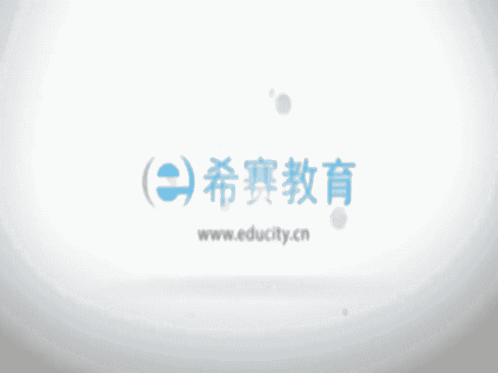
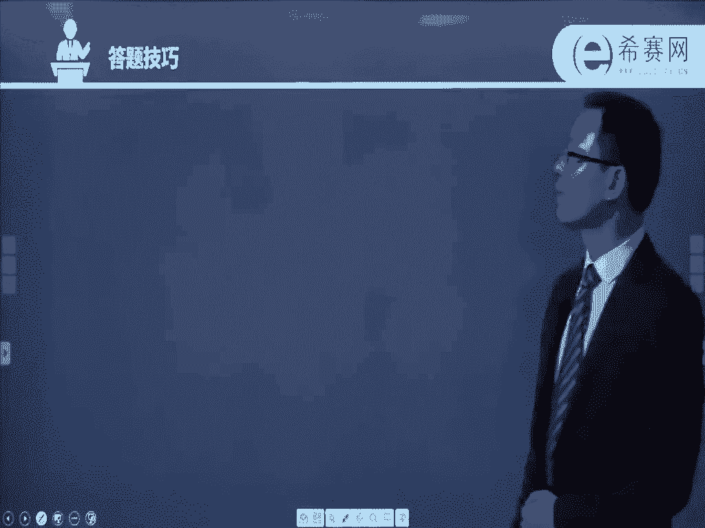

# 24年PMP网课全集免费看，114集pmp项目管理视频精讲视频-零基础 - P4：0004、PMP考试经验与答题技巧 - 冬x溪 - BV1Zo4y1c7Yh

那么整个考试经验，首先呢有一部分题目题目呢是纯理论性质的，也就是说他会让你去记这些东西，记我们的一些基本概念呢，输入啊，输出呀，工具和技术，这个是你需要去记得，另外呢还有一些是他会给到你的，是嗯一些。

情景类的试题经理的实力，就是说他会给到你某个场景，然后说你作为项目经理的话，你会怎样去应对，那么这个情形呢，事实上他最后还是会归属到某一个，理论知识上面去，只是说你要从pmi的角度来出发去考虑。

按照pm i的这样一个思维方式来去考虑，项目经理应该怎么样去做，同时你还是要去知道，他的这样一些理论知识是什么，所以在这里的话，我顺便想提醒大家的是，关于每一个过程它的输入，它的输出，它的工具和技术。

也就是我们所谓的i t p o，因为输入呢叫input，对不对，然后输出呢叫output，然后工具呢叫tools，然后技术人叫technology，它们挤在一起的话，通常我们说的是叫i t g o。

所以通常情况下是建议大家i t t后要记得嗯，能够记得相对来讲比较熟啊，不是说完全要背下来，但是你要比较熟，一般建议大家至少手抄两遍以上，手抄的同时慢慢的心里面去记它。

事实上整个po指南这本书他从第四章开始，一直到第13章，就是从项目的整合管理，然后到范围时间成本质量各个管理，一直到最后的这样一个项目相关方的管理，那么它都是在讲每一个过程啊。

每一个过程他都会讲那个输入工具和技术，输出都是这样的，所以呢整个这本书基本上都是在讲输入输出，工具和技术都在讲i t t，所以你说它重要不重要，非常重要，呃之前有同学说，那我手抄已经抄的很少了。

我就用用键盘去敲字的方式，这个也是可以的，毕竟很多人都是习惯性的用电脑用的比较多，用手写字写的比较少，对不对，好，如果说是在答题的时候，通常情况下呢，是建议大家按照美国人的这样一个工作。

价值观和思维来去考虑啊，这个的话到底他的美国人，美国人的工作价值观和考虑，是什么样一种一回事呢，事实上在整个这本书中就会有展现，会有展现啊，我们会一个章节一个章节，一个知识点，一个知识点去看到啊。

考试的时候默认你是北美做的这样一个偏僻，是一个大型的举证组织的甲方的项目经理，就是因为默认情况下，你是必须要有3年以上或者，5年以上的项目管理的经验，你才有资格来参加这些考试。

所以你默认一已经是一个项目经理了以后，哎，你只是顺便去拿一个偏僻的证书，所以你要把自己当做是偏僻的人来去做啊，他考最佳实践，我前面也有写过啊，最佳实践也就是题目中可能多个选项都正确。

你要选相对来讲最正确的一个，那么同样它也有可能说某一道题目，它的四个选项好像都不是那么正确，都有一点点瑕疵，那你就选那个瑕疵最少的一个，就是错的最不离谱的一个是这样一个情形啊，因为考试它是不会倒扣分的。

所以呢200道选择题，不管你会不会一定要涂答题卡，不能空着。

然而通常情况这边给到一些答题技巧，事实上我觉得现在你看的话呢，对你来讲还为时尚早，因为我们一定是对于某个知识内容，有所了解的情况下，你再去看关于做题目啊，是有帮助的对吧，但是我们先放在这边呃。

大家可以等你学到一定章节以后，再回过头来看这一段，这也是可以的啊，那关于答题技巧，首先是要跟题干有关联的东西，有相关的东西才是答案，因为有可能有一些试题，他的某些选项是那种正确的话语。

但是呢是跟题干不相关的，那么类似跟题干不相干的比，即便是再正确，他也不可能成为正确答案，如果说有多个选项是很雷同的时候，那么他们他们通常都不是正确答案，如果说有一个啊跟题干相关的这样一个。

两个截然不同的答案，那么有可能他们就是中间有一个，是你的正确答案，如果说有几个以上的题目，是你让让你觉得很纠结，很不能选择的时候，就follow your heart。

就是遵从你的最后一个项目经理的这样一个，主动性的这样一个本能的这样一部分，体现你作为一个积极上进的，愿意面面对问题，去解决问题的这样一个主动的项目经理，诶，本着这样一个思路来去看。

如果某个选项中的词汇是你从来没有见过的，很生僻的词汇，通常它是不是答案，如果说是有些东西是有片面的，有些是有比较全面的，那通常是比较全面，他可能会概率大一些，而有一些他可能是很具体的答案。

另外有些答案是很抽象的，那么相对来讲，那些具体的答案可能会概率会大一些啊，如果说题目中有一些那种绝对的程度的话，通常不选，就是那种太过于绝对的那种修饰词，这边举的例子说总是啊必然呢。

所有啊完全呢这样一些词的话太过于绝对化，因为本身管理它是来源于工作，来源于生活，在生活中很少说有一种情况是必然这样去做，必须这样去做才行，因为本身在工作中，其实很多东西它都是哎这样也行，那样也行。

对不对，只是说我们会从中去选择出，或者说筛选出一套相对来讲比较良好的实践，甚至说是最佳的实践来去推广，所以不应该要选这种绝对的选项，而是选那些相对来讲会比较有保留性的，这样一些词汇。

比如说是啊什么经常啊，可能啊有时啊这样一些词汇，它就正确的概率会大一些，也就是说在结构上非常类似的选项或性向，很类似的选项，那么最近答案很可能是其中的之一，还有那种特别异类的那种选项，通常一定是错误的。

那这样的话也是一种排除的方式，做题目的话，因为大家都是经过了从小学到初中，到高中到大学对吧，经过了很多年的学习和考试，我相信每一个人都有自己的，这样一套考试的方法，那么都可以用得上，通常都可以用得上。

只是说他考试跟国内的考试会稍微有点不相同，他考的更加的灵活，他更多的会考这一个实用的场景，给到一个场景以后呢，呃让你去说你会怎么样去做，而不管是哪种场景，它一定背后有个根源，就是某一个具体的知识点。

这个你是需要去清楚的，所以那个知识点内容，你清晰的情况下就比较有帮助，那到底要怎样才能够比较顺利通过偏僻考试呢，我觉得是这样的，首先我们要建立一棵知识树，建立一个知识体系。

然后呢再去了解一些具体的知识点，就像咱们这样一个p m p的话，五大过程组，十大知识领域，49个过程，如果直接跟你讲说啊，我们有49个过程让你去记，你可能会觉得很崩溃，对不对。

那么事实上如果说你知道说这49个过程呢，它是这样的一个情况，好它是一些主干，然后每个主干有十来个主干，然后每个主干呢下面呢就有一些个，又长出来一些东西，每个主页上面长出来一些东西。

这样的话我们去记它就会容易一些好，然后长出来一些东西，下面又会有又会再长一些新的东西出来，也就是说它会不断的去分类，从大枝条分到小枝条，小枝条分到在诶小的果实，这样子也就是说我们整个有十大知识领域。

每个知识领域都有几个过程，加起来才到49个过程，然后每个过程呢它又会有一些输入呀，又会有一些工具和技术呀，又会有一些输出啊，这样的一个情况下，那我们先把大的框架，大的线条给搞清楚以后。

再去即接下一些细部的这样一些知识点，相对来讲就会容易很多，第二个呢当然就是还是要看书，因为所有的东西它是都是来源于拼搏指南，第六版，这本书还是需要去看的，但是你直接去看的话，可能会觉得看起来非常的费劲。

看不懂，所以这个时候我的建议呢是看视频，就是咱们这一套视频讲解，有老师在这边跟你去讲解这样一个视频以后，你再去看这些内容，你可能就会比较容易去理解他，并且我们对一个东西有理解以后再去看它的话。

会看起来舒服很多，也能够帮助我们去做一个记忆呃，同时还有一个是认真听课，认真听课的话，一方面是包括这样一个视频教程，另外还有一方面是我们会有直播课程，我会希望大家能够去认真听直播课。

我们直播课通常可能会有多个老师，大家可以去选择听某位老师的，甚至是说听多位老师的都是可以的啊，然后是做题，整个在西夏的平台上面，我们会有大量的题库，就是那些都是通过跟各大培训机构的题目，其实是一样的啊。

内容题库ok啊，所以能够去帮助你对整个偏僻考试的利益，过往啊，以及题型啊，考察的知识点啊，这些东西有所了解，通过刷题以后呢，能够让你更好的去呃掌握它，这样的话能够让你更从容地面对考试。

当然还有一个非常非常重要的建议，大家看看，就是看老学员的分享，就是我们西夏教育啊有一个这样的一个习惯，每一次考完试以后呢，我们会邀请一些优秀的学员，来给大家做个分享啊。

当然还有包括也包括一些很乐于去分享的学员，来给大家做这样一个分享，他会分享他们在学习过程中的这样一些精密啊，经验呐，以及一些觉得他觉得可能有点措施啊地方吗，叫教训啊之类的这样一个经验教训。

也就是我们这样一个组织过程，资产库啊，通过看他们的分享，我们所谓叫前车之鉴，后事之师，你看完别人的分享以后，你会审少走很多弯路，可以快速的去达到这一目标，k，所以呢这样的话，我们是有更多的机会。

可以去顺利的通过这样一个考试，呃，这是哈佛的案例，教学法里面给到的这样一个精髓，就是说如果我们对一个东西的学习，如果只是听的方式的话，也许我们能够吸收的只有5%，也就是一个东西，你听完以后再过两周。

然后让你再回顾的话，可能还能记得的东西可能是5%，甚至还不到，那如果说你只是阅读，只是看的话，默默看的话，你可能能够学习到的，掌握到的可能只到了10%，而如果说你是既听又看诶，可能会达到20%。

这样的话你看比那个观视听和观视看要多很多，所以是小的时候，为什么老师让你去诵读诵读诶，既能够看到又能有声音啊，如果说有人去给你示范的话呢，你会记得更多，有人给你释放，但是以上呢都是一种被动学习。

都是东西在这边，然后呢你去被动的去接受它，那如果换一种方式，如果说我们是一种主动学习的方式的话，你可以看到整个主动学习里面的话，这样一个学习的效率，会比那个被动学习的效率要高很多，那主动学习的话。

别的方式可能不容易去做到，但是我们这个是可以做到的，就是小组讨论，但我们去讨论一个东西，我们至少是有自己的思考，夹杂了自己的思考，掺杂自己的思考，然后再去聊一些东西的时候。

诶这样的话你对他的认知可能会更进一步，我们都应该是会给到学员们做一个分组嗯，嗯每一个学员都有可能会被分到一个组，甚至分到几个组里面来，然后大家多做交流，当你主动去交流的话，你会学习到更多。

你会掌握到更多，并且事实上的是三人行必有我师呃，在这样一个交流和讨论过程中，蹦蹦床出火花，同时你所遇到的困难也许别人早就遇到过了，他会帮你做一个解答，那同时也希望别人遇到的困难，你能你刚好已经知道的话。

你也可以帮他做一个解答，相互之间互帮互助，那么这样的话一方面是学习起来会更加的轻松，另外一方面呢你会觉得自己没有那么的苦逼，因为啊我知道大家都是参加工作的人士啊，工作可能也都挺忙。

那么在这样一个忙碌的情况下，然后难得有一点点呃，每个工作之余的时间可能会想要去休闲啊，看球赛啊，然后啊看电影啊，然后打游戏啊之类的，如果说突然之间切换到这样一个学习的频道，可能会有点不适应。

但是如果说有一个小组学习小组交流和讨论，你会发现其实你没有那么苦逼，因为有一堆人跟你一起在做这样一件事情，那么当大家都在做这样一个事情的时候。

