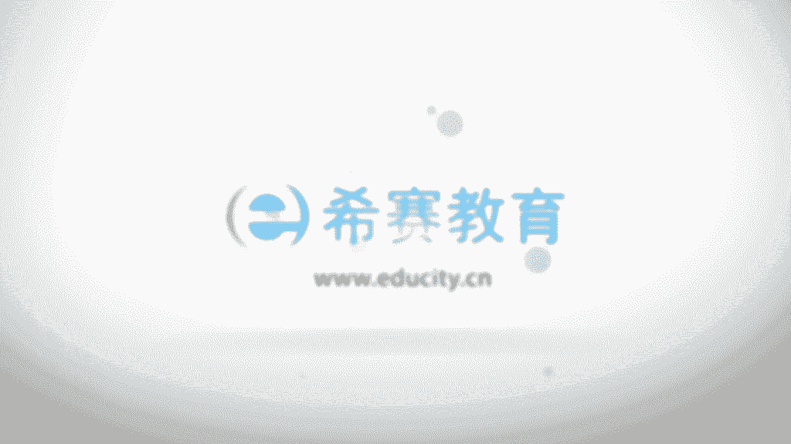

# 24年PMP网课全集免费看，114集pmp项目管理视频精讲视频-零基础 - P84：0804CMMI、OPM3、ISO、概率统计 - 冬x溪 - BV1Zo4y1c7Yh

好，然后接下来我们看到的是一个关于，能力成熟度模型啊，人力成熟度模型的话，在这边只是做一个简单的介绍啊，事实上我对他也不是很熟，然后呢，呃也不是我们重点需要去关注的一个内容，它是是美国的一些机构。

然后对于这样一个it类的，就说软件开发类的质量管理，然后有了这样一些想法，说如果能够按照这种方式来去做的话，能够让这样一个软件的开发质量做得更好一些，所以呢就有一个能力成熟度模型的一个评测。

而这样一个评测呢它会分到了这样几个维度，分到了五个等级，一般很多很多机构都已经是那个，通过了什么三级，对不对，它的5g是这样的，首先是初始机，也就是说没有一个很健全的这样一个，软件工程管理的制度。

每一件事情都是用一种特殊的方法来做，什么叫特殊的方法呢，就是自己临时起意，自己想到的一些方法，它不是一个有既定的一个系统的规则呀，系统的方法呀，去参考，去参照的这样一种方式，这是初始机。

然后第二集叫可管理机，可管理机什么意思呢，他说有一些基本的软件项目的管理，行为设计和管理技术，是基于相似的产品中的这样一些经验来定义的，那么这样的话有些东西是可以重复的，重复来去管理起来。

第三个呢是以第一集，他说已经为这些过程编制了完整的文档，软件过程的管理方面和技术方面，都明确的做了一些定义，并且呢按照需要，会不断的对这些东西做一个改进，并且采用评审的办法来去保证软件的一个质量。

就是一个以定义级13级，这也是大部分的机构会要去通过的对吧，还有第四集呢叫量化管理，而事实上呢我们在做管理的时候，很多时候都没有办法做到一个很具体的量化，对吧，但是呢如果能够真正做到量化的话。

这是很了不起的，量化管理，它是对每一个项目都要设定质量和生产的目标，而这两个量呢将会不断的测量，就是有量化，有目标能够去测量，去监控的时候，这种是量化管理，那么这个的话就是已经很厉害了。

然后到第五集叫优化及管理，那优化管理机呢，他说是组织及改革与实施因果分析和解决方案，就不断自我去提升，自我去解决，去处理更多的这样一个情形啊，这是semi。

然后还有一个呢也必须要介绍一下叫o p m3 ，叫组织级项目管理程序的模型，为什么要介绍他呢，因为这是偏咱们考的是pp，然后呢，呃那个o p m3 呢是由pm i来去倡导的，这样一套体系。

o p m3 拍摄的是就是组织，项目管理程序的模型，它是由美国项目管理协会来最新发布的，这样一个标准，然后o p m3 ，它是不能三个维度的这一个模型啊，第一个维度呢是成熟度的四个等级。

然后第二个维度呢是项目的十大知识领域，五大过程组，第三个维度的是项目管理的三个版图的层次，我们来看一下啊，呃首先是个等级，它又分到什么标准化的，可测量的，可控制的和持续改进的。

跟那个cm i那个前面还是有一点像，对不对，然后它的十大知识领域呢，我们可以看一下我们现在讲的哪个知识领域，我们刚好是讲到了项目的质量管理对吧，然后呢看一下整体范围，时间啊，当然我得说明一下。

这是在咱们之前就已经出来了，就是o p m3 呢是之前就出来，而以前的版本中一直都把它叫做时间管理，其实在第六版中才改造进度管理，所以这个东西的话目前还是叫做时间管理，我刚刚在百度上面查了一下。

没有改名字啊，然后是成本管理，然后是人力资源管理，这个名字也没改，是以前的版本叫人力资源管理，最新版的改叫资源管理对吧，然后是沟通管理，风险管理，采购管理以及相关班的管理，然后除此以外呢。

五大过程组启动规划，执行监控和收尾三个层次，他说是单个项目的管理，项目组合的管理，项目投投资组合的管理啊，这是关于o k m3 啊，具体的你对家如果感兴趣的，你可以去详细的了解啊。

我在这里是呃就不去展开来去讲，然后还有一个呢是iso 9000族的这样一个标准，我们经常会说啊，什么通过了iso多少多少的一个标准，对不对，他说是帮助各种类型和规模的组织实施。

并且去运行有效的质量管理体系，来增进顾客的满意度，iso 9000呢表示说是质量达到一个什么样的，一个标准的一些术语，然后9001呢是规划规定，质量管理的一些体系要求，用于组织证实其具有已经提供。

满足顾客要求和适用于的法规要求的，这样一些产品的能力，目的在于增进顾客的满意度啊，这边是有一个什么目的在于增进顾客的满意度，然后这边是一些基本的一些体系的术语，然后呃。

iso 9004会说到的是关于有效性和效率，这两方面的一个指南，就是能够提升业绩，提升业绩的改进以及啊客户满意，然后这边iso 9011，他说提供了一个什么啊，审核质量和环境管理体系。

这些东西实在不是我的菜啊，然后我们简单看一下，他说iso的八项原则，以顾客为关注的焦点，然后关注领导的作用，然后要求全员参与，这个是不是都是跟我们前面看到内容，其实都是呃一脉相承的对吧。

然后关注过程的方法，管理的系统方法要持续去做改进，以事实为基础来进行决策，与官方互利的这一关系啊，这是关于一个iso 9000组，当然不会让你去记这些东西，也不会让你去背这些东西啊，不会的啊。

好然后这边还有两组术语的比较，一个呢叫做产品的质量和那个项目的质量啊，其实我们前面有看过那个产品范围和项目范围，对吧，呃他说是项目质量的管理呢，需要去兼顾到项目管理和项目的产品，这两个层面。

然后产品质量的测量方法和技术，专门是针对于项目所生产具体的产品类型，也就是说产品测量是具体的，针对这样一个结果，针对这样一些产品，而项目质量管理的方法，它是既针对这样一个结果。

也针对过程中我们去管理它做的，无论什么项目，没有达到产品或者是项目质量的要求的话，都会给这样一个东西带来一个严重的结果，也就是说，项目的质量管理是，既既要去关注最后的结果的东西。

也要去关注中间在执行的过程中，包括我们前期去规划呀，去执行呢，去监控的时候所产生的这些质量的要求，或者是去管理质量啊，这边还有一个词叫精确和准确，他说精确呢是指重复测量的结果是不是聚焦诶，这是说精确。

而准确呢是说的是这个值和真实值是否有相近，和真实的值是否有相近，这说的是准确，然后再来往下面看一些统计的概念，关于那个概率和统计啊，首先关于概率事件，就是某一个事情发生的概率，比如说我们抛一个硬硬币。

抛下以后呢，正面的概率可能是50%，然后反面的概率也是50%，然后有个词叫随机抽样，那么为什么要做那个概率统计，就是有的时候因为样本实在太大，我们只能去从中去抽样，对不对，而随机抽样呢。

就说我选的样本是没有一些特殊的原因，而是从一大堆样本中随便抽的，嗯比如说有一个笑话，就说小明的妈妈让小明去买苹果，说不甜的不要，结果买回来一大袋苹果呢，每个上面都咬了一口。

那是因为小明没有学会这个概率统计，对不对，没有学会这种抽样统计啊，他只是切一小片尝一下诶，甜的，就大概能够知道这一大批苹果应该都还不错，然后还有一个说统计的独立性。

他说是两件事情之间可能是没有任何的联系的，这a事情的结果，跟下一个b事情是没有什么关系，比如说你这一次抛硬币得到一个值，和你下一次再抛硬币得到一个值，这两者是没有关联关系的，还有一个是统计上相互排斥。

也就是说在同一次实验中，两个结果它不可能同时出现，也就是说你抛一个硬币，你不可能既是正面也是反面对吧，你只能是要么就是正面，要么就反面，但还有可能说是立着啊啊均值，所有的测量数据的那个算术平均值。

叫我们一个均值和中位数呢，他说是区分上下各50%个数据的，这样一个分界点叫中位数，然后种树就说整个测量，假如说是有一大堆的测量的话，从中出现次数最多的一个数值叫重数。

