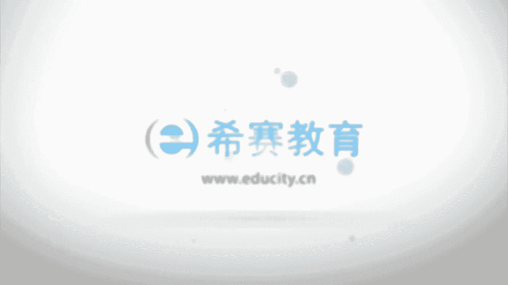

# 24年PMP网课全集免费看，114集pmp项目管理视频精讲视频-零基础 - P1：0001、PMP介绍 - 冬x溪 - BV1Zo4y1c7Yh

大家好，欢迎来到西塞教育，接下来由我跟大家一起分享，关于p m p考试的一些介绍性的信息，那p mp考试呢我会从考试的背景，pp本身以及如何来获得pp认证的这样一个流程。

以及关于他的一些考试介绍和经验介绍，最后呢会简单介绍一下，关于如何去学习这一门功课，来成功的拿到这样一个证书，在开始之前，还是想先简单介绍一下关于我自己啊，那我在西塞教育呢。

已经是做了几年的专职的培训讲师啊，西夏教育最大的一个竞争力之一，就是我们所有的培训老师基本上都是专职的啊，然后我在这些年做培训的过程中呢，然后得到很多绰号，这都是同学们送给我的很多很多的绰号，呃。

当然也许有机会能够把整个这一个版面，慢慢的去填满啊，啊，可以看到我从通常情况下是会比较倾向于一个，呃轻松活泼的方式，来跟大家去做这样一个学习的交流和分享，那我自己呢之前是在北京有工作了8年的时间。

然后做项目管理的培训和生产管理的培训啊，在之前工作的过程中，我是已经有考过了信息系统项目管理师，然后系统集成项目管理工程师，还有p p考试，当然我对心理学这一块也比较有兴趣。

然后也是考过了国家二级心理咨询师，我觉得学习本身是一件比较枯燥的事情，大家也都是在工作之余来抽空学习，所以都会比较辛苦，那我会希望用一种简单的方式，用一种比较容易理解的方式来跟大家去讲解，关于偏僻呃。

首先说到偏僻的话，这个机构是不得不提叫pm i，它的英文叫project management institute，叫项目管理协会，项目管理协会呢，它是啊已经存在了大概有50多年嗯。

它的最大的一个作用或价值，就是能够创造一套标准的项目管理知识体系，也就是我们在学习和参加考试的，这样一个p m p，它是由pmi由项目管理协会来弄出来的，然后他把全球各行各业中项目管理的通用部分。

把它收集整理，然后分析以后得到一个相对来讲，被认可度最大的那些啊，实用的最佳实践或者叫良好实践，而且得到这样一个得到这样一个知识体系，而这个知识体系呢，它也是能够应用到接近说是绝大部分的行业。

他编写了一本书叫项目管理的知识体系指南，叫pino指南，这本书呢目前是已经到了第六版，第六版呢是在2018年的3月份开始，正式的启用，那么嗯这个版本相较于之前的第五版呢，有比较多的改动。

我们会在后面的章节中逐渐的去看到展现，他给我的感觉就是越来越落地，越来越接地气，更加的实用，同时对项目经理的要求也是越来越高，当然同时他也会给到更多的这样一个，指导性的一个建议和意见。

然后整个偏僻考试它的英文叫project management professional，professional是什么意思，专家的专家或是专业人士，那整个项目管理的p m p考试呢。

他就是项目管理专业资格认证的这样一个考试，并且呢它是全球认可度最高的一个，项目管理的这样一个专业人士的认证考试呃，这张证书呢是一张全英文的证书，然后下面会有你的一个名字，到时候可以换成你的名字。

然后呢会有你的一个唯一的编码，就是你个人的这样一个编码，同时呢它会有一个有有效期，是从哪1年开始获得这样一张证书，从01年截止到哪1年开始，证书期满，那正数期满以后呢，是需要去续这样一个正数的。

咱们市政，到时候可以跟我们西夏的工作人员联系，我们都会给你做一个详细的解答，那要参考的书籍，首先有一本叫pua gade pm，盖。

他的那个英文全称呢叫i get to the project monument，body of knowledge，就是项目管理的知识体系指南，然后呢这边是第六版，而事实上在我现在讲课的时候呢。

第六版它还没有上市，也就是说你在呃任何一家网站上面呢，并买不到这样一本书的中文版，但是他的电子版已经是面试了，那么我们到时候会把电子版发给大家，然后第二本书呢叫pmp考试的培训讲义。

这本书呢是由希赛教育来出版的，然后到时候我们会邮寄给大家，然后第三本书呢，是西夏偏僻的备考知识点集锦啊，当然我们会把它换到第六版，这个也到时候是会啊，当你报完名以后呢。

