# 24年PMP考试，3天冲刺训练营27集精讲视频，完整免费分享！ - P1：1.1  三天训练营内容简介 - 冬x溪 - BV1Do4y1x79r

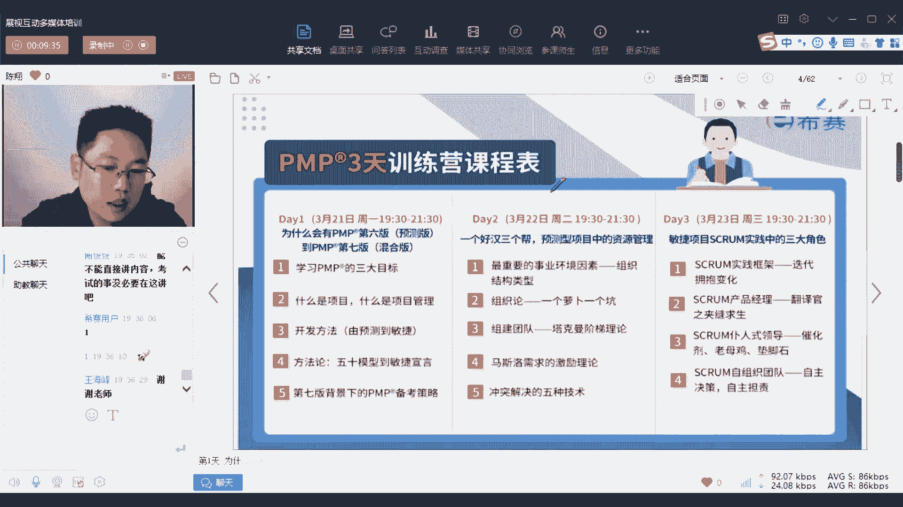

然后呢我们这三天讲什么呢，我大概给大家介绍一下啊，就好像我们旅游之前。

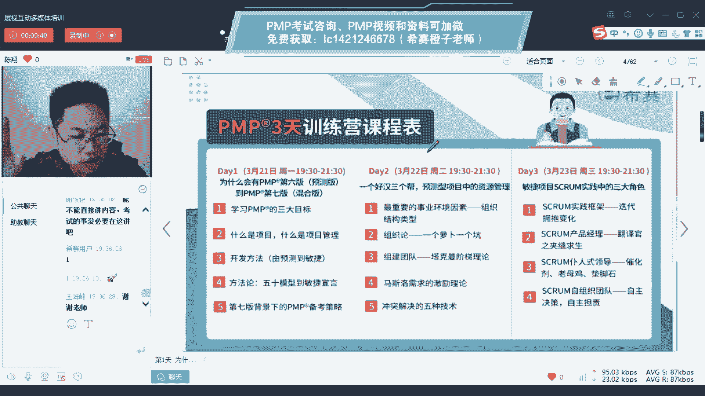

我作为导游先给你概览一下，第一个就是今天我们会给你讲一下，a p m p的这个体系啊。

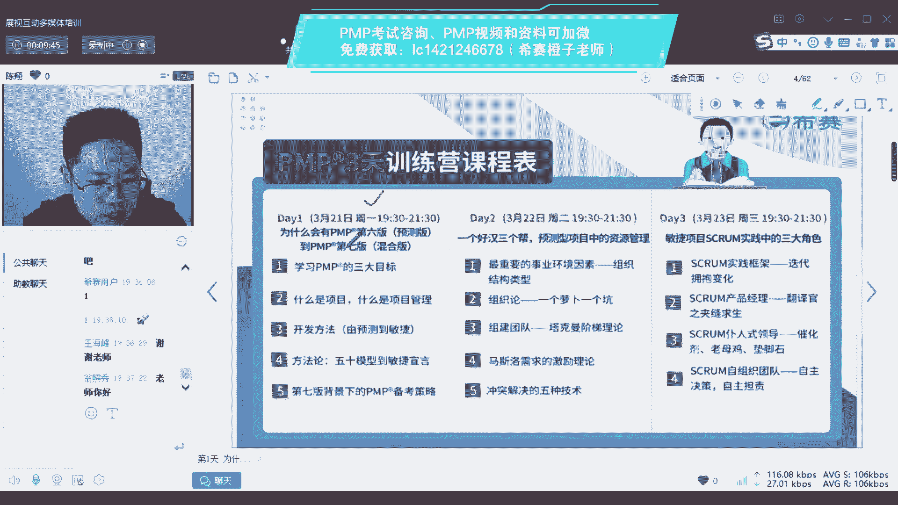

是个到底是个什么东西，为什么要学pmp。

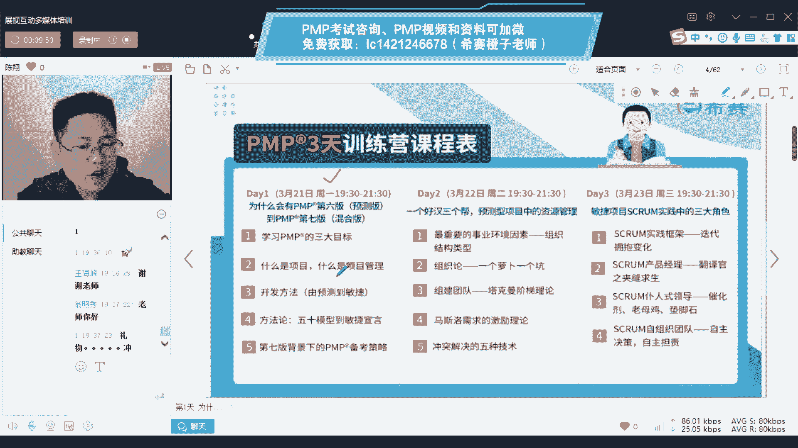

学p m p是学什么，以及第六版的预测型，和第七版的这个敏捷混合型。

他们之间到底有什么区别啊，今天主要是给大家做概况介绍。

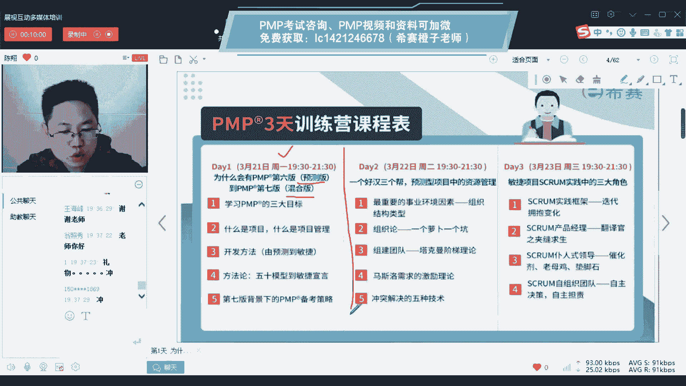

同时呢它也是我们p m p 10几张的内容的。

第一章的内容啊，然后呢明天我会给大家讲，大家呢讲一个资源管理。

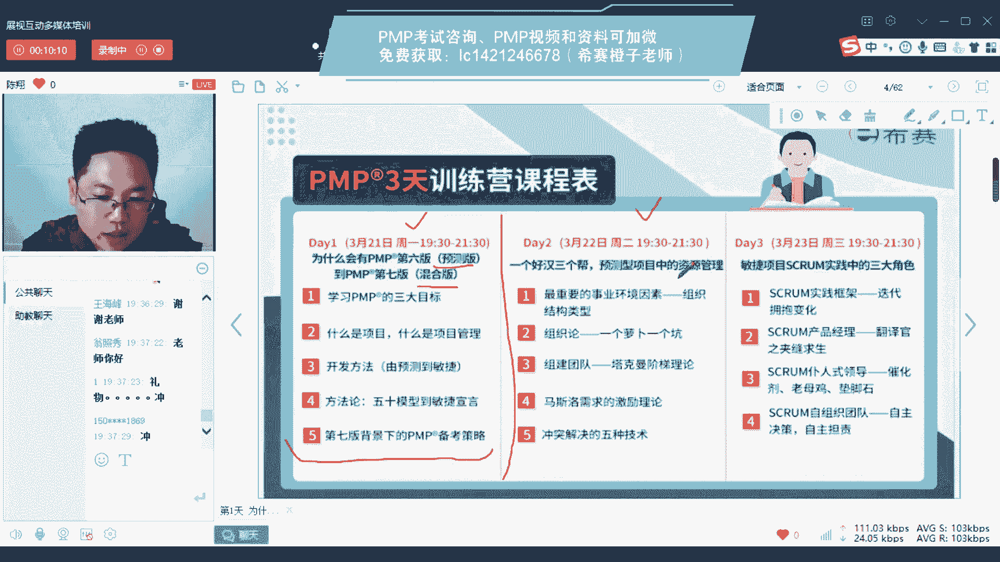

因为大家如果了解过，就知道我们大概分十个知识领域，其中一个知识领域呢就是人力资源管理啊。

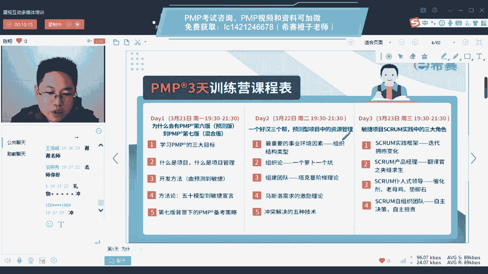

那么这个人力资源管理说白了就是怎么管人，但是呢我明天给大家讲的是。

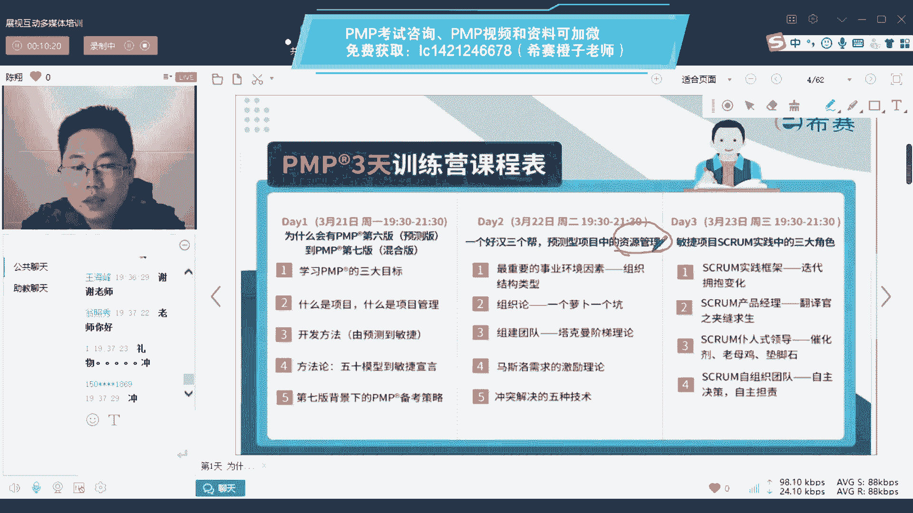

在预测型生命周期中如何管人这个词，你现在还不明白。

待会儿听了就知道了，你就理解为第六版的时候，诶，他是怎么说管人这件事的。

那么第三天呢我还是给你讲怎么管人，但是呢就是给你讲敏捷项目管理。

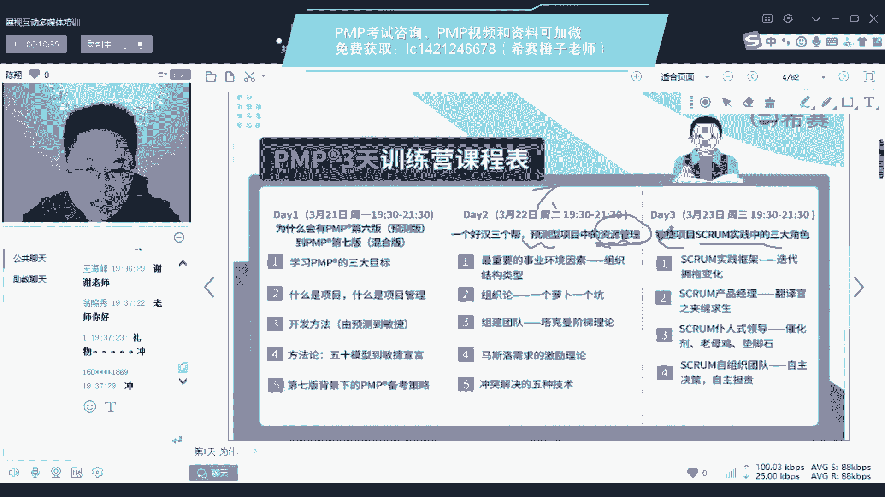

也就是说第七版中了诶，那他又是怎么讲管人的。

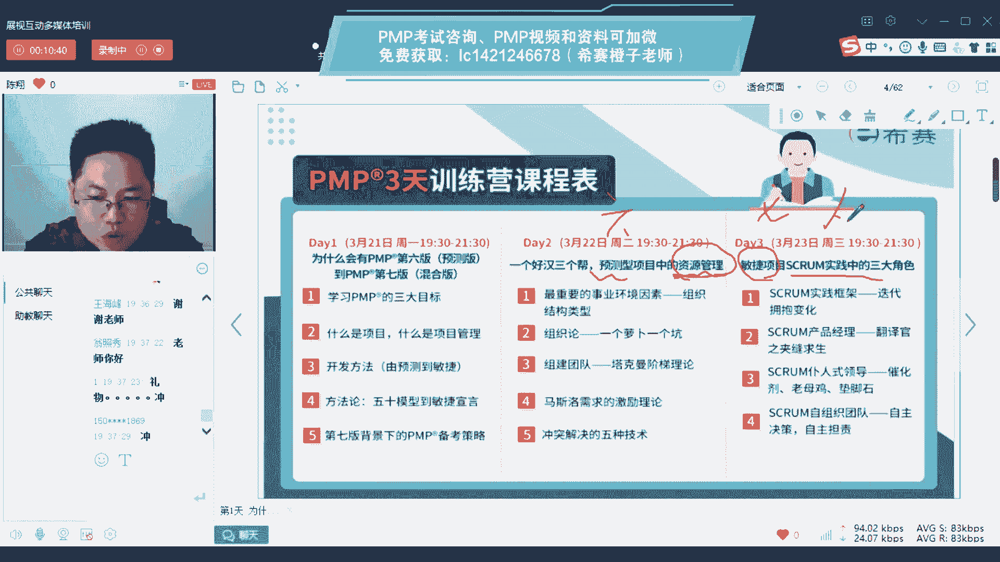

你完全可以体验一下，第六版和第七版在同样一个内容模块上。

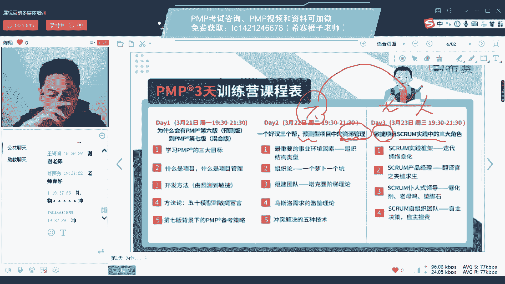

他们有一些怎样的呃差异，但是大家也可以放心啊，第六版就是我们第二天讲的内容一样。

也是会考的，所以大家如果了解过就知道说诶。

我们的第六版并没有完全废除，它，其实还是在沿用，只是在它的基础上。

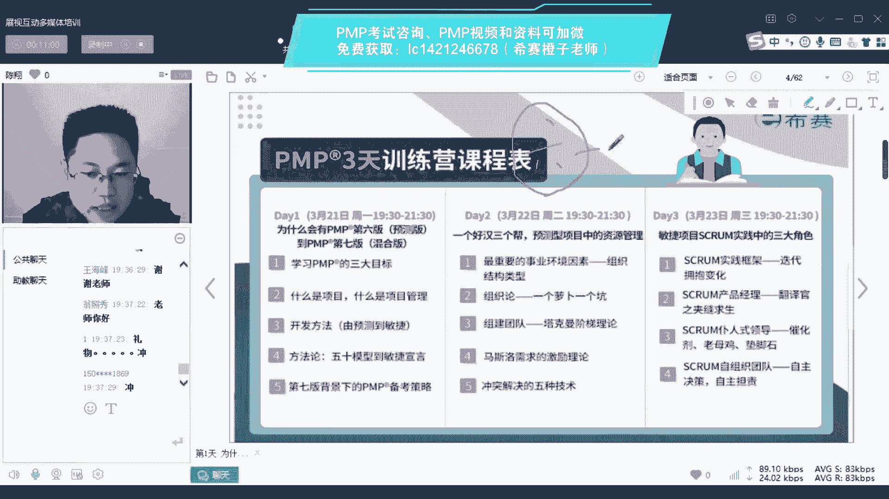

咱们优化进化出了第七版，是新增的一个关系好。

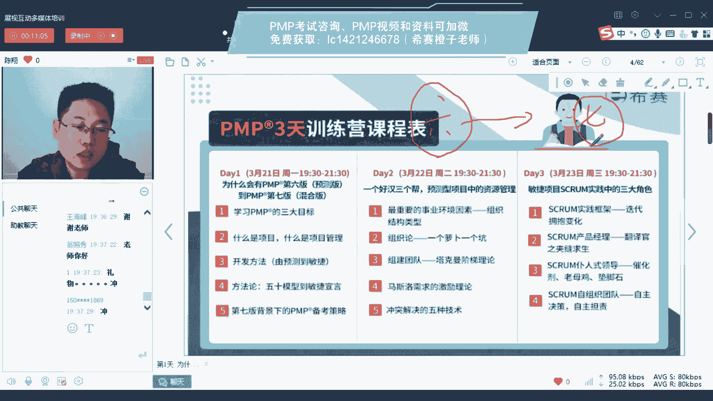

所以整个三天呢，哎会给大家提供大概我们200 180分里面。

可能会占个二三十分的分值内容啊，这个从性价比上来讲。

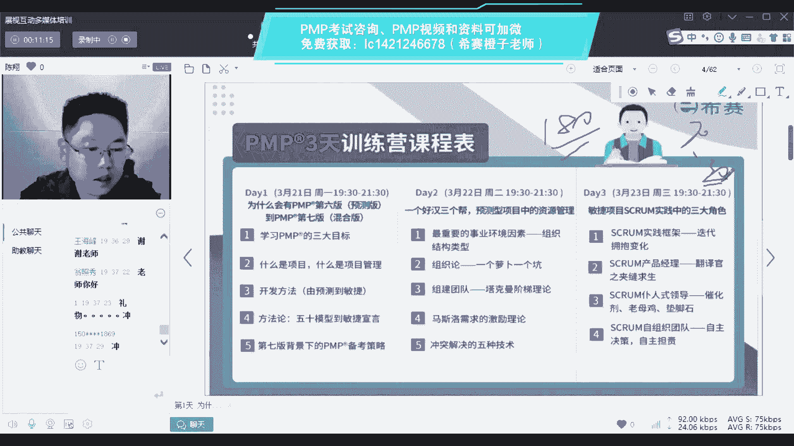

三天占个二三十分的内容，然后呢帮助大家从整体上和细节上来。

对我们整个项目管理，建立起一个a概览性的一个这个东西啊。

好这是我们接下来三天的内容啊。

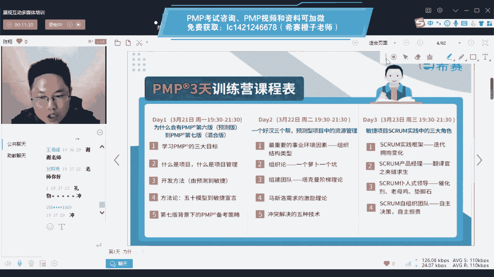