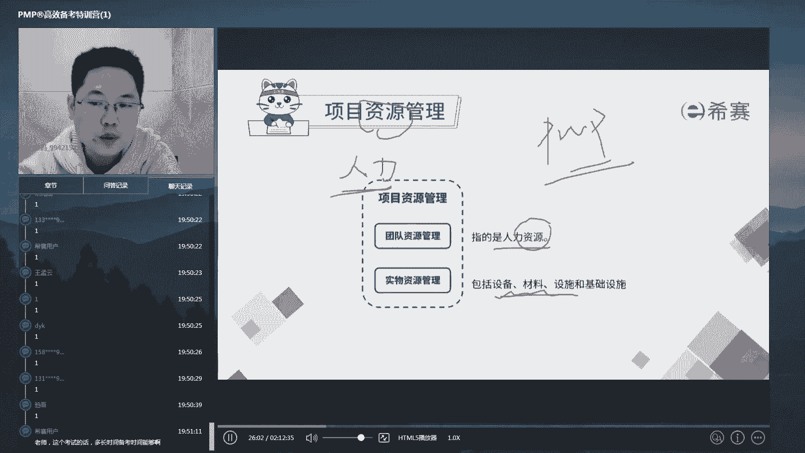

# 24年PMP考试，3天冲刺训练营27集精讲视频，完整免费分享！ - P11：2.1 项目资源管理 - 冬x溪 - BV1Do4y1x79r

我们讲第九章资源管理啊，刚才已经提到了，对吧？哎，我们项目经理不是一个人在做事情，他最要擅长的事情是收集资源建设团队利用资源，用别人把事给做了。在这儿呢，我们先强调一句啊。

因为一般来说我们说的资源这个词的时候，我们会说它是代表两类的，一类是人力资源，二类呢是物力财力设备资源。就是我们昨天讲的人机量法还除了人以外，其他的资源啊，但是呢在我们啊PMP这个里面。

因为他是教大家做如何做管理而不是如何做技术管理，做技术管理呢跟材料设备打交道啊，做人的管理是我们现在所说的这个小范围的管理。所以呢在整个PMP里面，在整个第九章啊，或者说在PMP里面。

一旦你看到资源二字，你可以马上把它跟人力啊等同起来。比如说我们经常会这样的一个语句来表达掉。哎，我们现在这个呃部门的资源不够。😡。

听啊，从别的部门去调配一个资源过来，对吧？这句话说的就是调配一个资源，就是调配一个专业技术人才过来啊，所以在这儿资源等于人啊，这是一个。那么关于人力资源怎么管呢？

我们昨天是不是说过了PM book给那里49个子过程组在每一个。😡。

领域里面呢分为了几个子工程组。每个子工程组呢？就是你在做这件事情的时候的几大步骤，它可以作为一个核对单来作用啊。那么这个地方我们列出了有6个小步骤啊，子共程组，他们分别是规划资源管理，估算活动资源，哎。

获取资源建设团队管理团队和控制团队啊，他们分别什么意思呢？其实很简单啊，就是说我们是不是说过在做任何一件事情之前，你首先得哎去做计划。那么你得了解一下我们这个项目，比如说领导安排给你个啊，说小陈啊。

明天你带着几个人去做做某一个项目。哎，那这个项目到底是大是小有什么特性，需要怎样的专业人才估摸一下哎。

你这个项目啊怎么做？那么在此之前是不是要做好怎么带人的这个计划。然后呢，基于这些计划估算一下你们到底要几个人，要什么类型的人啊，那么再从老板那或者是从人事部那去获取到这些个资源。好，人都来了。

待过团队都知道最难迈过的就是什么呀？就是团队刚刚组建的那一刻，互相都不熟。我们说什么呀？人在一起，心不在一起叫团伙，对吧？你人在一起，心也在一起，才叫团队。

所以呢我们获取到资源和在利用他们之前一定有一个建设团队的这样一个过程，让他们的心也在一起。好，新建一起了，团队打造好了，这个时候呢就能够带着团队去冲锋陷阵了啊。

那么怎样在打仗的过程中管理我们的团队又是一个步骤啊，那么在这个过程中，我们一定会出现变化，对不对？我们在每一个子工程组中都未出现跟计划不相符的误差变化，留了我们的操作余地。那么这个呢就叫做控子资源。哎。

一开始估算少了，或者呢调过来的人不符合你的要求，或者有人生病了，有人辞职了等等。那么怎样在动态的过程中来确保哎。

这个东西的掌在你的掌控范围之内，那么这就是控制资源。好，那么这六步呢，如果我们都做到了，那么对于资源管理这件事呢。

基本上也就OK了啊，那么整个这一章节的展开呢，就是围绕着这6个小步骤进行讲他们的ITTO啊。今天呢我们在每一个步骤上挑出考点最多呃，使用性最广的几个关键点，我们来展开一下。

