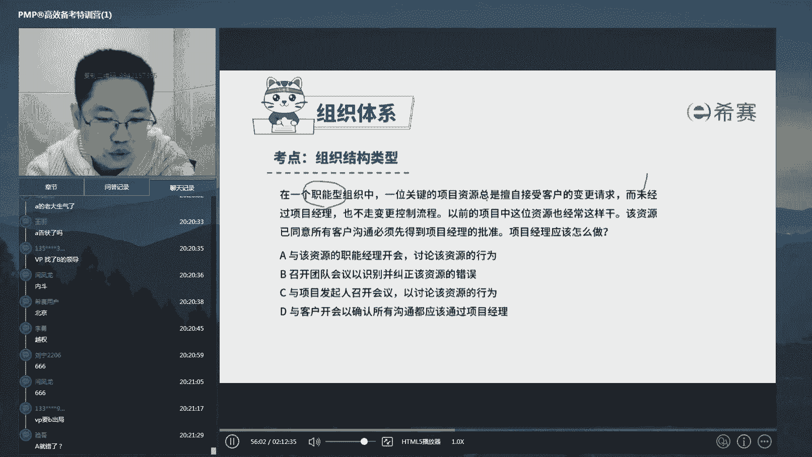
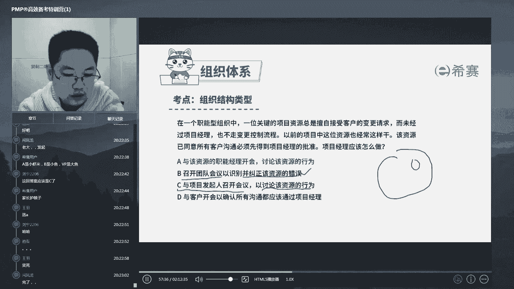
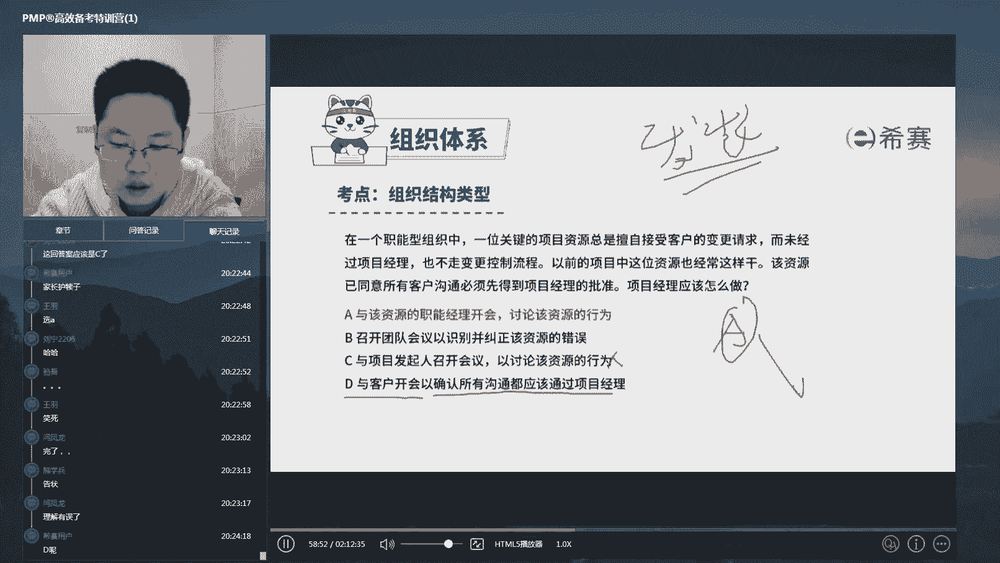
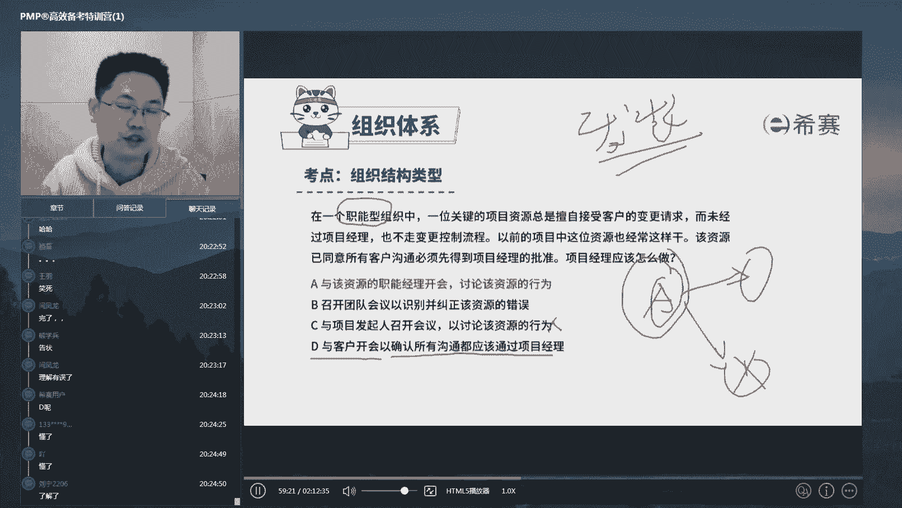
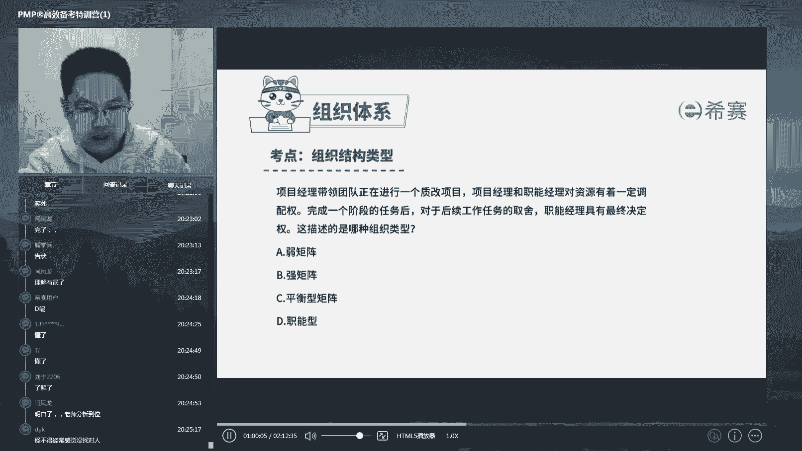
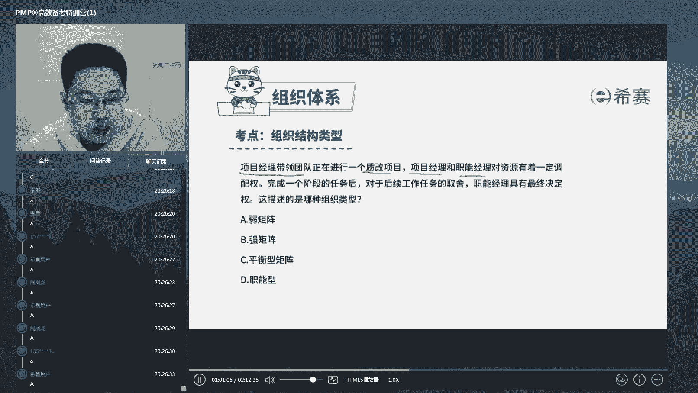

# 24年PMP考试，3天冲刺训练营27集精讲视频，完整免费分享！ - P13：2.3 规划资源管理--组织结构体系（习题） - 冬x溪 - BV1Do4y1x79r

这道题呢啊一些同学选选错了啊。

这道题选错的同学呢，你得千万小心，你们现在很危险。

啥意思呢，我先不讲题，我给你举个例子啊，就是这种事情呢永远在发生啊。

我也见过不少，比如说呢啊假设有这么一个场景啊。

有一个vp呢，它有一个就是一个凤凰裁，它下面呢有一个他的亲信。

我们打算叫a吧，有个亲戚叫a，然后呢这个公司组建了一个项目概念啊。

这个a呢就被纳入到这个项目概念的范畴了，这个时候呢项目经理我们假如说叫b啊，就天天发现了这个a就跟他对着干。

然后呢他天天在公开场合各种diss a，没过多久呢。

这个b就被扫地出局了，好请大家帮我分析一下这背后发生了什么。

这个b天天diss a，然后没过多久啊。

这个b就被扫地出局了，而这个a是vp的亲信好。

最后其实什么场景呢。

还不是a是啊，还不是a是这个呃去告状了。

而是什么呢，而是a天天跟这个b对着干的那些事。

全部都是这个vp的意思。

想清楚了吗对吧，vp它不会直接出面的啊。

都他的意思都安排a来干了。

结果这个这个b呢完全看不清楚形式，天天跟这个a对着干啊。

天天在公开场合diss，是不是这种人不不出局。

谁出局呢，所以这个案例虽然说得极端一点。

但是我们这道题是不是其实就是这个意思。

你想清楚看这种题，马上一定要定位到哪啊，定位到职能型组织结构里面啥意思啥意思。

职能型组织结构里面。

意思就是说你作为项目经理，你就等于小透明啊。

应该是啥呀，应该是职能主管，下面有他的各种员工。

你作为啊名义上叫你叫项目经理，但是你在职能心里面。

你完全没有权利啊，那么这种时候你会发现a现在有个a。

这个a呢虽然名义上是你们这个项目范畴的。

但是注意是职能型里面，他是人家的孩子对吧。

他是别人家的孩子啊，那么他们经常跟客户之间单独沟通。

明显这个行为是错误的，那么就算他是错的，你应该怎么办。

你应该是找到这个孩子的家长啊。

来讨论这个孩子哪儿做错了诶，要求家长来调教他。

这就跟当班主任是一回意思是吧，家长把孩子交给你这个班主任来管。

你就真的成了家长，你能够随意打骂吗，不行对吧，这个孩子做错了。

是不是要找到他的正牌家长，唉，让正牌家长来教育他对吧，所以呢这道题的正确选项呢应该是a。

应该是a好，这是一个，那么第二个啊，召开团队会议。

以识别并纠正该资源的错误，这就是典型什么呀，这是典型的在公开场合骂别人家的孩子。

你没这个权利。

好好c是什么呢，与项目发起人召开会议，以讨论该资源的行为。

好这句话什么意思呢，啊这句话的意思是啊。

是我们要给大家讲的，在你做p m p题的时候。

有一个选项永远错误，什么意思呢，就是把问题抛给你的领导啊。

什么意思，就是说我们经常有一条选项是a向项目发起人。

唉请教啊，问项目发起人该怎么办。

向项目发行求援，这这这这这这个意思就是我解决不了了。

老板你出面，你帮我解决吧，在整个p m p的思想里面，这个都是错误的，因为它强调的是你一旦接了这个项目。

你就是这个项目的总负责人。

你得发挥你的主观能动性，在你的尽可能的范围之内把问题给解决了啊。

所以呢你还能够具备去找职能经理讨论诶。

看他是不是能够解决这个问题的选择，在的时候你就不做。

把这个问题直接抛给你的领导，让他来解决，这就是属于一种什么呀不担责的行为。

领导不喜欢啊，项目经理，pm管理也不喜欢。

所以c永远是错误的，好在pp里面c永远是错误的啊，把问题抛给你的老板好，那么d与客户开会。

已确认a沟通不应该通过项目经理，这意思就是说a a你找错找找客户。

你跟客户聊有什么用，解决了这个客户，也许那个客户还会跟人聊呢。

是要解决a对吧，这个问题的本质是a有问题。

而不是客户有问题，你解决了一个客户。

还有十个客户，你是不是跟十个客户都去聊对吧，你要解决a的问题。

但是又要用正确的方法和途径来解决他的问题，最关键的是职能组织结构里面。

你只能按照自己的责权大小来解决问题。

是不是，所以呢我们p m p的题呢，你说他很理论啊。

很很很很抛，但实际上呢你真的在现实生活中碰见的时候。

那一刹那你才会发现哦，这件事我做错了，但是这道题我在pmp考试中做过。

好ok啊，扯的比较多了啊，这个是我们的这个智能型。

好k d y k说，怪不得我感觉经常没找对人是吧，你那你应该是说你们整个公司里面的权利。

权力的流动啊，你没有看清楚对吧。

组织结构类型是我们特别关注的一个东西啊，好这是一个再来看第二个好。

这个就简单了对吧，项目经理带领着团队正在进行一个制改。

项目，a项目经理和职能经理。

都对资源有着一定的调配权，诶这句话是不是马上定位到两人都有调配权。

说明也有双头领导，这是一个典型的职能。

那么到底是强还是弱呢对吧，那么完成一个阶段的任务后，对于后续任务的取舍，职能经理有着最终的决定权对吧。

这只是说两人都有调配权，但是如果冲突的时候以职能为主。

说明项目经理弱一头啊，所以应该是选a好飞扬。

选了b这就是最典型的强弱搞混淆了，其实很简单，还是那句话。

你站在像你永远站在项目经理的角度来看，它作为我项目经理而言。

我强一头就叫强矩阵，我弱一头就叫弱于矩阵。

这里面是职能经理强，那么项目经理就弱，所以呢应该是弱矩阵是吧。

其实还挺好记的啊，挺好记的，ok那么这道题是不是有讲的啊。

一正一反，总之呢就是在考在什么组织结构类型里面，你有怎样的权利对吧。

你要当好项目经理，管好人调调配好资源。

