# 24年PMP考试，3天冲刺训练营27集精讲视频，完整免费分享！ - P15：2.5 规划资源管理--组织论-三图两表（下） - 冬x溪 - BV1Do4y1x79r

当你把正确的人安排上了正确的事儿了，你是不是就应该得到了一张唉责任分配矩阵，这张矩阵特别重要特别重要，因为它是我们一个阶段性的成果展示，它意味着你已经捋清楚了，你这个项目要干什么事。

以及你要什么人和他们分别干什么啊，没有这个表格的现象，或者是并真也特别啊，这个啊典型就是我问你们个问题，有没有碰见过推锅的三个和尚没水喝的啊，推责的抛锅的这么些的。

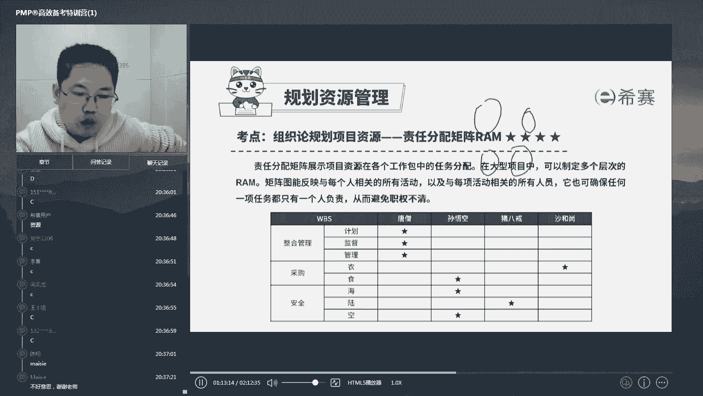

有经历过吗，三个和尚没水喝诶。

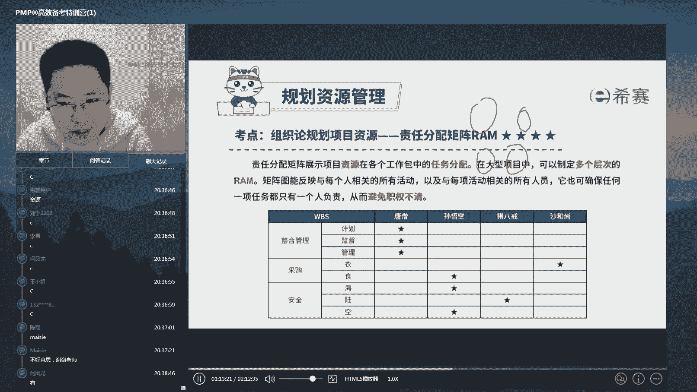

这是你做的，这是你做的呀，对吧，如果一个领导分配任务是这么说的，说哎张三李四王五，你们过来诶，今天有这么个事，你们三个人一起去把这事给干了，请问大家这个领导分配任务分得对吗。

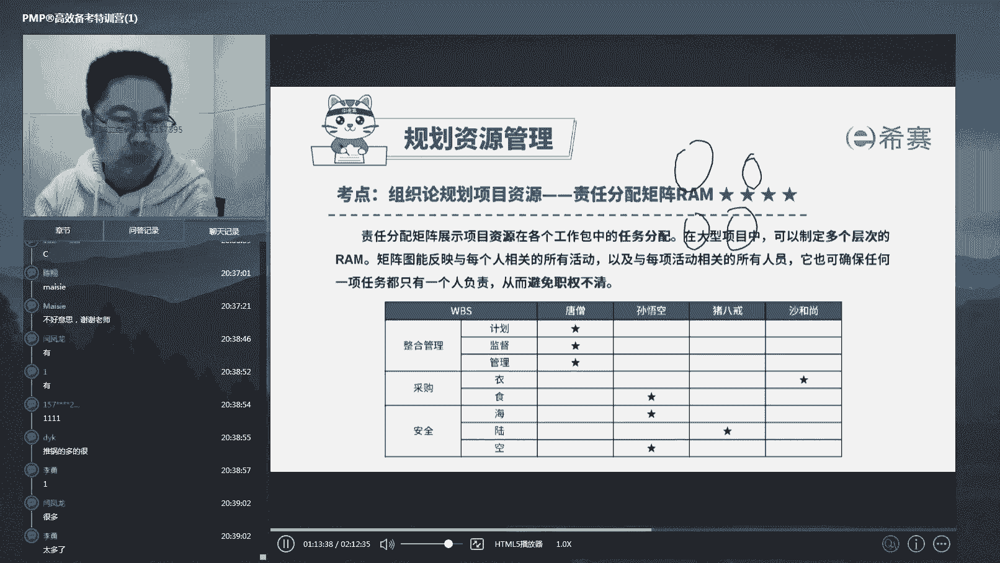

一定是不对的对吧，你们三个共同去把这件事给干了，意思就是说对吧，谁也不是他的主责人，那么出了问题啊，是大家的，既然是大家的，就不是我的，那没人去干好房。

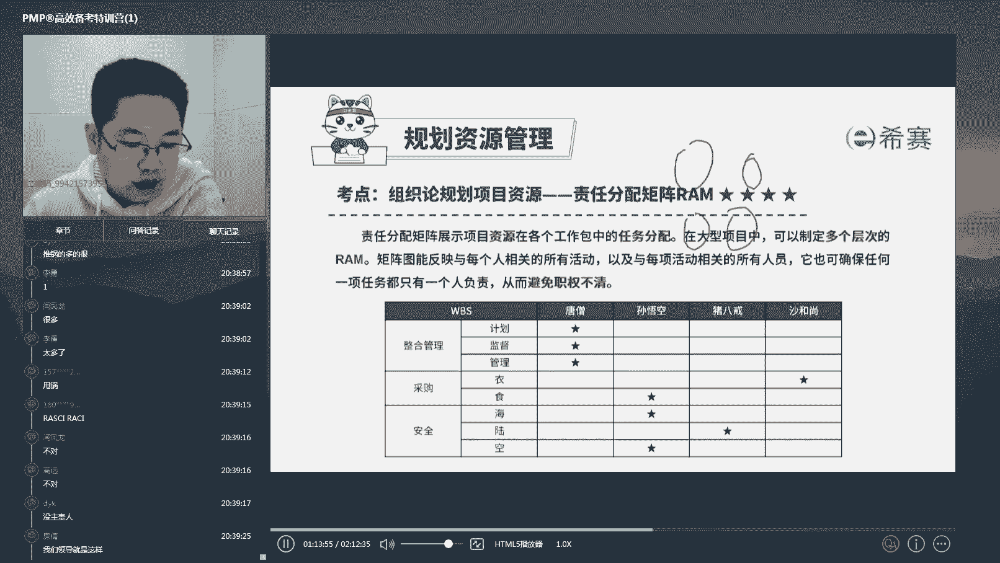

先说我们领导就是这样，那你一定要好好跟你领导说一声啊，你领导这样分配任务，你肯定很难做啊，如果在这三个人里面，abc有一个啥，有一个主动性更高一点的，那是不是就变成这个东西就是a了。

我们原来在组织写论文的时候，不就经常一样哎几个人一块去写一篇大论文，然后呢你就会发现分组写一篇大论文，然后你就会发现永远只有最勤快的那个人，一个人在独立的支撑，其他人全在玩儿。

这就是因为责任分配不到位造成的啊一些问题，所以呢解决这个问题的办法和工具也很明确。

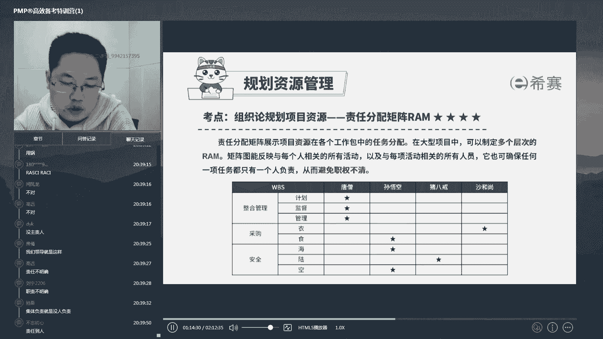

就是这张图对吧，对，说的非常好啊，防线说的这个，这句话就是特别典型的一个现象啊，所以呢一定要养成一个意识，任何一件事得有一个主责人啊。

哈哈听着写啥，说来好，这个问题应该是深受其害的人不在少数啊，所以一定要把这张表推荐给你们领导，或者你自己，那么用起来其实就很简单对吧，那么这张表格就很明确的说了。

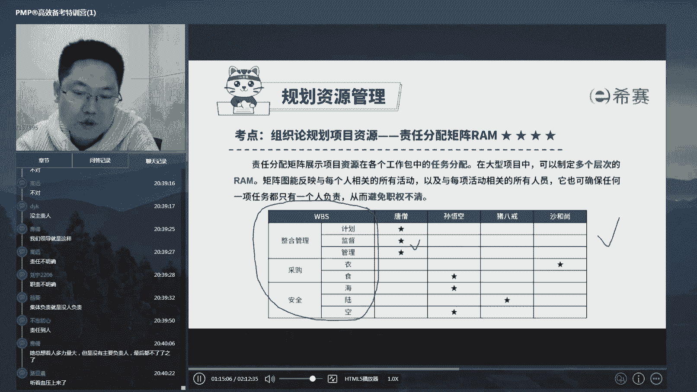

哎整合管理计划，监督管理这么大的东西，唐僧来，因为他是项目经理对吧，那么诶这个海陆空的安全，海上的和空里面的悟空管，因为它能飞能下水，猪八戒呢哎也有点武力，但是只能在地上哎打打怪，那么衣食呢是不是。

仨和尚每天背着个那个几个担子都挑着衣服，孙悟空呢每天就画圆，是不是这个问题明确的规定了唉，谁干什么，那么哪件事情没做好，能够明确的找到他的主责人好，这是一个，但是这张表呢还有一点点缺陷，就是什么呢。

就是它不太详细，如果一件事情跟几个人都有关的话，那怎么办呢，如果一件事情确实是由几人合作办成的，并且在管理职能上还有层级之分。

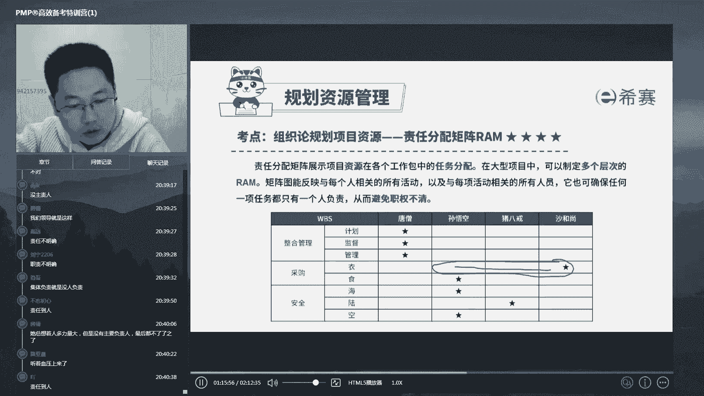

那么这怎么办啊，这呢我们继续细化出一张表格，叫做r a c i啊，矩阵，这个i x sn呢就是英文四个单词的首字母。

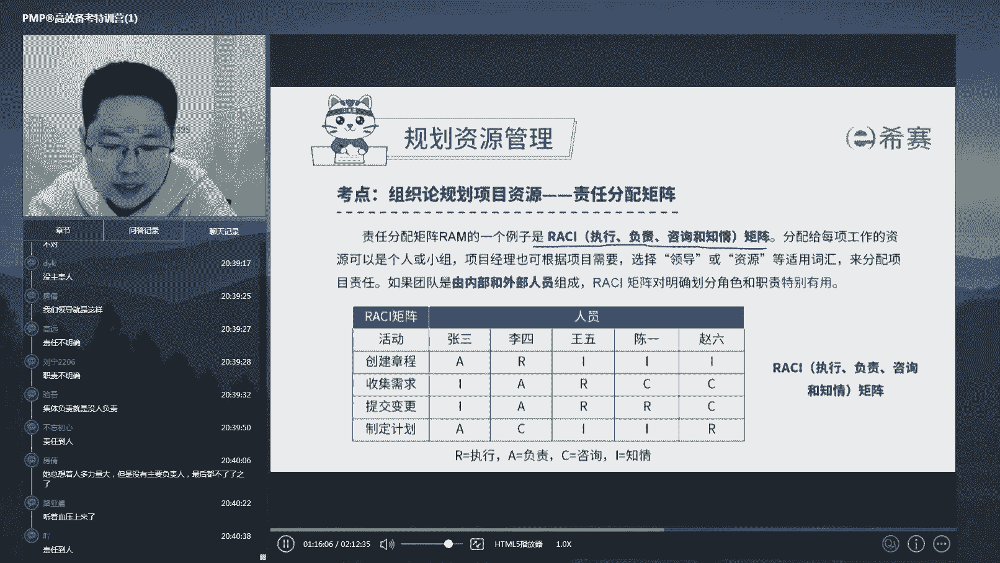

叫做执行，负责咨询和知情，当然这个东西呢它是什么呢，它是呃唉各个公司的习惯问题对吧。

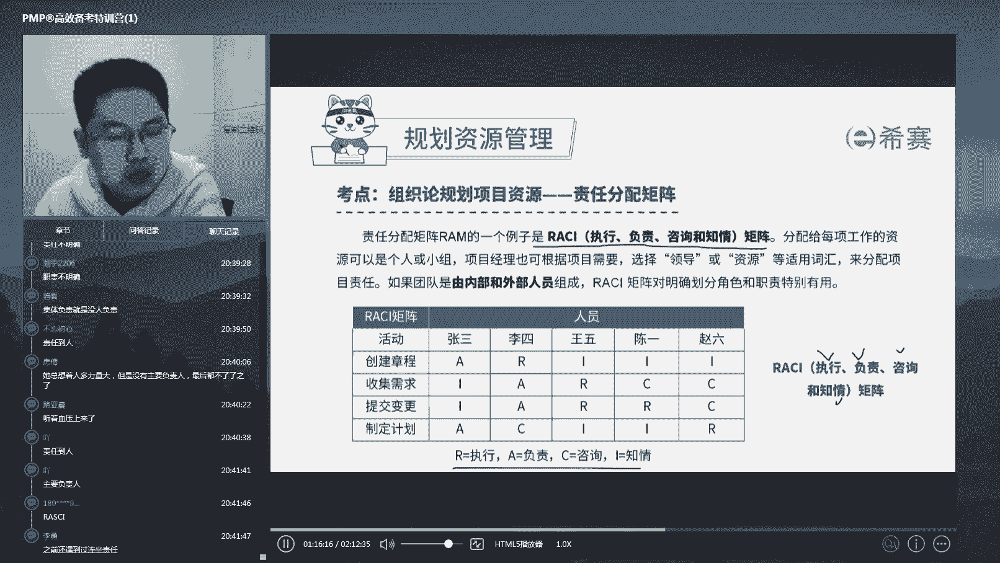

各个公司的习惯问题，那么我们每个公司可以根据你的职能不同，也进行细分，那么这样的一分之后是不是就更加清晰了，比如说你看一下这个这个创建项目章程，你不用管知道它是什么，那你是不是就能识读出来诶。

那么在这个里面张三是这件事情的执行啊，这个负责啊负责人啊，李四呢是这件事情的执行人啊，然后呢王五赵六他们是这件事情的执行人啊，这个知情人如果在这画了个c呢，那么他就是咨询，就是你不懂的时候。

你可以去问他是不是这样子一划分之后，每件事情谁负责咨询，谁负责咨询谁或者执行谁不是负责，是不是都都ok了啊，这样子就能够更细化好，在这经常我要问一个问题啊，比如说这个里面啊，请大家告诉我，如果你是领导。

你是领导，这个活动做黄了啊，做失败了，你该找谁，这一项活动创建项目章程，这项活动如果做失败了，你该找谁，非常好啊，在我们这一批人里面，我只看见一个说找李四的啊，在别的时候啊。

我经常遇见百分之二三十甚至40以上的人说，找李四问题在哪，你想清楚，这就是一个常见的误区对吧，负责人负责人什么意思，甭管这件事是谁做的，总之出了问题你得负责啊，这个东西的反例是什么呢。

就是经常你想过你有没有说过这种话啊，你的领导交一个任务给你，然后你安排给你的一个下属去做了，然后你领导现在事情做完了，领导找过来的时候，你说这件事情是唉李四做的，回去我一定好好批评他，对不对。

回去我一定好好批评他，然后你的领导对你是什么样的一个印象，想清楚啊，很多人啊，特别是在我面前，我很多下属也说过这件事对吧，哎这个任务安排给谁了，他没做好领导，你放心，回去，我一定好好教育他，批评他对吧。

对于这种人啊，我基本上是将来再也不会可能不会重任了，不会往上升他了，很明很明显，因为我交给你来负责，你就要负责到底至于谁做，那是他们的事，他们做没做好，我不管啊，我交给你了，就是你的事对吧。

所以呢千万不要推锅，不要推责，明确好身份身份以后，就按你的身份去办事情好，ok这个是我们的i si矩阵好，那么这个i c i矩阵和这个刚才讲到的im，责任分配矩阵什么关系呢，是不是i sa矩阵管的更细。

他们叫什么呢，相当于是起子和十字起，是不是更针对一些特殊情况，什么特殊情况呢，就是啊在我们的工作中呢，就是更细致的要求的时候，在我们题目里面呢，他一般会出这种字眼。

叫做复杂项目的和由内部和外部成员构成的。

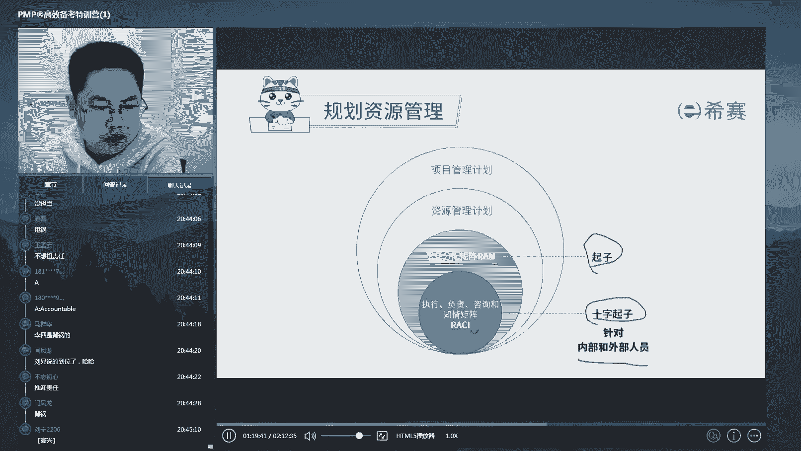

这样的一个场景，什么意思，就是当有很多部门或者是公司，合作来干一件事的时候，是不是这个责权利的分配就容易特别不清楚，这个时候呢，你需要把a责任分配矩阵过得更，做的更细致一点。

这个时候呢就算他们俩同时出现，你也该来选什么呀，选i ci对吧好，这个是我们的具体责任分配，那么这个责任分配呢，其实就是我们涉及到我们资源管理计划，的一部分，这是刚才讲的。

做任何一个模块之前都得先进行一个计划对吧，那么资源管理计划呢跟我们十大知识领域，其他管理计划合起来又叫做管理计划，项目管理计划，所以这些东西都是一个计划类文件啊，层层包裹。

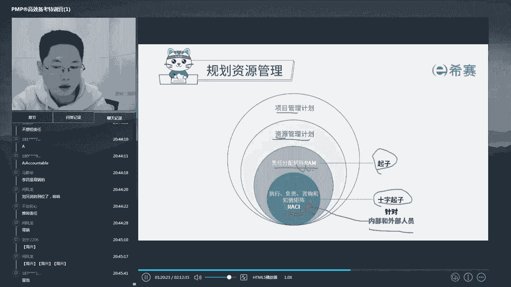

ok那么这个我们来做道题看一看，第一个答对的啊。

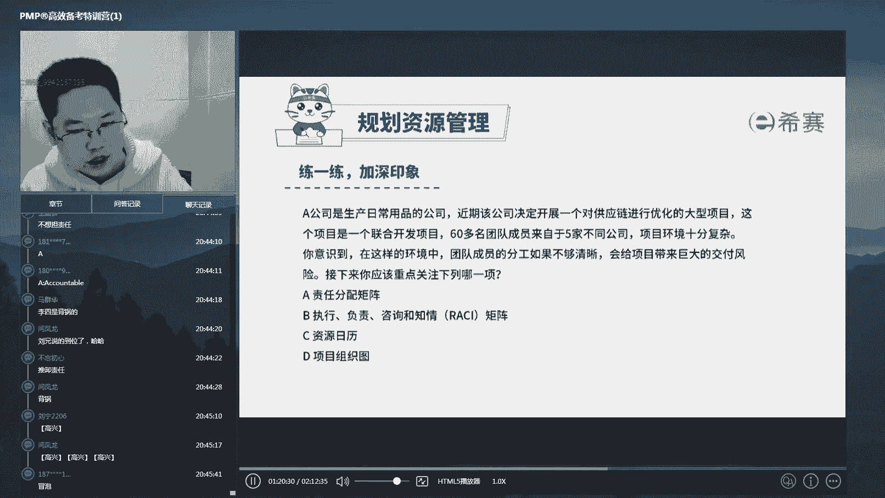

咱们送一份小礼物好，这道题选择b选项啊，辽宁啊。

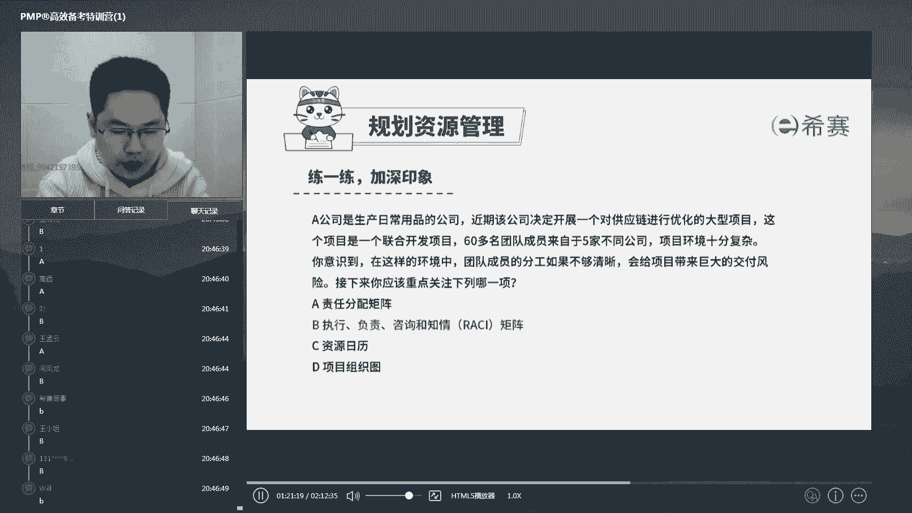

辽宁第一个答对，送他一份小礼物啊，是不是昨天你已经领过一份了啊，有点过于强了，我感觉是有点过于强了。

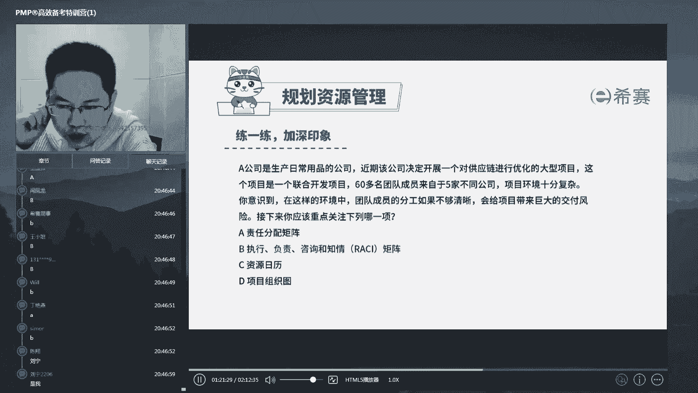

每天都都能抢到，是不是，是不是昨天昨天已经领过一份了。

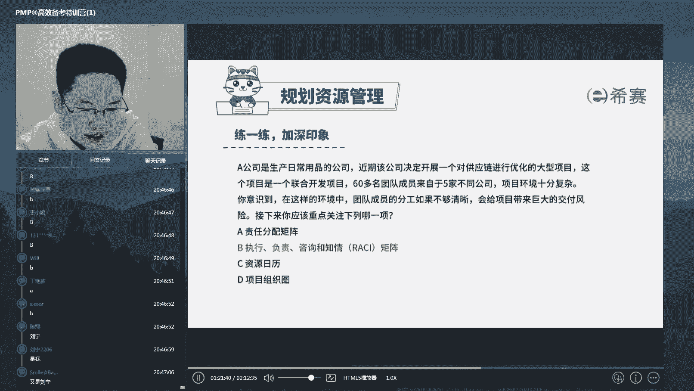

好我们来看这道题啊，这道题其实说的很简单，是不是你读几个关键词，现在是在做一个大型的项目啊，优化的项目对吧，优化的项目，然后呢，这个项目是一个联合开发的，那么60多个团队成员来自五家不同的公司。

环境十分复杂，在这种环境下面，如果分工不够清晰，会带来极大的交付风险，你应该用下面哪个工具对吧，大型的复杂的，特别是什么呀，特别是60多个人来自于五家不同的公司，这是不是我们我刚才说的。

你的这个项目是由多个内部。

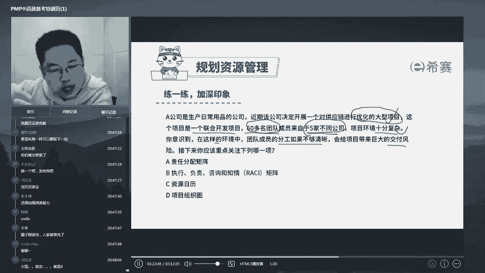

外部的这个团体构成的，那么对于这样复杂的，一定要把责任分配这件事情做得特别细致对吧，所以呢应该是这个选b i c i矩阵对吧，所以我刚才讲了，责任分配和这个i c i起到作用是一样的。

明确这个责任责权利啊对吧，但是呢b比a更细致，它更适配于现在这道题的背景啊，这个复杂内外。

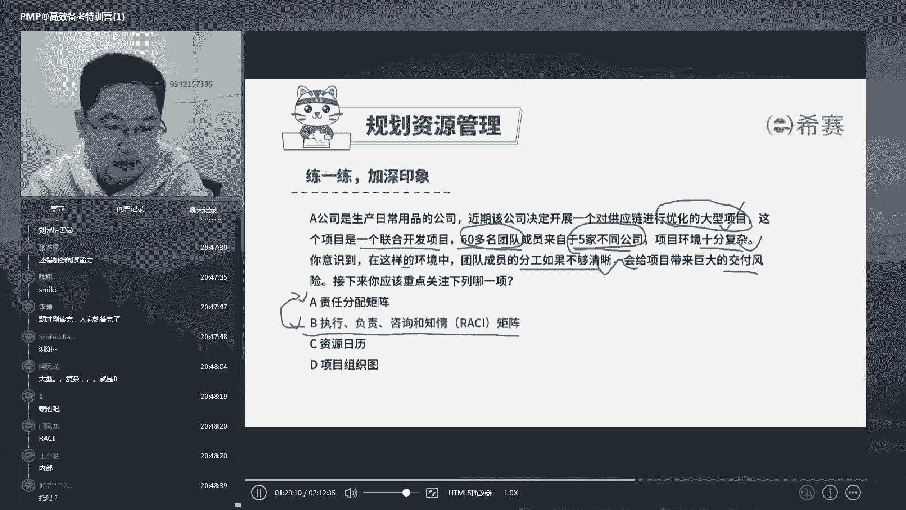

好ok那么这个啊我们就讲完了好，那么当你把你的这个人，他的责权都分配清楚之后啊，那么我们来看一下，那么还有什么呢，还有呃啊这个有点没必要对吧，这个完全没有必要在这个地方射托啊，完全没有在这个地方射脱啊。

就一个十几20块钱的小礼物而已啊，我要是抽个几千块钱的这个这个啊这个礼物啊，呃我看他还设个图，ok好回来啊，回来回来，那么接下来干嘛呢，是不是进一步的细化明确他要干嘛是吧，第一张表格虽然清楚明确。

但是还是过于简略了，所以我们呢可能还会设一个港则清单对吧，每家公司可能有不同的叫法，有的叫岗位责任书的，有人叫岗位清单的啊等等，那么通过更加详细的描绘来填充，让这个人知道自己该干嘛对吧。

你这个东西就有点类似于，你在boss直聘上去做题的时候对吧，这个应聘的时候会给你两段话，一段话说这个岗位要干嘛，第二段话说你应聘这个岗位，你要需要具备什么样的能力和精力是吧。

就这个东西就是告诉你你是来干嘛的，好这个东西呢知道就行了啊。