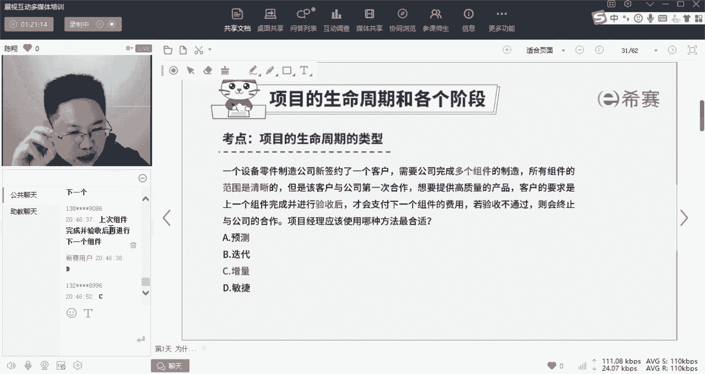
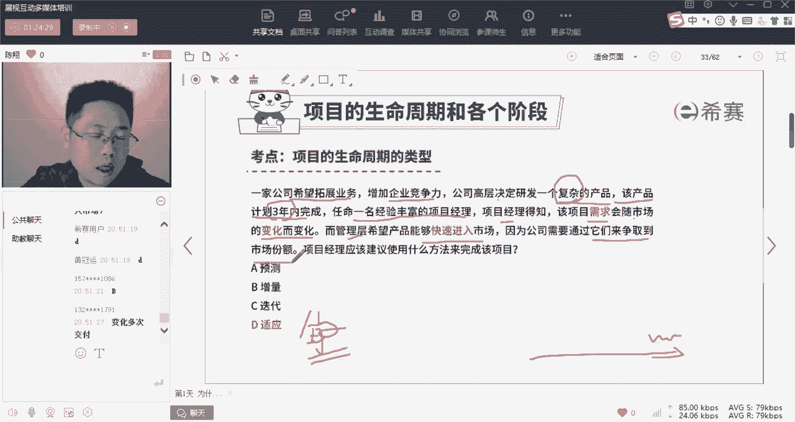

# 24年PMP考试，3天冲刺训练营27集精讲视频，完整免费分享！ - P7：1.7 项目管理生命周期的各个阶段-习题 - 冬x溪 - BV1Do4y1x79r

所以大家会发现对吧？选择到了正确答案的人，一般都是找到了正确的关键词的人。

选择到错误答案的人呢，可能只找到了一个关键词。

好，那么这是我们的第一道题啊，我们直接来看一下。这道题呢应该是选C关键词是什么呀？先解读这些道题啊，首先读懂题是最关键的啊。一个设备零件的制造商签约了一个新客户，需要公司完成多个组件的制造。

说明呢现在他要你做的这个项目，可以分为多个组件，也就是多个部分来完成。而呢所有组件的范围是清晰的。好，可能很多人对范围这个词还不太敏感。所谓范围是清，就是需求是清晰的，就是要你做什么事儿是清晰明确的。

那么这个词是不是立马先在这张图上定义到了什么呀？定义到了这一列。是吧？

需求不变，一开始就很清楚。

好，第二个是什么呀？但是呢该公司。与该客户是第一次合作啊，那么可能就是不放心，对吧？对你不放心，所以不看一开始就把所有事儿都交给你做。所以客户的要求是上一个组件完成以后进行验收了。

才进行下一个组件的费用支付。若不通过就直接终止了。意思是什么呀？哎，做一块交一块再做一块再交一块。如果但凡这个地方不合格了。接下来事就跟你无关了。那这是不是一个典型的分多次多阶段分别交付。

是不是每交一次的东西就叫做一点点增加的啊有效的价值量叫增量啊，所以呢这道题的两类关键词啊，一类帮你定义它的需求清不清楚。一类帮你定义它交付的频次是一次还是多次。

那么两个关键词一定两维四象限的结果就定出来了。所以这道题呢应该是选增量。

是不是O好，我这样解释啊，大家还有什么啊问题没有这样子解释能不能接受啊，因为我们是碰见第一道题，所以呢我停下来卖点，我们可以讨论一下。😊。

基于这道题，你对刚才的那个两位四象线图。

加深一下理解。如果有问题啊，你说我跟你回答嗯。

好，这就是我们做这这种题的啊，唯一的诀窍找两个维度。

对，范围清楚，排除了迭代与敏捷。对的，因为范围清楚一开始就清楚了，你不用去啊多次探明。迭代和敏捷一样嘛啊ok我们再来看一下这道题。

好，带着你的这个问题啊来看这道题。

看清楚了啊。不要太快了，看清楚了。

好，有人选C，有人选D啊。我跟你们说，有人选错了，给你们一次反悔的机会。

好呃。

好，这个地方啊可能有过一点小问题，我给你们加个码啊，适应型，刚才没跟你讲，适应型呢，你就当做敏捷型来理解就行了。😡。

啊，适应在这儿你就等于敏捷。有没有人要改答案的？

适应就是敏捷。

这个没跟你讲啊，好，事应就是敏捷，然后那就是C了。😊。

好，OK我们看一下这道题啊。😊。

好，注意啊，这道题这是一个典型的敏捷生命周期的要求了。

对，关键是什么呀？一家公司希望拓展它的业务能力，增加企业竞争力，高层决定研发一个复杂的产品。你对复杂和简单的产品这种词一定要有敏感性啊，该产品计划三年内完成，对于三年这个长时间要敏感性。

任命一个丰富的经验的项目经理。项目经理得知该项目的需求，因为会有三年时间会随着市场的变化而变化，是不是马上定位到A，它是多次变化，需求不清楚的啊，那么又因为管理层希望能够快速的将产品投放市场。

来抢占到市场份额，是不是就我们说的哎，微信抢市场啊，元宇宙抢市场。

是不是所以呢怎样能快速抢占市场，尽早的投入，但是怎么样尽早投入呢？分多次交付，先交一小点核心功能啊，再多次交付，是不是？那么。既然既有多次，又有哎这个既有多次又有啊需求不清晰变化。

那么是不是两个都定高定到了高维度，那么最终合适的只有右上角这个也就是敏捷型生命周期啊，在这儿呢我们叫做适应性。好，有人说了迭代输在哪儿了。啥叫迭代呢？比如说就拿你的这个。

我们刚才说的写论文这件事儿，其实大家知道写论文也是拼速度的，对不对？你这篇论文一发表了啊，他的这个你跟他论文跟他的论文写的命题是一样的，他比你早发一点时间，它发出来了，你就没价值了，是不是？

但是你跟你在你导师呢一直在迭代迭代了108遍了，还没迭代出来。那么这篇论文是不是还是发不出去，没发出去，它就没价值。所以你迭代这个生命周期，它涵盖着什么呀？涵盖着最终一次性交付。对，交付太久了。😡。

好，这样说大家能接受了吗？好，所以这道题呢是选D啊，适应性生命周期，也就是敏捷型。

