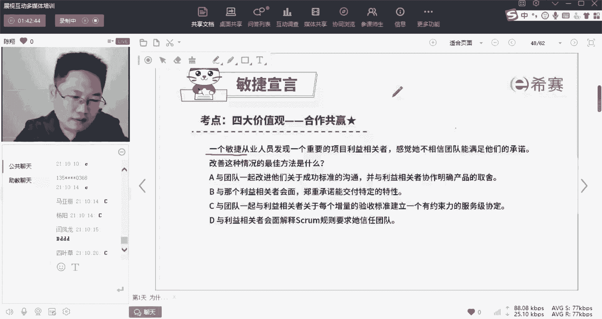
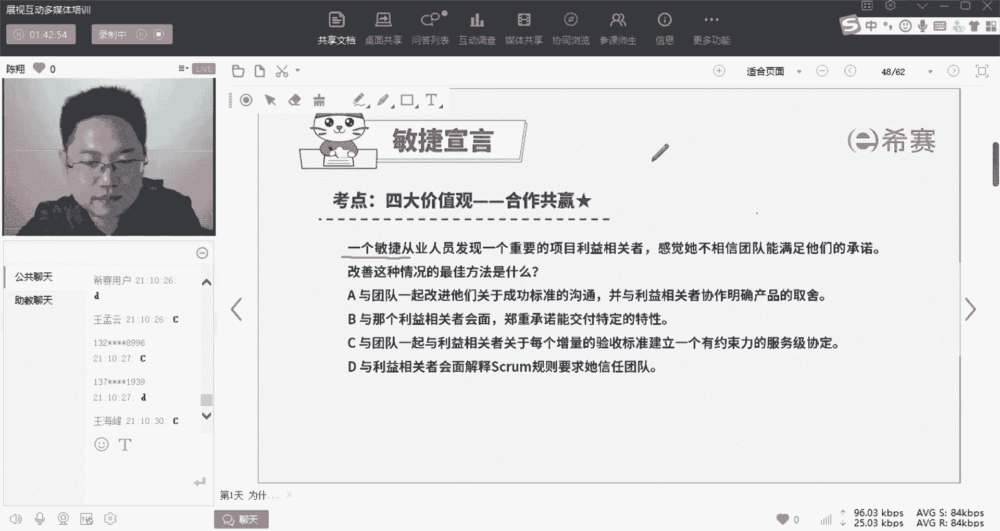
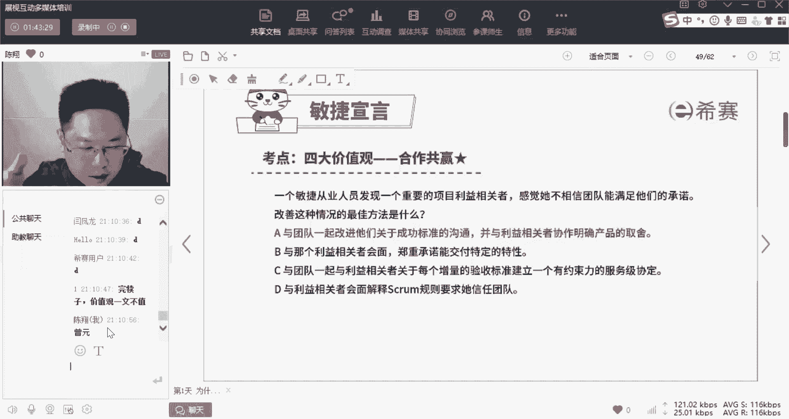
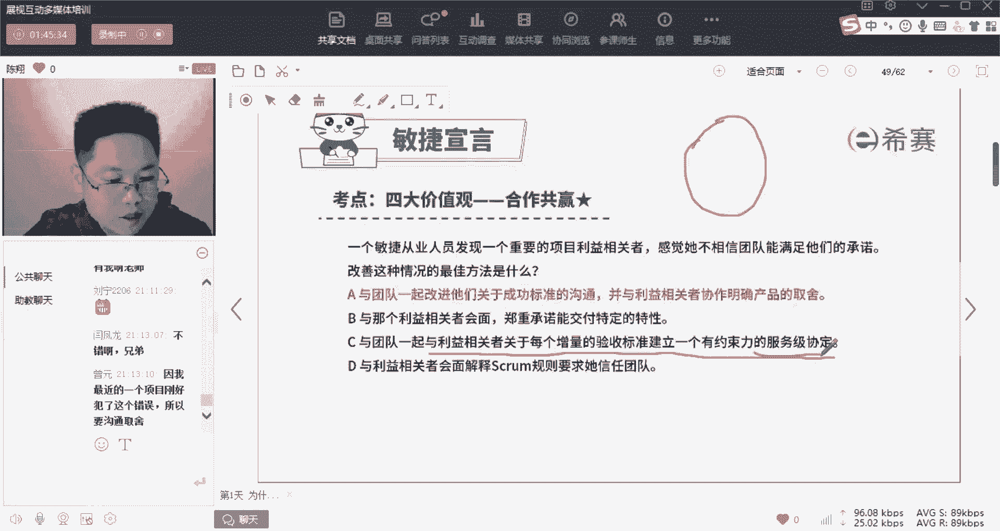
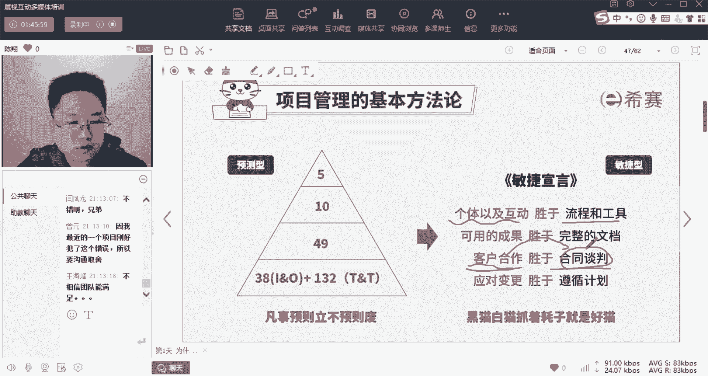
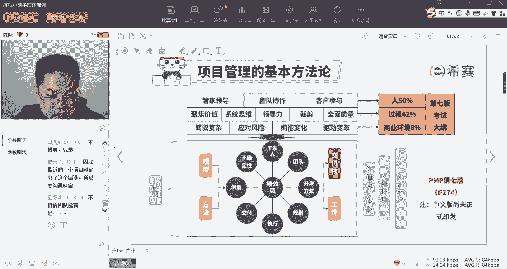
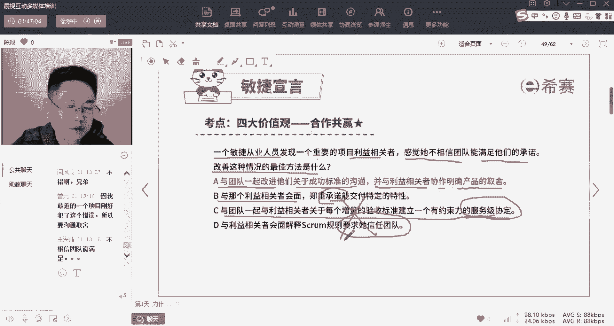

# 24年PMP考试，3天冲刺训练营27集精讲视频，完整免费分享！ - P9：1.9 项目管理的基本方法论-习题（敏捷） - 冬x溪 - BV1Do4y1x79r

这道题我就是要让你们去选c。

为什么呢，因为c是错的啊。

因为c是错的好，我看一下啊，第一位选对的朋友，我讲的太嗨了，今天忘记送礼物了啊，下下节课你们要提醒我，这道题第一个选对的人是这个cc用户，你看我让你改名字，你不改吧啊，其他用户我不知道你是谁啊。

我没办法送礼物，我只能送给接下来的增援好吧，真源，好增援啊，请凭借我的这个截图啊，你截图下来到我们群内找我们助教，可以领一份礼物啊，我们直接邮寄给你，放心啊，上面没有粘病毒啊。

ok这道题是选a啊，啊刘宁我看一下啊，稍等一下，我看一下谁第一刘宁没看见啊，增援是第一个啊，啊刘宁是第一个啊，我看错了，好没关系，两人都送啊，好稍等一下啊，ok两个人都送啊，两个人都送啊，凭我的截图啊。

到群内去领礼物，送我们知识地图好，我们来讲一下这道题啊，那么这道题对吧，你们直觉告诉你都是肯定选c，为什么呢，因为你们的直觉都是预测性的，我刚才不是讲了，就算你知道或不知道你们现在公司运行的准则。

运行的方法大概率都是预测的啊，讲究什么呢，讲究管控，讲究计划，讲究合同，讲究啊谈判啊，讲究标准的工具和流程对吧，这都是我们现在习惯的一种价值观，但是呢敏捷就是要突破它啊，为什么呢，我给你举个例子。

你就明白了，就比如说刚才有人问我说哎，6月份到底会不会考试，能不能考上对吧，能不能考试，现在我们的环境是变化的对吧，现在不是说我不愿意跟你承诺，而是我真的没办法给你承诺，也没有人有能力给你承诺。

所以如果说诶你现在不相信我，6月份能让你参加考试啊，那么我告诉你，我给你签一份合同，如果你不能考试，我怎么怎么样，你怕不怕我骗你，你怕不怕我跑了，哎你怕不怕怎么怎么，这个那个的是不是在变化的时代。

纸质的承诺甚至都没有那么有用，什么东西有用呢，我们俩通过互动建立起信任，比如说我不能确定6月份能不能考试，但是我给你承诺的是，我服务到你能参加考试为止，不管是6月9月还是12月，为什么呢。

因为曾经我们就是这么做的，比如说3月份，如果你参加了哎，你你遇到了这个推理推迟考试的情况，那么那么你会发现对不对，推迟多久考试，我就给你增加多久的服务，是不是，所以在敏捷的环境下对吧。

敏捷的环境下我们更讲究什么，回到这句话啊，回到这句话，个体的互动啊，剩余流程和工具客户的合作胜于谈判啊，谈判带来的是什么呀，承诺性的合同文件，但是呢我们一旦能够通过合作建立互信，让他把环境变得更好。

是不是就优于诶合同谈判这种死板的啊。

这种东西对，所以呢这道题啊我们是一个典型的预测题。

我们在最终来看一下这道题，一个敏捷从业人员发现一个重要的利益相关者，其实就是甲方，甲方金主爸爸，感觉他不相信团队能够满足他们的承诺，唉不相信他们能办到最佳的改善方法是什么，应该是a与团队一起。

改进他们关于成功的标准的沟通，并与利益相关者协作，来明确明确产品的取舍，就是我刚才讲的，唉你不相信我们，我们就去做，做到你满意，做到你相信为止，通过更多的互动，通过更多的成果来让你看见我们的能力。

我们的诚意，我们的决心啊，这就是敏捷的价值观，如果你不了解这个，你肯定会啊，要么选择b与他会面啊，郑重承诺他给口头答复啊，给口头承诺，或者选哎建立一个有约束力的服务及协定，就签合同或者是要求他信任团队。

这些通通都是什么呢，都是敏捷型啊。

