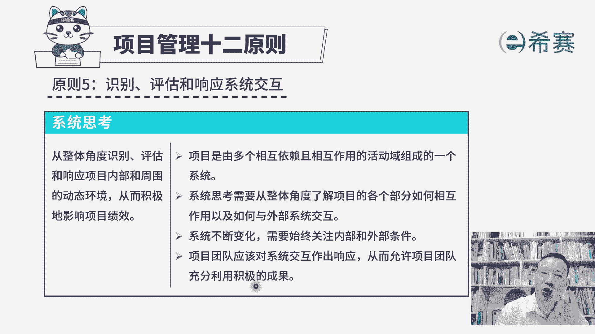
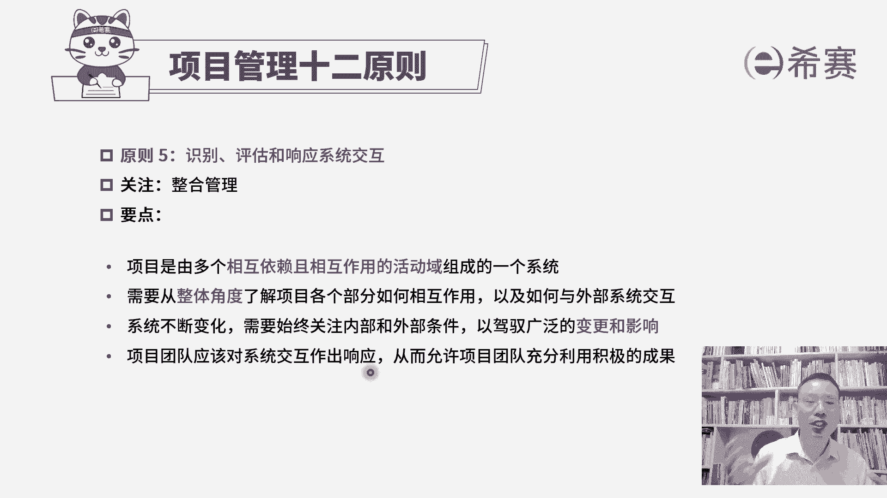

# 24年PMP考试告别啃教材！PMP第七版《PMBOK指南》精讲免费观看，8大绩效域+12项目管理原则 - P30：PMP第七版项目管理原则之05系统思考 - 冬x溪 - BV1JV411L7Zn

接下来我们一起分享的是项目管理12条原则，的第五条原则叫识别评估和影响系统交互。

这个词看起来很陌生啊，其实你看完以后你会发现，相对来讲，基本上就是类似于这样一个整合管理的意思，在里面，我们来看一下，它更强调的是一个叫系统思维，什么叫系统思维呢，就是我们在做项目的时候。

你不要去头痛医头，脚痛医脚，你有一种整体的思维来去考虑，你要考虑到包括启动规划，执行监控和收尾，你要考虑到范围进度成本质量资源沟通风险，采购相关方等等啊，他说要从整体的角度来去识别项目。

内部和外部的这些动态环境，然后要去评估项目内部和外部的，这样一些动态环境，并且要去响应项目内部和外部的这样一个，动态的环境，我们要去识别这些环境因素，要去评估环境因素，并且相对应的来去做出一些调整。

去响应它，从而积极的去影响项目绩效，这个积极的影响项目绩效，其实说的是有效的把项目往前去推进，去推动它，那整个项目他说是由多个，相互依赖且相互作用的活动域来组成一个系统，也就是我们前面学过包括范围管理。

进度的管理，成本的管理，质量的管理，资源的管理，沟通管理，相关方管理，风险管理等等对吧，其实会有很多事情，他们还会有规划呀，执行啊，监控啊，还有49个过程，有好多好多东西。

那么这些个东西一起来去组成一个大的系统，那所以呢我们需要系统性的去思考，要有一个系统思维，要从整体的视角去了解各个部门的关系，因为我们有讲过，比方说如果你要去让范围做得更多一些，那你的周期可能要更长。

你如果不希望这个周期变得更长的话呢，你可能就要去增派更多的人手，可能资金就要花的更多，你如果不想要增派更多人手，你也不想花更多的资金，那有可能就是只能是偷工减料，或者只让做的更差。

所以他们相互之间有很多的这种关联关系，我们要从一个整体的视角来去考量这个事情，来去了解各个部分，它们是如何相互作用，以及如何与外部系统的来去作用，所谓的外部系统，也就是说。

这个项目它和整个外部的环境之间，也有一些类似的这样一个影响，那整个系统它可能会不断的发生变化，我们需要去始终关注外部的这些环境条件，以及系统内部包括范围，进度，成本质量这些自身的这些因素。

我们要去从中去取一个balance，取一个平衡好，再有一条说，项目团队应该对于系统交付作出响应，也就是说如果有什么样的一个情况，比方说进度落后了，那你要怎么办，你要去做一个进度压缩呀。

你要去做赶工或者快速跟进呢，如果说范围有蔓延，那你可能需要去做这个实施，整体变更控制要管控的更加严格一点，不能说想变就变，那如果说成本有超支，你可能要适当的去压缩成本，你怎么样去压缩。

你让一些更牛的人去做事情，把那些某一些不重要的人给替换掉，或者什么样的给大家提供培训，让他技能得到提升，因总之你要对于这种系统环境的这个有什么，什么情况的时候呢，你要做出相对应的一个响应。

从而能够允许项目团队，充分的利用积极的成果，来去比较好的推进这个项目，达到一个相对良好的状态。

整个关于识别评估和影响系统交互，它其实讲的是一个整体视角，是一个整合性的一个思维，所以呢他用了不同的词汇，但是表达其实类似于整合管理，所以整个项目呢它是由多个相互依赖的。

这一些歌活动欲来组成一个大的一个系统，最多一点，那里就会少一点，这里有影响，那你就会有影响，我们说是会牵一发动全身，所以我们才需要从整体的角度来去了解项目，各个部分，它们之间的这个相互作用。

以及跟外部环境这个依赖关系，并且本身我们说，整个这个项目还在不断的往前去推进，所以进度也好，成本也好，资源也好，各方面都占去不断的发生变化，那么这种系统变化呢，我们需要去考虑到系统本身的这个内部情况。

以及外部的这样一些条件，从而能够去说驾驭广泛的变更和影响，其实也就是我们要去实施整体变更控制，来去对接一些变化，做出相对应的响应，项目团队，如果说能够对这些系统交互，做出相对应的响应的话呢。

我们就能够更好的去产生好的结果，好的影响，这是我们项目管理12条原则中的第五条，关于识别评估和影响系统交互，它其实是一个整体思维。

