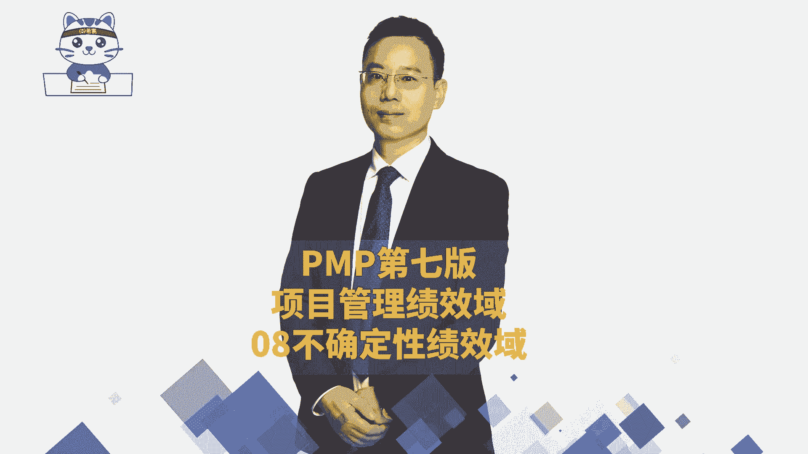
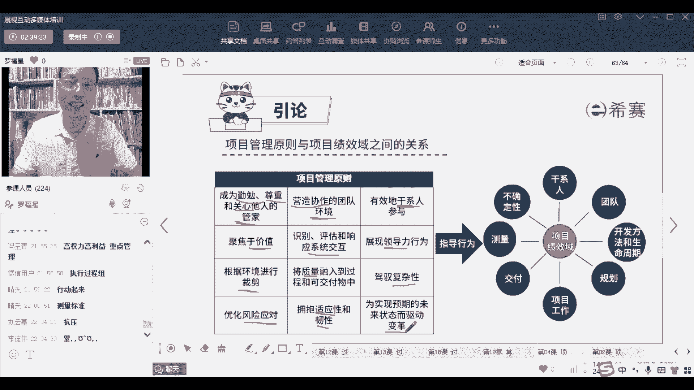

# 24年PMP考试告别啃教材！PMP第七版《PMBOK指南》精讲免费观看，8大绩效域+12项目管理原则 - P24：PMP第七版8大绩效域之08不确定性绩效域-下 - 冬x溪 - BV1JV411L7Zn

接下来是团队绩效率，而整个关于团队呢其实就是组建资源，组建团队资源，然后什么什么之类的，那么这个团队绩效率啊，他在整个团队过程中，他给了一个信息，我们要不断的去运用各种各样的技能，可使用各种技能。

包括一些什么领导力的啊，而各种技能来去让团队持续保持一种好的状态，那怎么样才能保持好的状态呢，我刚刚给了一个词叫持续小赢，希望大家可以去持续小赢对吧，这里还有一个是，他说我们在整个项目生命周期之内。

我们关于团队，我们都要跟干事人去沟通愿景和利益，让大家更好的去支持项目，让他们对项目的抵制变得更少啊，这是一个，当第二个说是在参与项目工作的时候呢，运用批判性的思维解决问题的方式，其实也就是说团队。

不要完全都是呃那种那种那种人云亦云，我们可以用这种DAI啊啊，用这种头脑风暴呀，等论方式来去想一些新的东西好，还有就是说在整个规划绩效率和测量计效率中，要说明是谁对谁对成果去担责。

也就是我们这个团队中谁为某一件事情负责，带各自分配的工作任务或认领的工作任务，你要去为你认领的东西来负责啊，这是关于团队绩效率，和其他教育之间的相互作用，好再来看生命周期，生命周期呢。

它能够去影响我们的这个规划的行为，并且生命周期某一些类型的生命周期，它是减少项目的不确定性，就是他用预测的方式来做事情的话呢，就可以减少不确定性，同时如果说是用敏捷的方式来做事情，它会有一个交互节奏。

那你如果说能够做好这个交互节奏，就能够更好的去按照价值自动交付，而按照价值驱动交付的方式，能够让客户更好的拿到价值，所以它是能够去确保价值与商业论证啊，收益啊是保持一致的，那么这也是在。

其实这个呢是讲的是预测型的方式来开发，这个讲的是敏捷性的方式来开发，各有各的好，然后能够去启发开发的团队，他就满足这些交付的交付的这些绩效率，也就是说我们去有一些好的开发方法的话，就让他去好做事情。

并且呢在整个过程中，团队的能力，领导力也能够有所体现和展现啊，这是开发方法，这个就比较简单啊，然后再来一个就是规划，规划呢你在找找的时候，你要做好计划，比方说你要先想好，我们大概要做一个什么东西出来啊。

预期成果是什么样的，并且在前期要做一个高层级的计划，然后随着时间推进，可以去逐渐去细化它，细化它，而这个计划呢在执行的过程中，他是可以去指导我们工作的，在监控的过程中可以去用来去做一个参考。

就计划可以去这个计划中就包含了基准，对不对，计划就包含了基准，那么它也可以用来去做一个参考，还有就是他也可以计划是可以去改的，计划是可以去修订的，原来计划如果不合适，可以去修订，并且呢。

他说其实某一些事情可能会影响我们的计划，不管是谈的行为也好呀，外部的环境也好呀，呃突发的一些情况也好，可能会影响计划，就是规划绩效与它和其他机效率的作用，然后再有一个呢叫工作绩效与工作教育。

就是做事情对不对，他和其他绩效率的相互作用是什么呢，首先第一个他说促进并支持有效率，这些规划交付测量，OK你只有做事情，你才能够有这些好的事情的发生，然后呢，还有就是能够去给大家提供一个。

好的环境和氛围，驾驭不确定性，模糊性复杂性，这就是你只有做事情才会强结果，所以我经常会觉得这，有的时候有些人他为什么会抑郁，就算他一直没有做事情，或者他做的事情做的太少了，他一直在想。

脑袋里面在想那些东西，他没有去过好动手，你只要去通过工作绩效与过去做事情，你才能够持续想赢，才能够财务真的驾驭不确定性，那个东西不确定你做了一点东西，不就确定你的东西你多做点，多多确定一点，对不对。

是这个逻辑对吧好，还有他说是通过做事情来去平衡各种制约因素，进度啊，成本啊，质量啊什么之类，你要去平衡它们之间的关系和因素，好再来一个是叫交付效率，那么交付绩效率，他说交付绩效率。

是在规划绩效域中去执行这东西，OK执行这些所有的东西来交付这些东西，本身工作和交付他们之间关联度比较大，所以呢他们很多东西都是相似的啊，他说工作教育通过各种过程啊，管理啊什么之类的来去促使交付工作。

OK所以是交付和工作之间是先工作，然后才能够去做这样一个交付，团队成员要去不断的去执行，然后才能够有效的去交付，然后交付的话，其实你都交付出去的东西基本上就定下来了啊，定下来了好。

他说在创建交付的工作性质，会影响到团队驾驭不确定性，然后可能会影响项目的这些结果啊，即使还是要去做事情，你只要做对，你只有行动起来才会有东西好，再来一个呢就是到了测量测量技教育。

首先测量教育它跟什么东西有关系，其实测量技教育，你看他说他说计划构成了交将交付，合计划进行比较的基础，其实也就是说我们这个测量计效率中的一个，测量指标，对不对，那么这个测量指标定还定下来以后。

我们在最后去做监控的时候，监控是拿实际执行的这个结果，和计划结果进行比对，那么这个比对中既有测量指标，也有那些就别的，我们在这个测量教育中会定下一些测量标准，比方说进度的标准啊，成本的标准呢。

质量标准啊什么之类的，可以用来做一个基础，还有就是提供一些好的信息，来去为我们这样一个规划测量做一些准备啊，去测量一些有测量结果，这个测量可加不同，其实就是测量结果就是测量这个结果，QC去测量结果。

然后测量这些东西也会他说一些不确定的事情，其实也就是说这个不确定性，不确定性，这个技巧，这种东西也会影响我们这个测量指标的度量，还是一些变更，他也会去影响我们这一个测量度量呃。

根据绩效测量启动启动不确定性啊，这什么鬼，也就是说这个测量和不确定性，他们之间有一些些千丝万缕的联系吧，你可以理解为他们有很多的观点和关系啊，就是这个最后一个最后一个叫不确定性，而不确定性呢。

它其实就是会跟我们的所有东西都有关系，跟规划有关系，跟工作有关系，跟交付有关系，跟车辆有关系，你但凡做的不好，就是有问题，包括说我们的团队成员也有关系对吧，团队成员如果相互不和睦，也也是有问题。

开发生命周期你选了不同的方法，你不同类型的项目，你要是选错了开发方法，它也会导致有可能很很多的风险，也会有更多的风险，OK不确定性就是这个那整个项目的管理中呃，有一张图也是这张图啊。

就如果说前面没有截图，没有来得及截图的同学也可以解释，这张图也是可以算了，不截这图，这张图已经被截过好多次了，截了一张图，好一点，就是我们一共是讲到了12条原则，有八个绩效语。

那么这12条原则我们简单念一下，我们就结束了啊，一个叫成为一个管家，管家精神成为什么样的管家呢，成为一个勤勉的管家，成为一个尊重别人的管家，能够关心别人的管家，OK然后第二个呢是要营造好的环境。

他这不是管家要干的事情吗，你管家你要营造一个好的协作的环境，还有呢就是能够让干系人能够好好的参与进来，做好干系人管理，能够让他好好参与进来，在整个做事情的时候要去聚焦于价值，这东西有价值才是好的。

要是没有价值可以跳过，那么那个价值流图中就是把那种把那种无价值，无意的东西给给给给跳过对吧，还有就是要去识别一些跟系统之间的交互，其实也就是说整体的东西，就整体系统之间我们要去评估它。

影响它展现领导力行为，就是关于人和人之间，团队内部，关于团队的管理中，我们需要有这样一个领导力啊，还有就是适当裁剪，裁剪就是取舍，你根据你的需要，就是我们这里有这么多东西，并不是每一个工具你都用得上。

每一个东西你都用得上，你可以根据你的需要来整个从头到尾，质量一定很重要，一定要把质量放到各个方面，如果做的东西最后没有纸，质量不过关就是垃圾，所以质量很重要，还有驾驭复杂性，就是复杂性。

其实就是有太多的那种不确定也好呀，乌卡也好，这东西也好，我们一定要去想尽办法，不管说是做模型，做测量，做做实验啊，做冗余，做什么东西能够去解决它对吧，好优化风险的应对应对方式有那么几种。

还有就是拥抱适应性和韧性，韧性适应性的就是有变化，变来变去，变来变去，韧性呢就是说可能会有挫折，如果有变化，你也能够去拥抱变化，有挫折你也能够弹起来，你就弹回弹，你能够弹起来好。

最后一个是能够去驱动变革，能够去迎接变革，能够去拥抱变革，因为只有最新的方式，他有可能才能最能够满足你，像现在新的状态，就最新的这种模型和新的方式，才能满足你最新的状态，所以我们要去拥抱这样一个变革。

去说要实现未来的状态，而且驱动变革，而这些指导行为他能够去对我们的干系人管理，团队管理啊，开发环境呀，规划呀，工作呀，交付啊，测量啊，不确定性等等这些东西来产生价值，以上就是全部内容。

