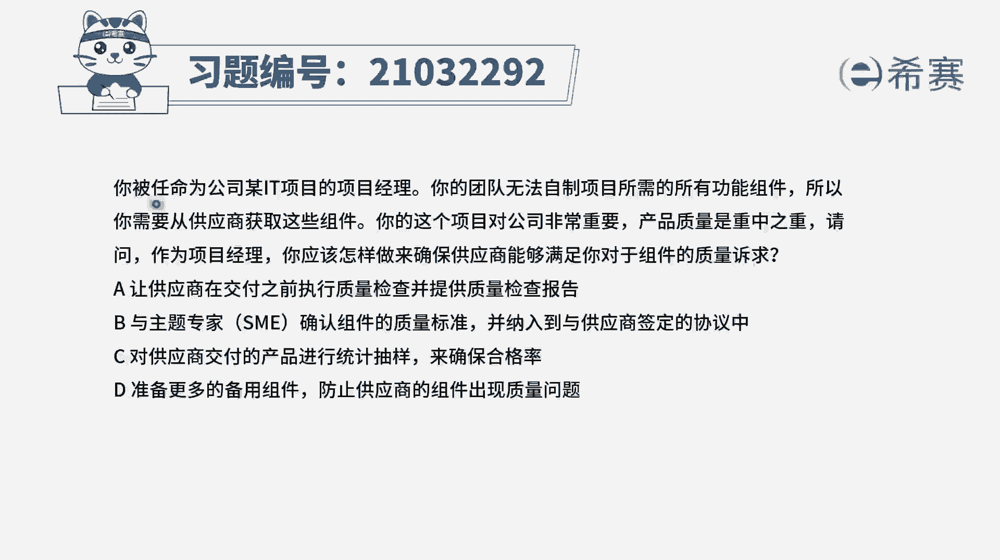
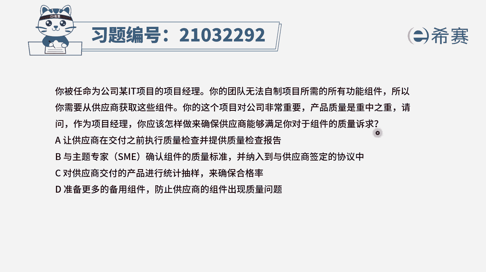
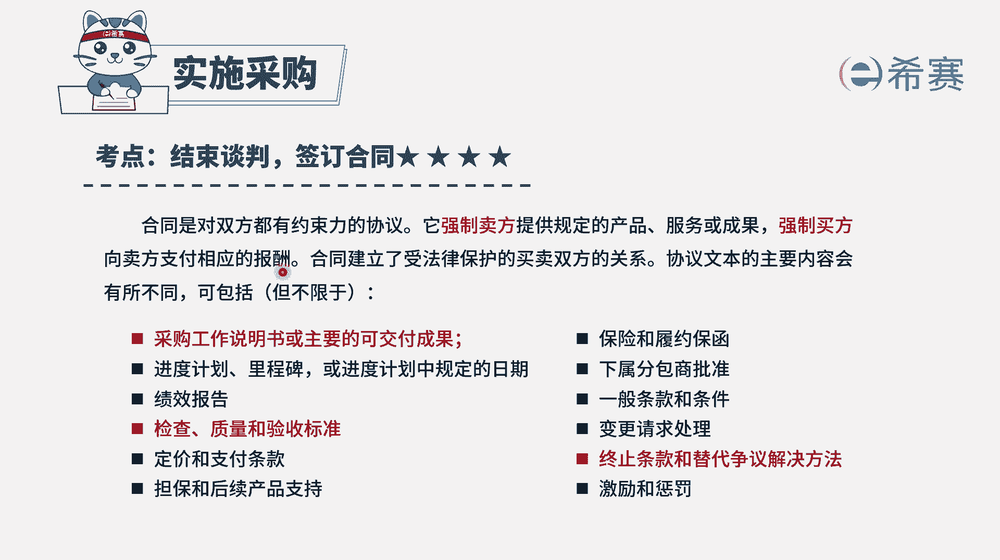
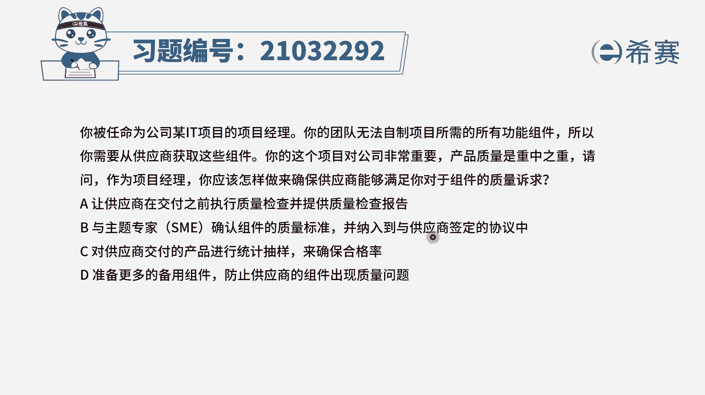
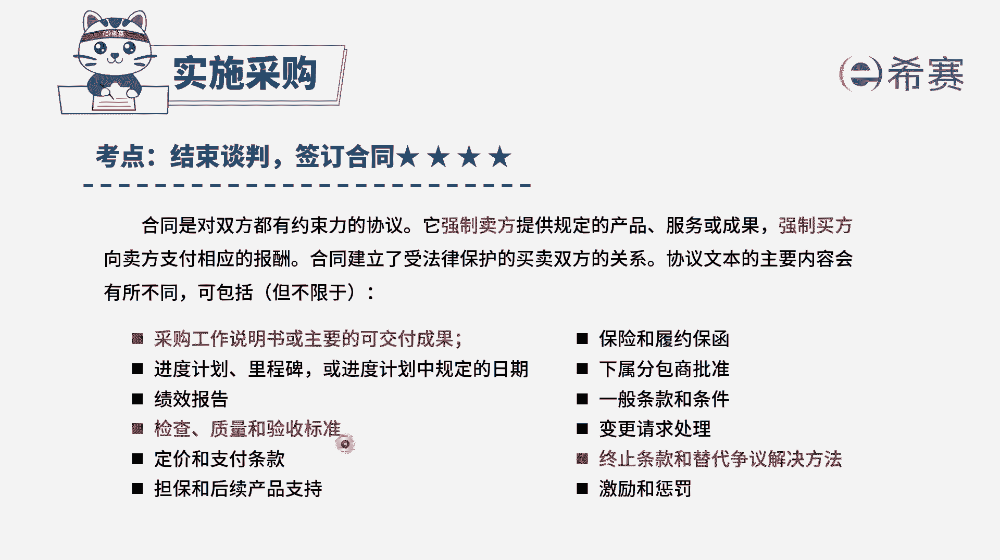
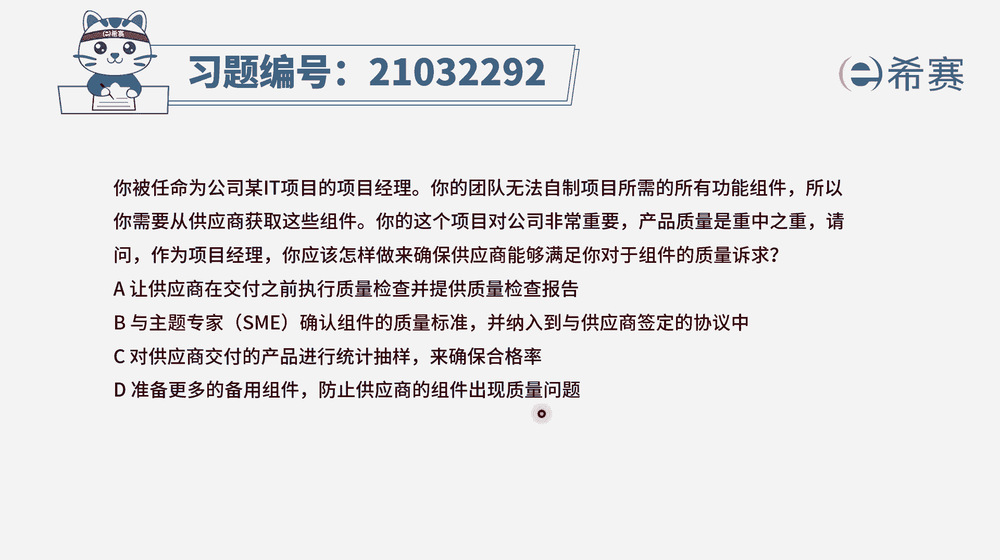
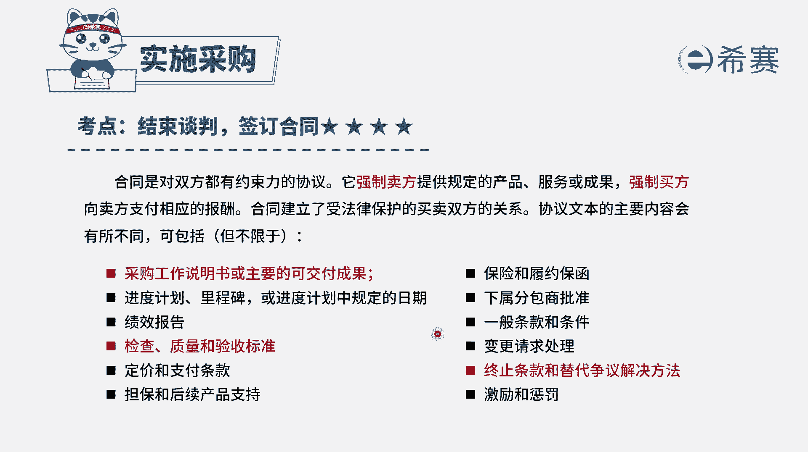
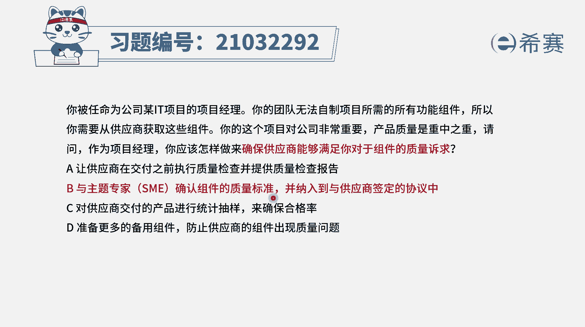

# 24年PMP考试模拟题200道，题目解读+知识点解析，1道题1个知识点（预测+敏捷） - P10：10 - 冬x溪 - BV17F411k7ZD

你被任命为某公司的it项目的项目经理，你的团队无法制止项目所需要的，所有的功能组件，所以你需要从供应商获取这些组件，你的这个项目对公司非常的重要，产品质量是重中之重，请问作为项目经理。

你应该怎样做来确保供应商能够满足，你对组件的质量要求，那这里面的话其实会收到一个很重要的信息，就是我们要去采购东西，又怎么样能够去确保这一个采购的物品，能够满足职业要求呢。

最好的方式就是把这些职业要求写到合同里面，因为合同本身它是对双方都有约束力的，合同会明确要求乙方要提供这些产品和服，务和成果，便是按照质量要求验收标准来提供，当然也同时对甲方有要求。

是要求甲方能够支付乙方相对应这些报酬。

所以我们既然要去这个项目的质量非常重要，我们又需要去满足质量要求，怎么办呢，那就提前约定好，我们来看一下这四个选项，选项A让供应商在交付之前执行质量检查，并且是提供这样一个质量检查报告，通常情况下。

这个进行质量检查以及提供质量检查报告呢，这是必须项，但是这个必须向他未必能够约束对方，而选项B与主题专家来确认组件的质量标准，并且是纳入到供应商签订了这个协议之中。

也就是跟对方签订的合同中，已经明确写出这个质量标准，唉这是可以的，因为本身这合同他就是对双方都有约束条件，如果都已经是白纸黑字写好了，那你就要按照这个方式来执行，如果没有执行的话呢。

那这里有惩罚措施，所以答案就是选B选项了，我们来看一下选项C，对供应商交付的商品进行统计抽样来确保合格，那这个事后检查它只能是检查了一些成果，把不OK的地方给挑出来，而只要事前做这些规划。

做质量规划才能够避免问题，所以这个C的这种方式肯定是不行的啊，选项D准备更多的这些备用组件，防止供应商的组件出现质量问题，那如果说他没有出现质量问题，我们就一定是有大量的浪费。

这种冗余的方式一定会有大量的浪费，这种方式不是一个很好的方式，我们应该是在有效的情况下，就利用有限的东西就能够做出所需要的质量。

那最好的方式就是把这个质量，签订到这样一份协议中。

能够让对方有约束，有要求去完成，所以答案是选B选项，我们就是跟主题专家一起来去确认职业标准，并且把它纳入到协议中来。

