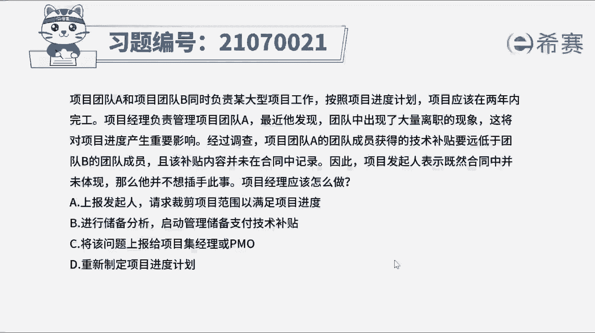
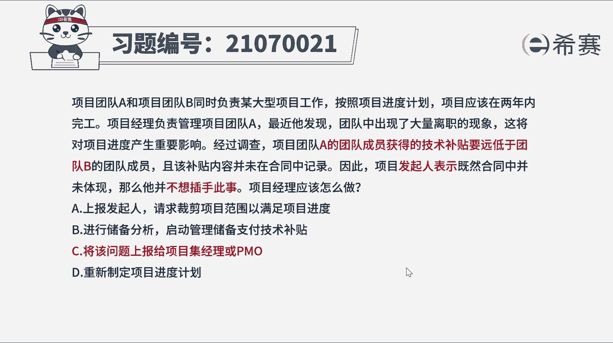
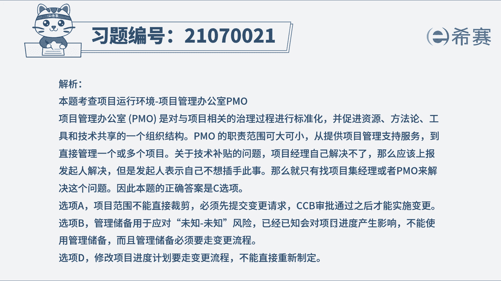
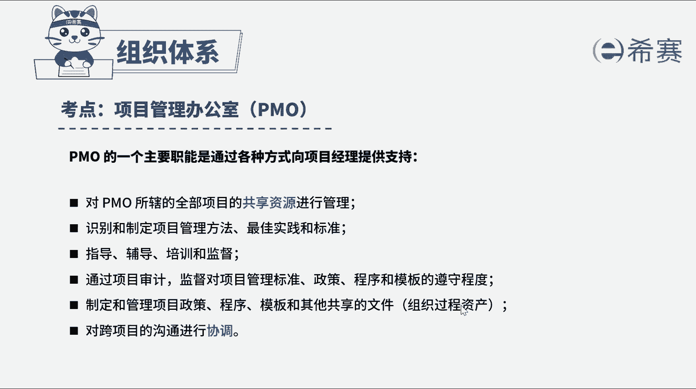

# 24年PMP考试模拟题200道，题目解读+知识点解析，1道题1个知识点（预测+敏捷） - P12：12 - 冬x溪 - BV17F411k7ZD

项目团队A和项目团队B，同时负责某大型项目工作，按照项目进度计划，项目应该在两年内完工，项目经理负责管理项目团队A，最近他发现团队中出现了大量离职的现象，这将对项目进度产生重要影响，经过调查。

项目团队A的团队成员获得的技术补贴，要远低于团队B的团队成员，且该补贴内容并未在合同中记录，因此项目发起人表示，既然合同中并未体现，那么他并不想插手此事，项目经理应该怎么做，A上报发起人。

请求裁减项目范围，以满足项目进度，B进行储备分析，启动管理储备，支付技术补贴，C将该问题上报给项目及经理或pm，D重新制定项目进度计划，好我们读完题目，找到题干中的关键词，A团队出现大量离职现象。

会影响项目进度，调查发现AB两个团队补贴不一致，发起人表示不想插手此事，物业项目经理应该怎么做，ab两个项目的问题，这属于项目级层面，应该选择上报的方式，寻找高级管理层的帮助，但发起人表示不插手解决。

但可以继续上报，寻求帮助，PMO管理一个或多个项目，可以提供项目管理支持服务，因此本题的正确答案是C选项，将该问题上报给项目及经理或PMO，再来看一下其他选项，选项A请注意项目范围不能随意裁剪。

必须走整体变更控制流程，通过cc b的审批才能执行变更，发起人不负责批准变更A不正确，选项B管理储备用于位置，位置风险，但现在已经知道离职会对项目进度产生影响，所以这属于已知风险，不能使用管理储备。

而且使用管理储备必须走变更流程，所以B选项不正确，选项D修改项目进度计划同样要走变更流程，不能直接重新制定，所以C选项也不正确。

好了，十道题我们就先讲解到这里，可以自行参考一下相关的文字解析。

整个题目讲解下来，我们可以知道本题考察的知识点，就是项目管理办公室PMO的作用，遇到项目及层面的问题。

