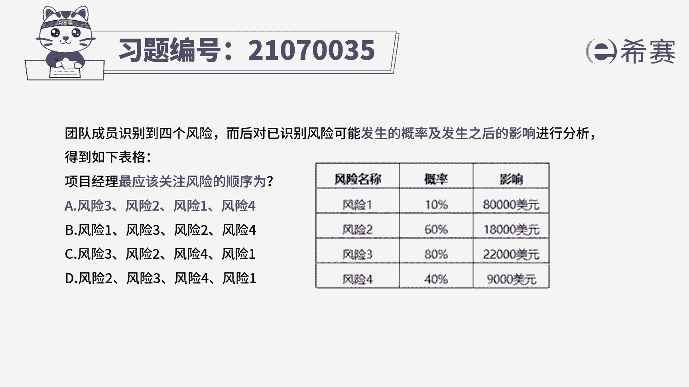
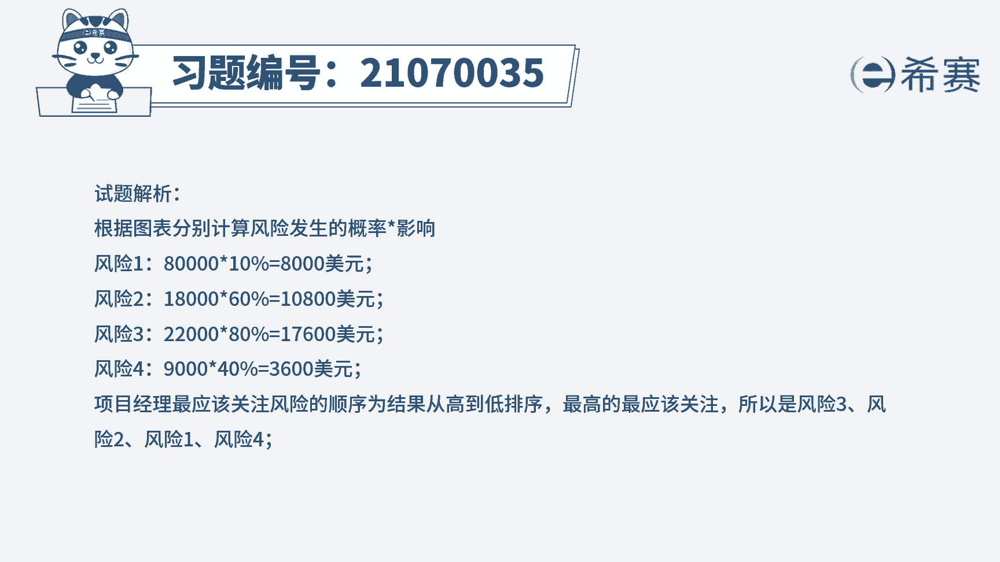
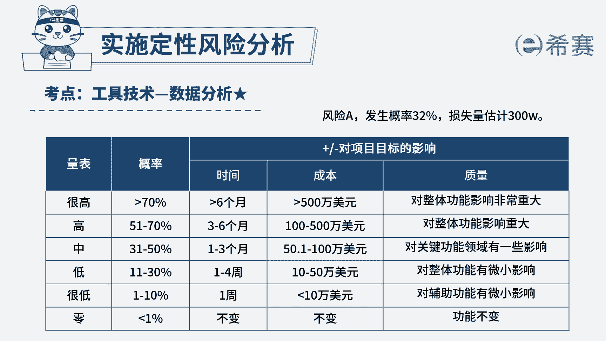

# 24年PMP考试模拟题200道，题目解读+知识点解析，1道题1个知识点（预测+敏捷） - P13：13 - 冬x溪 - BV17F411k7ZD

团队成员识别到四个危险，而后对以识别风险可能发生的概率，及发生之后的影响进行分析，得到如下表格，分写名称分别是非写1234，风险概率分别是10%，60%，80%，40%，风险的影响分别是8万美元。

1万8000美元，2万2000美元，900美元，好项目经理最应该关注风险的顺序为，A风险3214，B费写1324，C风险3241，D风险2341，好读完题目先来看一下问题。

项目经理最应该关注的风险顺序是什么，可以看到有个以识别风险的概率和发生的影响，表格，说明考察的是概率和影响矩阵，只需要用概率乘以影响，就可以得到一个权重值，这个值越大，说明越需要关注。

然后来计算一下即可，风险一为8000美元，风险二为1万800美元，费险三为1万7600美元，费险四为3600美元，然后问最应该关注的顺序啊，那就是从大到小分别是风险三分险，二分险，一分险四。

所以本题的正确答案就是A，只要看清楚题干的问题，这个题还是很容易做对的，只需要把概率和影响相乘，然后这个值越大，说明越需要关注好了。

我们这个题就先讲解到这里，大家可以自行参考一下相关的文字解析。

整个题目讲解下来，我们可以知道本题考察的知识点就是风险管理。

