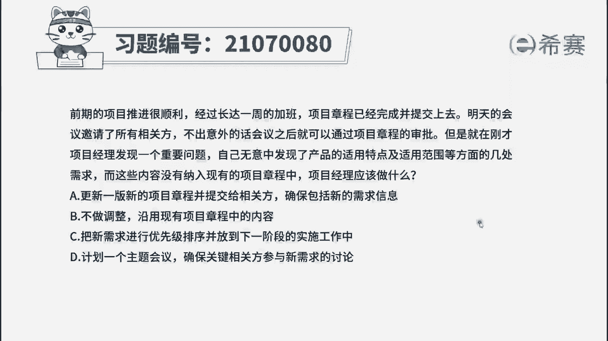
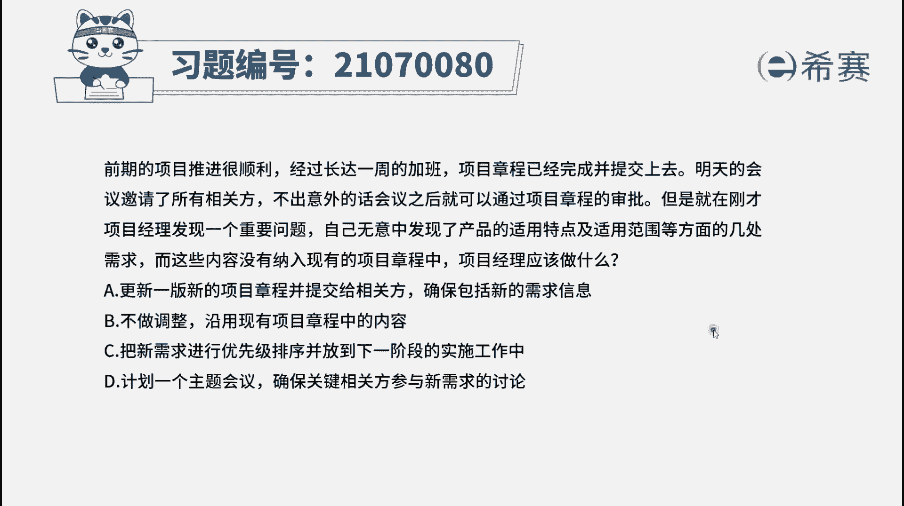
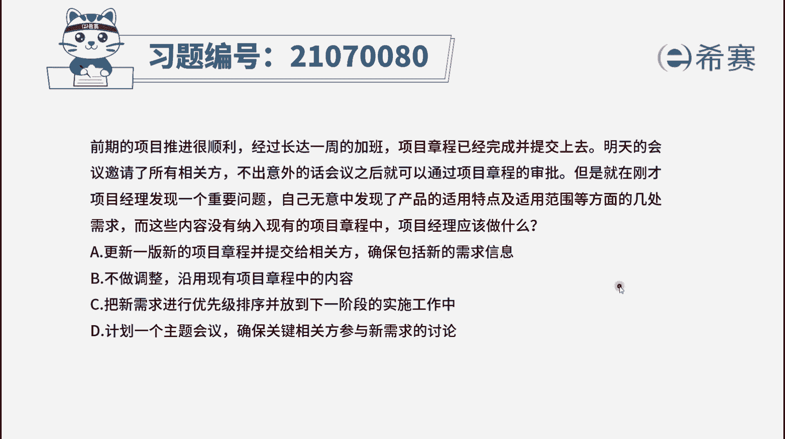
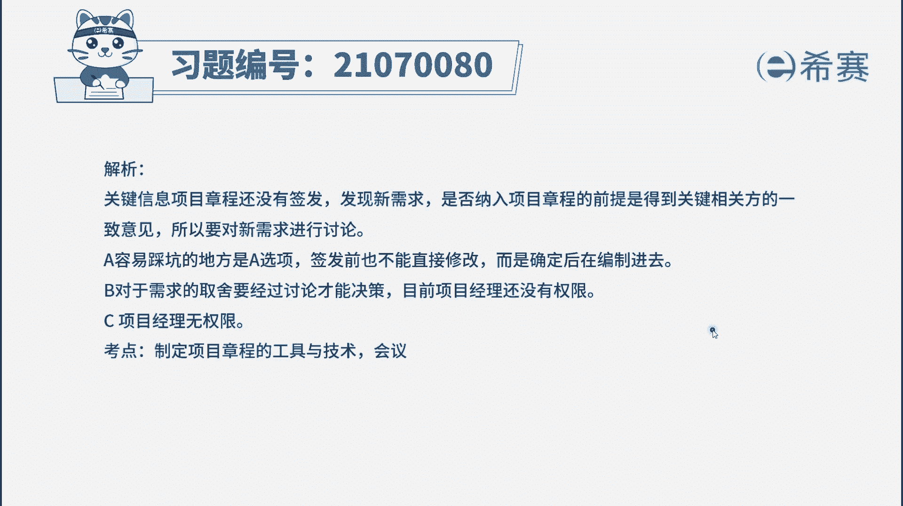
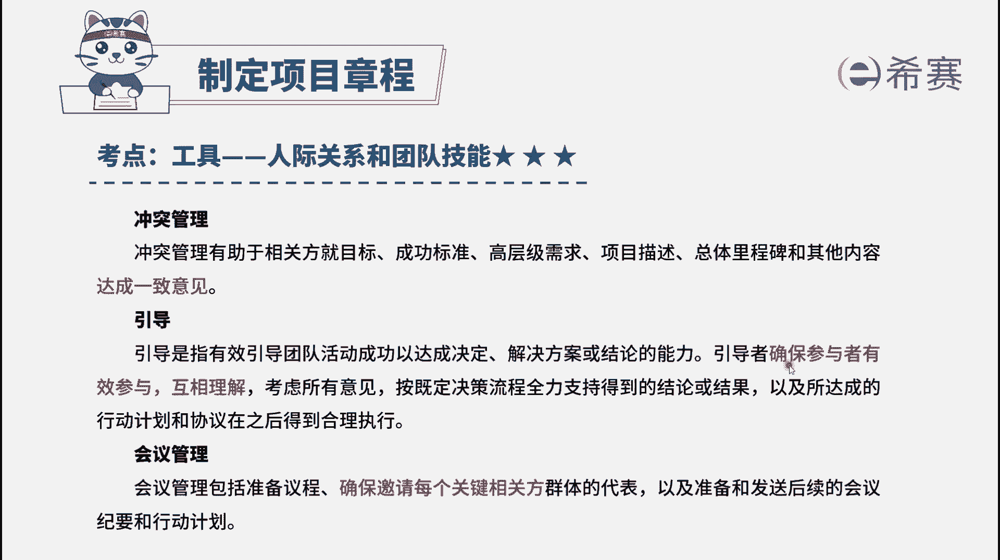

# 24年PMP考试模拟题200道，题目解读+知识点解析，1道题1个知识点（预测+敏捷） - P14：14 - 冬x溪 - BV17F411k7ZD

前期的项目推进得很顺利，经过长达一周的加班，项目章程已经完成并提交上去。

明天的会议邀请了所有相关方，不出意外的话，会议之后就可以通过项目章程的审批，但是就在刚才，项目经理发现一个重要问题，自己无意中发现了产品的适用特点，及适用范围等方面的几处需求。

而这些内容没有纳入现有的项目章程中，项目经理应该做什么，选项A更新100新的项目章程，并提交给相关方，确保包括新的需求信息，选项B不做调整，沿用现有项目章程中的内容，选项C把新需求进行优先级排序。

并放到下一阶段的实施工作中，选项D计划一个主题会议，确保关键相关方参与性需求的讨论，看一下题目信息，我们可以知道此时是项目章程还没有获得审批，而这时发现遗漏了一些新的需求，问此时项目经理应该怎么做。

根据这些信息，我们可以定位到这是启动阶段的，制定项目章程阶段发现新需求，也就是需要修改项目章程，那么获批之前的项目章程，项目经理可以直接修改吗，从权限上来说是可以的，但是我们要根据题目的具体场景来判断。

也不能说项目经理就一直修改项目章程，这样也会耽误项目进度的，我们在获得需求之后，首先要确认需求，然后再修改，这也是题目考察的另一个点，就是项目整合管理的整体思想，遇到问题要先分析后行动，在此基础上。

我们再来看一下选项，选项A是直接更新，没有确认这些需求，也不管还有没有其他遗漏的需求，因此这个说法不是特别完善，我们先放在这里看有没有其他更合适的选项，选项B不做调整，直接跳过这个问题，不处理。

这种做法是不恰当的，因此B选项排除选项，C其实也是说先不处理这个问题，等到执行阶段再说，这也是不恰当的，把需求排序是规划范围管理中的，因此这一个选项也排除选项，D是讨论一下相关方还有什么新的需求。

我们确定好之后再编制到项目章程中去，这个选项就是比较合适的，它与A选项的区别就是我们先进行了分析讨论，然后再更新，这是更加合理的。

因此这道题的正确选项就是D选项解析，在这里需要的同学可以看一下。

这道题考察的就是编制项目章程的工具，会议管理工具，通过会议收集相关方的需求。

