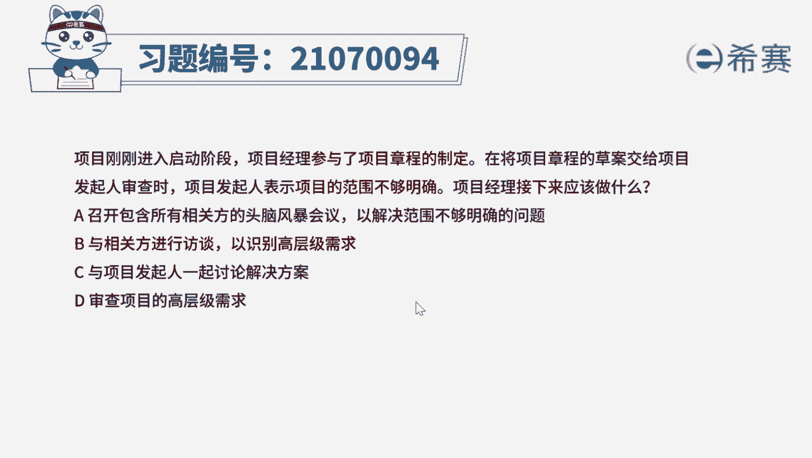
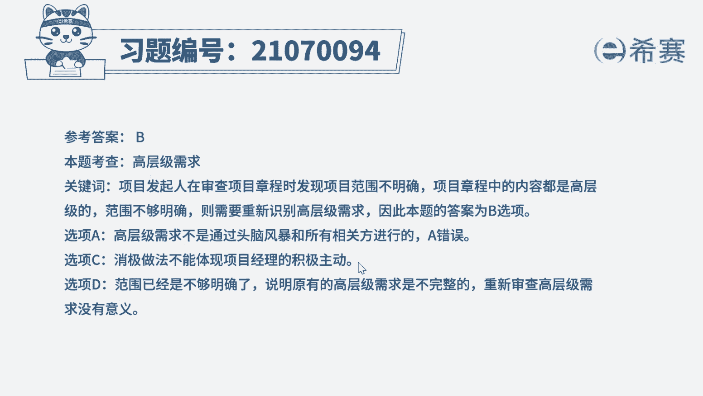
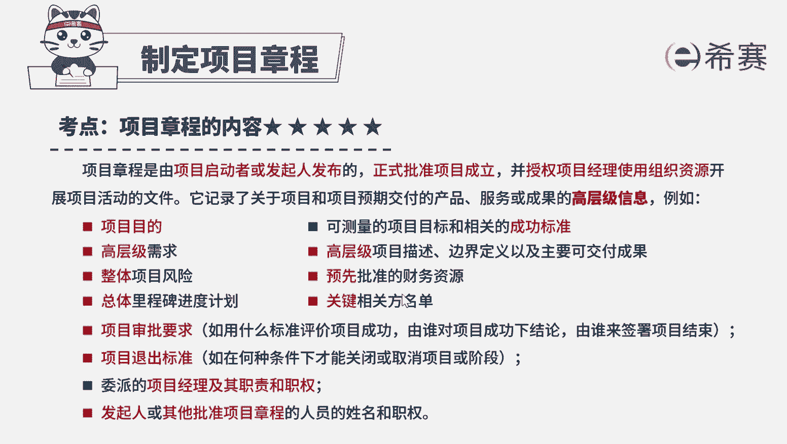

# 24年PMP考试模拟题200道，题目解读+知识点解析，1道题1个知识点（预测+敏捷） - P15：15 - 冬x溪 - BV17F411k7ZD

项目刚刚进入启动阶段，项目经理参与了项目章程的制定，再将项目章程的草案交给项目发起人审查时，项目发起人表示项目的范围不够明确，项目经理接下来应该做什么，召开包含所有相关发的头脑风暴会议。

以解决范围不够明确的问题，B与相关方进行访谈，以识别高层级需求，C与项目发起人一起讨论解决方案，D审查项目的高层级需求，好读完题目，我们先来看一下问题，接下来应该做什么，唉，再回到题干。

可以看到一些关键词，项目经理参与了项目章程的制定，并且目前项目的范围不够明确，哎项目章程中的范围都是高层级的，现在说项目范围不明确，说明高层级的需求收集时出了差错，需要重新识别高层级需求。

以明确项目范围，所以这道题的最佳答案应该是选项B，再来看看其他选项，选项A头脑风暴是用来收集创新概念，集思广益的做法，不适用于收集高层级需求，选项C，一般项目出现的问题，都是由项目经理自己来解决。

除非解决不了才考虑上报给发起人，现在C的这个做法过于消极了，选项D原本项目章程的范围就是不明确的，发起人已经审查过了，就不需要再进行一次审查了，唉没有解决题干中的问题好了。

这道题我们就先讲解到这里，大家可以自行参考一下相关的文字解析。

整个题目讲解下来，我们可以知道本题考察的知识点。

