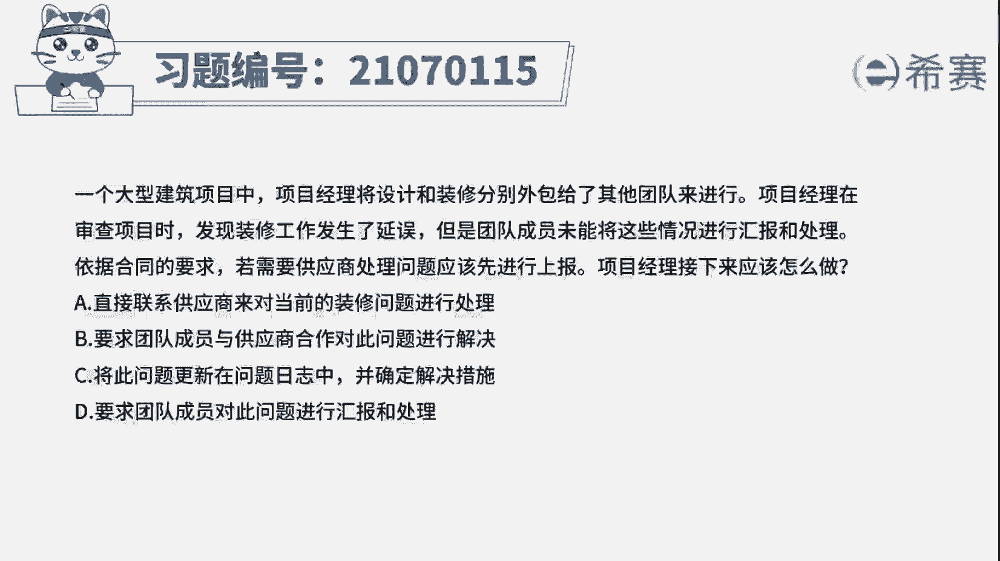
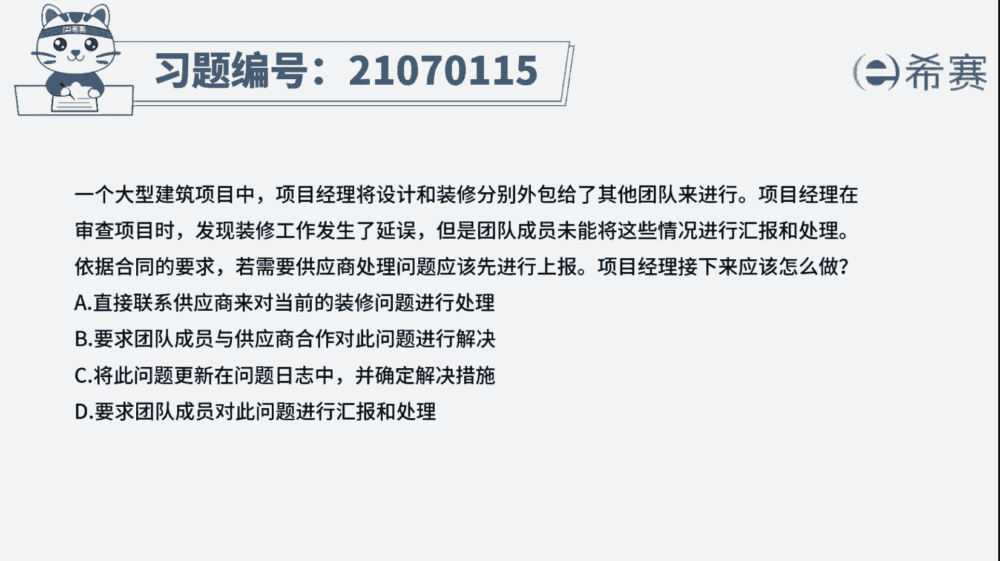
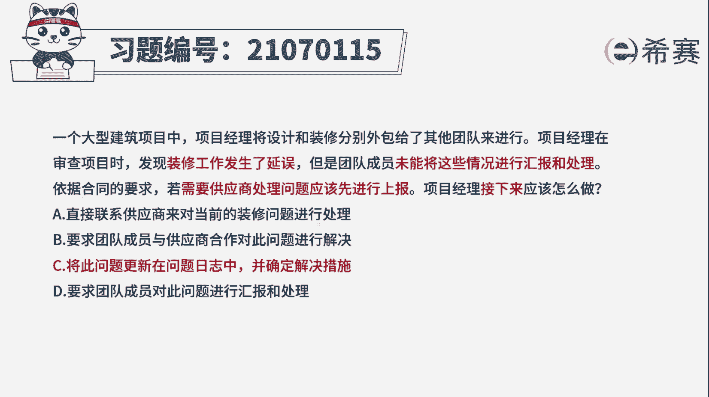
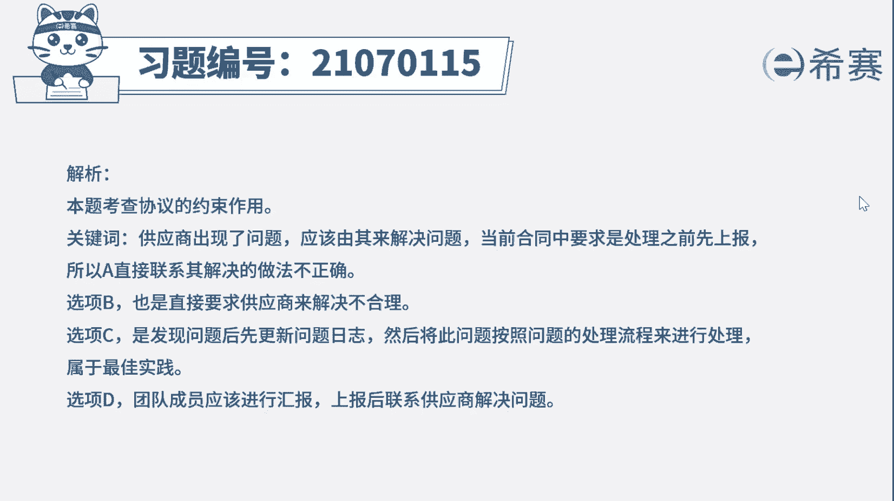
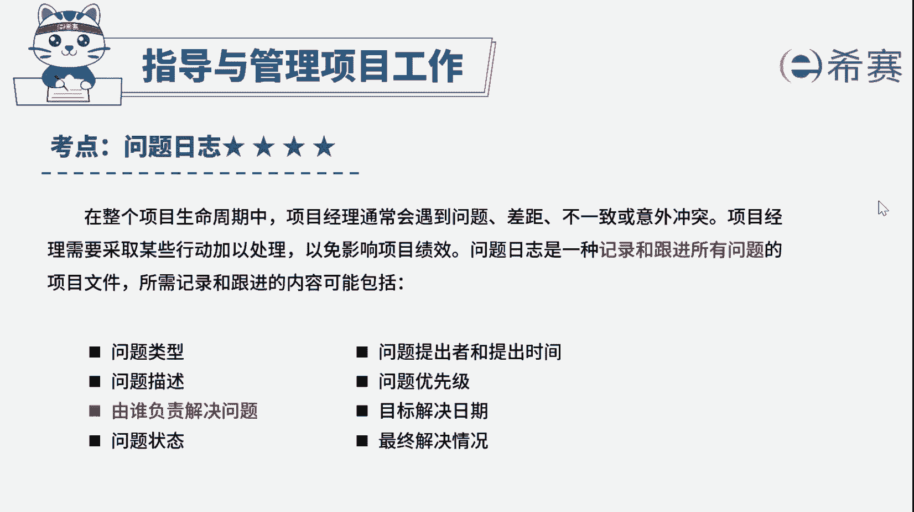

# 24年PMP考试模拟题200道，题目解读+知识点解析，1道题1个知识点（预测+敏捷） - P16：16 - 冬x溪 - BV17F411k7ZD

一个大型建筑项目中。

项目经理设计和装修，分别外包给了其他团队来进行。

项目经理在审查项目时，发现装修工作发生了延误，但是团队成员未能将这些情况进行汇报和处理，依据合同的要求，若需要供应商处理问题，应该先进行上报，项目经理接下来应该怎么做，A。

直接联系供应商来对当前的装修问题进行处理，并要求团队成员与供应商合作，对此问题进行解决，C将此问题更新到问题日志中，并确定解决措施，D要求团队成员对此问题进行汇报和处理，好读完题目，我们先来看一下问题。

接下来应该怎么做唉，再回到题干，可以看到一些关键词，装修工作发生了延误，未能将这些情况进行汇报和处理，若需要供应商处理问题，应该先进行上报诶，这里装修工作延误就是当前项目发生的问题。

那么出现问题就直接按照问题处理流程走，首先就需要更新问题日志，分析影响找原因，然后确定解决方案，所以这道题就不难，我们直接把答案定位到选项C，再来看一下其他选项，写上A和B。

题干关键词表明了需要供应商处理问题，应该先上报，这里不论是直接联系供应商，还是要求团队成员与供应商合作解决问题，都没有经过上报，不符合提议，而选项D这里只是对情况进行了汇报，但是没有上报。

也没有解决装修延误的问题，哎相对来说选项C的做法是最妥当的，好了，这道题我们就先讲解到这里。

大家可以自行参考一下相关的文字解析。

整个题目讲解下来，我们可以知道本题考察的知识点，就是项目中出现问题时。

