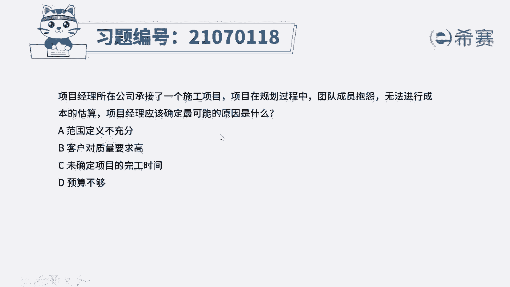
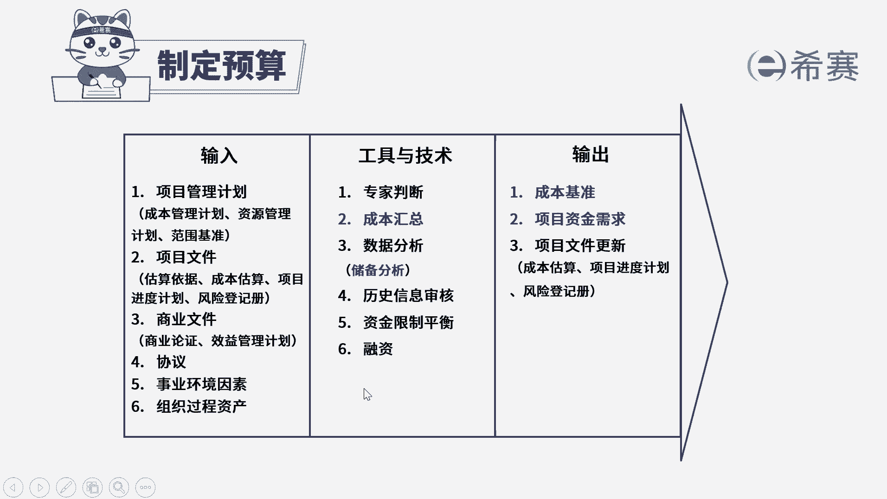

# 24年PMP考试模拟题200道，题目解读+知识点解析，1道题1个知识点（预测+敏捷） - P17：17 - 冬x溪 - BV17F411k7ZD

项目经理所在公司承接了一个施工项目项目，在规划过程中，团队成员抱怨无法进行成本的估算，项目经理应该确定最可能的原因是什么，选项A范围定义不充分，选项B客户对质量要求高，选项C未确定项目的完工时间。

选项D预算不够好，现在的时间节点是不是规划过程，而团队成员说无法进行成本的估算，注意是无法进行，那么最可能的原因是哪一项呢，看一下四个选项，A选项范围定义不充分，我们知道估算成本肯定是以范围作为基础。

我们需要知道要做什么东西，然后基于要做的这些东西，去进行一个成本的估算，所以如果你项目范围定义不充分，不知道要做什么，你肯定就估不出要花多少钱，所以A选项确实是一个可选的理由，再来看B选项。

客户对质量要求高，那么质量高和成本估算它们之间的联系，就是质量成本，也就是我们需要准备多少成本，去进行预防和评估，才能达到这样一个高的质量要求，他确实可能会有一定的影响，但是质量成本只是占到了一小部分。

它带来的影响是远远没有A选项，范围定义不充分，影响大的，所以A选项会比B选项又更合适一点，再来看C选项，未确定项目的完工时间，项目的完工时间没有确定，可能也会对你初步的一个估算有一点点影响。

你要考虑到资源的一个使用情况，成本对不对，但是为什么会确定不了完工时间呢，完工时间多久做完，如果进行估算，是不是也是基于范围，所以你源头还是在范围上，最后D选项预算不够。

这并不能构成我们无法进行成本估算的利用，所以在四个选项中，A选项它的可能性是最高的。

我们选择A选项。

大家可以看一下文字解析部分，本题考察的是项目成本管理。

