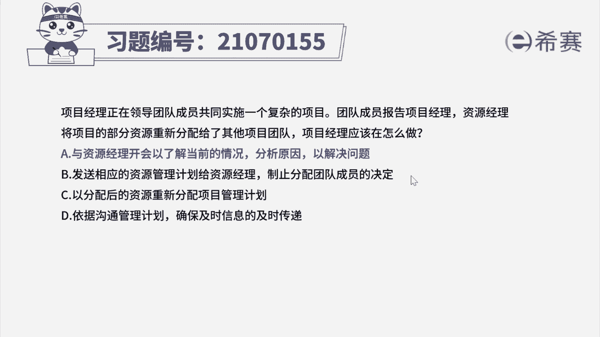
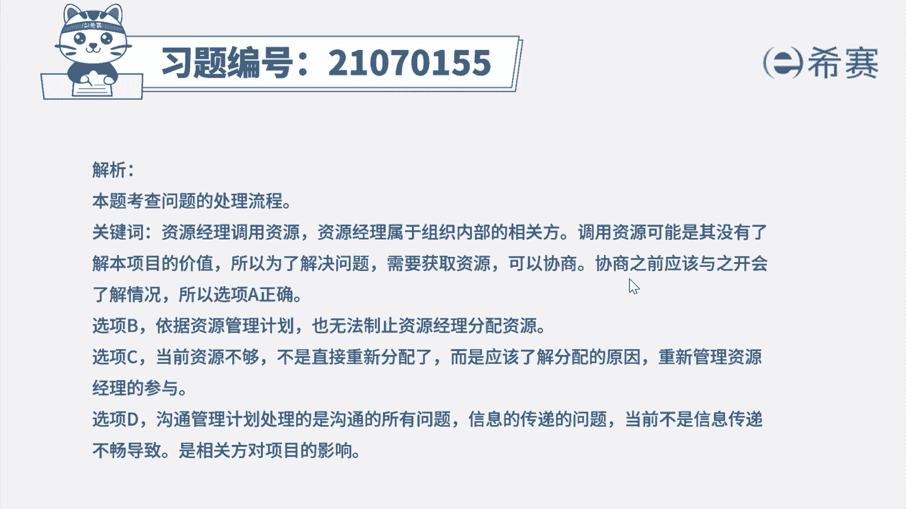
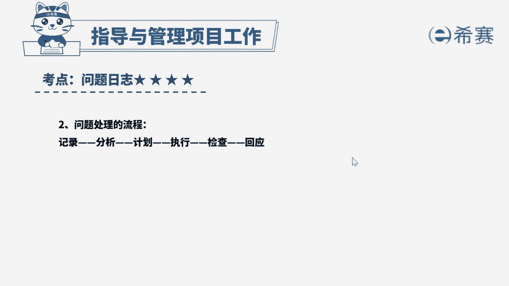

# 24年PMP考试模拟题200道，题目解读+知识点解析，1道题1个知识点（预测+敏捷） - P19：19 - 冬x溪 - BV17F411k7ZD

项目经理正在领导团队成员。

共同实施一个复杂的项目，团队成员报告项目经理，资源经理，将项目的部分资源重新分配给了其他项目团队，项目经理应该在做什么，A与资源经理开会，已了解当前的情况，分析原因，已解决问题。

B发送相应的资源管理计划给资源经理，制止分配团队成员的决定，C以分配后的资源重新分配项目管理计划，依据沟通管理计划，确保及时信息的及时传递，好读完题目，我们先来看一下问题，项目经理应该在做什么好。

再回到题干，我们可以看到一些关键词，资源经理将项目的部分资源，重新分配给了其他项目团队，资源经理属于组织内部的相关方诶，我们结合选项来看看，学校A与资源经理开会，已了解当前的情况，分析原因。

已解决问题啊，调用资源可能是其没有了解本项目的价值，所以为了解决问题需要获取资源，可以协商，协商之前应该与他开会了解情况，所以选项A被选好，选项B，资源管理计划只是当前项目的一个文件啊。

就算发给资源经理看，也无法制止它分配资源，好选项C当前资源不够，不是直接重新分配，而是应该了解分配的原因，重新管理资源经理的参与，好选项D，沟通管理计划，处理的是沟通的所有问题和信息的传递问题。

当前不是信息传递不畅，导致的是相关方对项目的影响，所以D选项我们可以直接排除好，那综合分析我们的最佳答案应该是选项A好。

那我们这道题就先讲解到这里，大家可以自行参考一下相关的文字解析。

整个题目讲解下来，我们可以知道，本题考察的知识点是项目整合管理。

