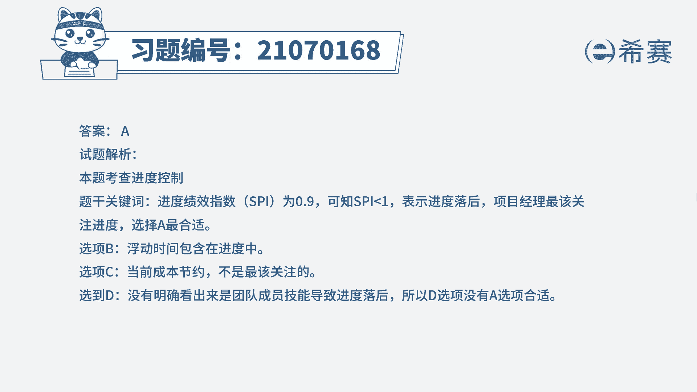

# 24年PMP考试模拟题200道，题目解读+知识点解析，1道题1个知识点（预测+敏捷） - P20：20 - 冬x溪 - BV17F411k7ZD

一个设计项目的项目经理，由于生病离开项目一个月，一个月后重新回到项目代理，项目经理与他交接工作，发现一项任务的最早结束时间为下周一，最晚的结束日期为下周日，负责该任务的团队成员技术偏低。

而当前的进度绩效指数为0。9，成本绩效指数为1。08，项目经理若要继续开展项目，最该关注什么，A进度B活动的总浮动时间，C成本D团队成员的技能，读完题目，我们可以找到题干中的关键句。

题干说当前的进度绩效指数是0。9，成本绩效指数是1。08，现在题目问的是项目经理若要继续开展项目，最应该关注什么，我们知道当进度绩效指数小于一时，说明项目进度延迟，题干说进度绩效指数为0。9。

说明此时项目进度已经延迟了，而成本绩效指数是1。08大于一，也就是说成本当前是没有超支的，而且是结余的情况，所以项目经理最应该关注的是进度问题，因此四个选项中只有A选项是符合的，我们再看一下其他选项。

先看B选项，总浮动时间是包含在进度之中的，所以B不选，我们再看C选项，当前成本没有超支，而且有结余，所以C也不选，最后看D选项，题干只是说负责该任务的团队成员技术偏低。

但是不能直接说明是导致进度落后的原因，技术偏低的这个问题也要关注，但是最需要关注的还是进度已经落后的，这个问题，所以D也不选。

因此本题最佳的答案就是A选项，本题考察的知识点是项目进度管理中。

