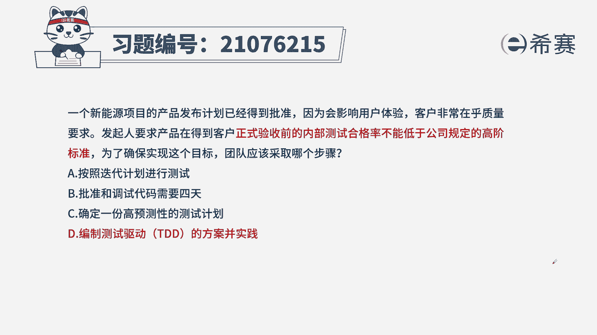
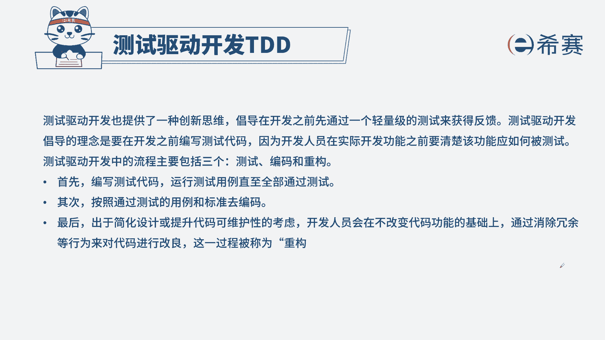
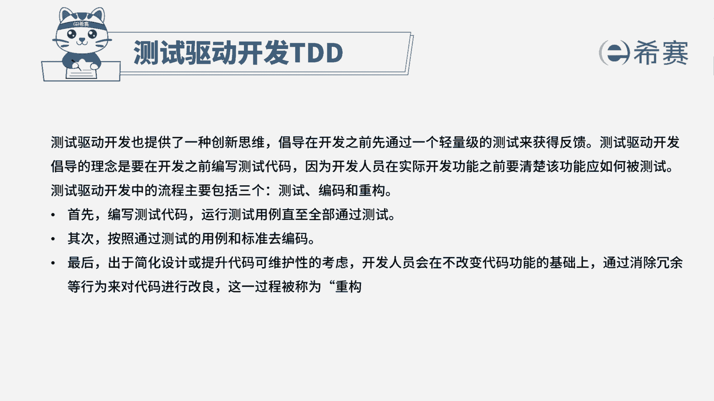

# 24年PMP考试模拟题200道，题目解读+知识点解析，1道题1个知识点（预测+敏捷） - P21：21 - 冬x溪 - BV17F411k7ZD

一个新能源项目的产品发布计划已经得到批准，因为会影响用户体验，客户非常在乎质量要求，发行要求，产品在得到客户正式验收前的内部测试，合格率不能低于公司规定的高阶标准，为了确保实现这个目标。

团队应该采取哪个步骤，A按照迭代计划进行测试，B批准和调试代码需要四天，C确定一份高预测性的测试计划，D编制测试驱动TDD的方案，并实现本题考法最佳实践，首先通过题干找到关键信息。

题目中提到在内部测试验收的合格率，不能低于公司的高阶标准，这里我们要聚焦在测试合格率上，要提高合格率一定是要通过测试，所以我们要先编制测试代码，通过之后我们再进行开发，再进行优化和重构。

所以这个步骤本身就是测试驱动TD的方案，从而选出D选项，一起来看一下其他三个选项，A按照迭代计划进行测试，敏捷项目本身就是变化大于计划，如果按照迭代计划违背了我们敏捷的价值观，B批准调试代码需要四天。

这里的四天和题干的信息关联性不强，而且我们也无法判断四天的长短，C确定一份高预测性的计划，敏捷项目变化大于计划，所以我们进行预测也非常不准，违背价值观。

这是本题的解析，大家可以暂停看一下本题的相关知识点。

测试驱动开发，针对这个知识点，我们要从两方面去下手，第一测试驱动开发的作用是什么，第二它的步骤有哪些，这样针对此类型的题目。

