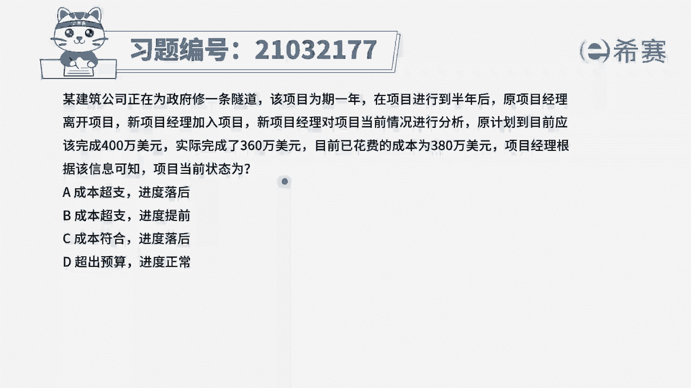
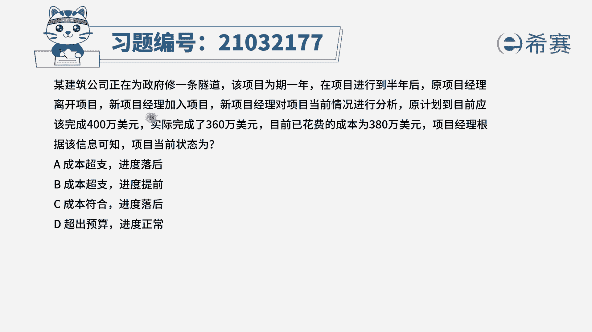
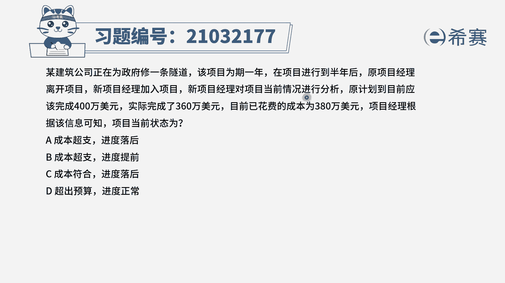
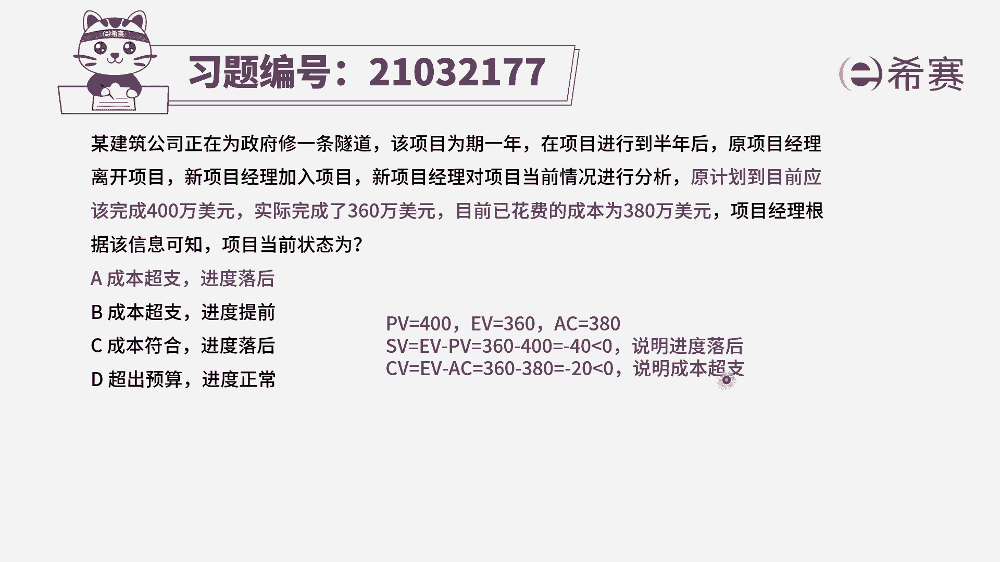
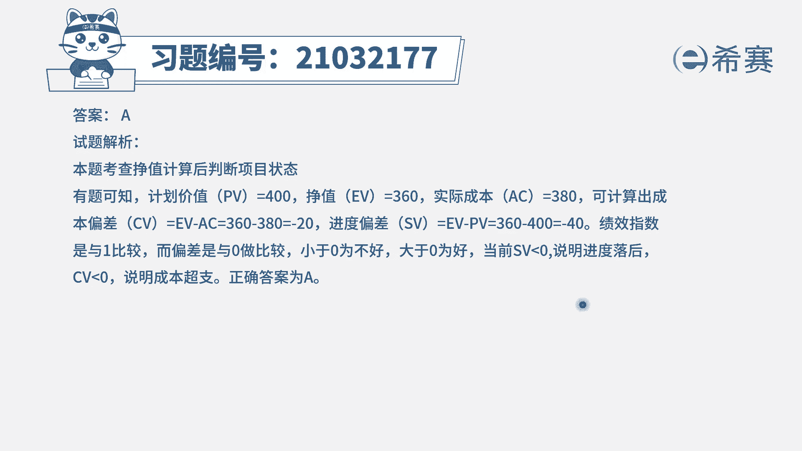
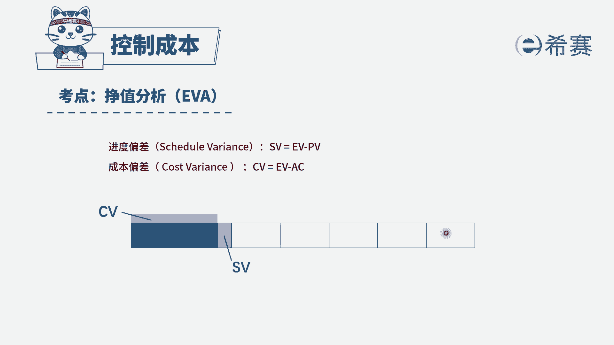

# 24年PMP考试模拟题200道，题目解读+知识点解析，1道题1个知识点（预测+敏捷） - P23：23 - 冬x溪 - BV17F411k7ZD

某建筑公司正在为政府修一条隧道，该项目为期一年。

在项目进行到半年后，原项目经理离开项目，新项目经理加入项目。

新项目经理对项目当前情况进行分析，原计划到目前已完成400万美元。

实际完成了360万美元，目前已花费的成本为380万美元，项目经理根据该信息可知，项目当前状态为选项A成本超支进度落后，选项B成本超支进度超前，选项C成本符合进度落后选项D，超出预算进度正常。

好题干是不是给出了三个数据，一个是目前为止原计划要多少，这个是指的计划价值实际完成多少，指的是正值，而最后花费的成本380万美元，是指的实际的成本，我们知道了三个数据之后就很好计算了。

不管你是利用成本偏差，进度偏差还是成本进度的绩效指数，都可以计算出来，这里我们使用成本偏差和进度偏差来进行计算，首先看一下SV，SV是指进度的偏差，进度偏差等于1V减去PV等于负的40，小于零。

CV成本的偏差也是用正值减去实际成本，等于负的，20也小于零，两个数据都小于零，我们可以判断他的状态是进度落后，成本超支的，因此这一题选项为A选项。

大家可以看一下文字解析。

